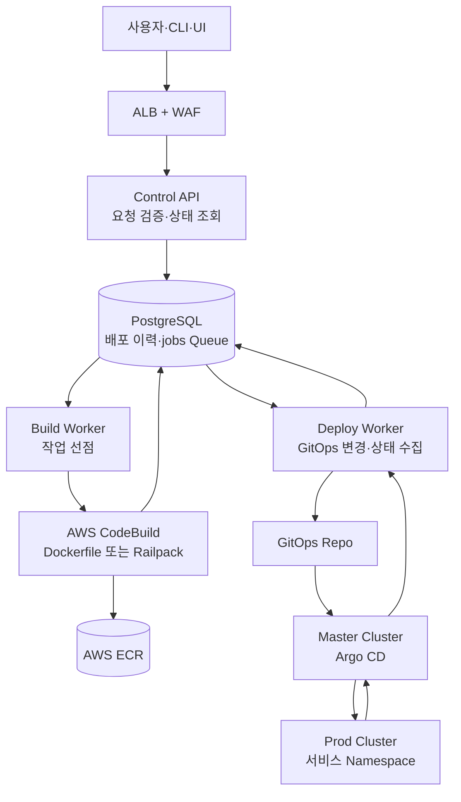
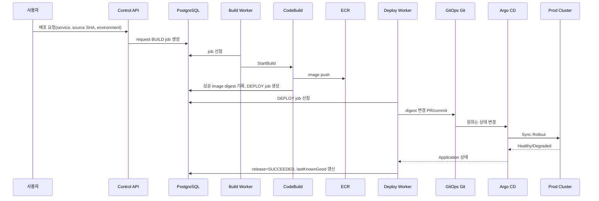
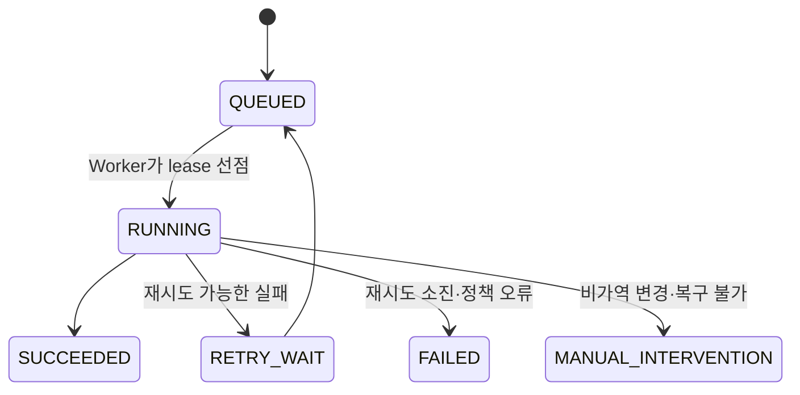
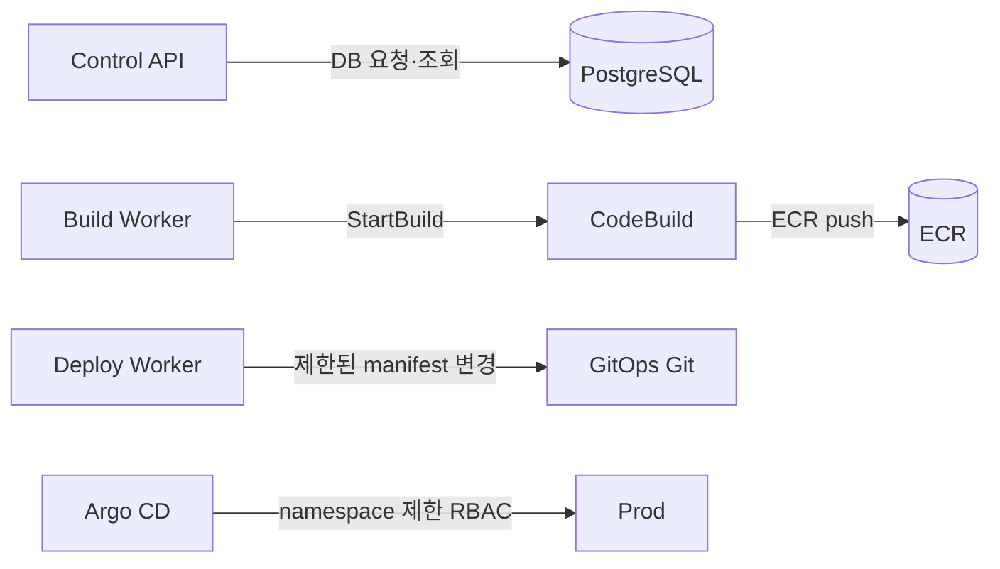

# AnyDeploy Control Plane — 빌드·배포 처리 흐름

> 기준일: 2026-09-30  
> 전제: AWS의 Master EKS에 Control Plane과 Argo CD를 운영하고, Prod 클러스터는 GitOps로 관리한다. 이 문서는 기존 Helm 직접 배포안과 별개의 **Argo CD GitOps 기준안**이다.

## 1. 결정 사항

- `Control API`, `Build Worker`, `Deploy Worker`는 하나의 `control-plane` 모노레포에서 관리하되, 각각 별도 이미지·Deployment·IAM Role로 실행한다.
- 실제 소스 빌드는 상주 Pod가 아니라 **AWS CodeBuild**가 요청마다 실행한다.
- 이미지 파일은 ECR에 저장하고, GitOps 저장소에는 배포할 **image digest**만 기록한다.
- Master의 Argo CD가 GitOps 저장소를 읽어 Prod 클러스터에 동기화한다. Deploy Worker는 Prod kubeconfig를 갖지 않는다.
- PostgreSQL `jobs` 테이블을 큐로 사용한다. 전달 보장은 at-least-once이며, 모든 외부 호출은 멱등하게 처리한다.

## 2. 전체 흐름



### 성공 경로



## 3. 실행 컴포넌트

| 컴포넌트 | 실행 위치 | 책임 | 금지 권한 |
|---|---|---|---|
| Control API | Master EKS, 2+ replicas | 인증, 요청·상태 API, DB 기록 | CodeBuild 실행, ECR push, GitOps 변경, 클러스터 접근 |
| Build Worker | Master EKS, 1~2 replicas | BUILD job 선점, CodeBuild 시작·상태 반영 | ECR push, GitOps 변경, Argo CD 접근 |
| AWS CodeBuild | 요청별 일회성 환경 | 소스 checkout, 테스트, 이미지 빌드·스캔, ECR push | GitOps 변경, Prod 접근 |
| Deploy Worker | Master EKS, 2 replicas | GitOps digest 변경, Argo CD 상태 수집, rollback commit | 소스 빌드, ECR push, Prod kubeconfig |
| Argo CD | Master EKS | Git desired state를 Prod에 동기화 | 사용자 요청 인증, 소스 코드 빌드 |

`Control API`는 긴 작업을 기다리지 않는다. 요청 ID를 반환하고 상태 조회·webhook·SSE로 진행 상태를 제공한다.

## 4. 빌드 정책

### 빌더 선택

서비스 등록 시 빌더를 확정해 저장한다. 최초 등록에서만 Dockerfile 유무와 Railpack 감지를 이용해 기본값을 제안한다.

```yaml
# 서비스 소스 저장소: .anydeploy/build.yaml
builder: dockerfile # dockerfile | railpack
dockerfilePath: Dockerfile
platform: linux/amd64
# railpackVersion: "<고정 버전>"
```

| 조건 | 빌드 방식 |
|---|---|
| `builder: dockerfile` | 지정 Dockerfile로 BuildKit 빌드 |
| `builder: railpack` | 고정된 Railpack 버전과 BuildKit으로 이미지 생성 |
| 설정 누락 | 초기 등록에서만 감지 결과를 제안하고 확정 전에는 배포하지 않음 |
| 설정·소스 불일치 | `BUILD_CONFIG_REQUIRED`로 실패 |

- Dockerfile이 없는 Node, Python, Go 서비스는 Railpack을 쓸 수 있다.
- Railpack은 CodeBuild의 네이티브 기능이 아니다. CodeBuild의 custom build image 또는 buildspec에서 Railpack과 BuildKit을 실행한다.
- Dockerfile과 Railpack 모두 최종 결과는 컨테이너 image다.
- 배포 기준은 mutable tag가 아닌 `repository@sha256:...` digest다. `latest`, `prod` 태그는 배포 manifest에서 사용하지 않는다.

### CodeBuild 역할

CodeBuild Service Role에는 다음만 부여한다.

- 서비스 소스 저장소 읽기
- 해당 서비스 ECR 저장소의 image push
- CloudWatch Logs 쓰기
- 빌드에 꼭 필요한 KMS·Secrets Manager 읽기

Docker image 빌드가 필요한 프로젝트만 privileged mode를 허용한다. CodeBuild에 GitOps 저장소 쓰기, Argo CD 토큰, Prod 자격증명을 넣지 않는다.

## 5. PostgreSQL Queue와 상태

### 최소 테이블

| 테이블 | 핵심 데이터 |
|---|---|
| `deployment_requests` | 요청자, 서비스, 환경, source SHA, idempotency key, 최종 상태 |
| `jobs` | 종류, 상태, payload, 시도 횟수, lease, 외부 작업 ID |
| `builds` | builder, CodeBuild ID, image digest, 로그 URL |
| `releases` | GitOps commit SHA, 배포 digest, Argo Application 상태, 이전 정상 release |

`jobs.kind`는 `BUILD`, `DEPLOY`, `RECONCILE`, `ROLLBACK`을 사용한다. 서비스·환경별 진행 중 배포는 하나만 허용한다.



여러 Worker는 `FOR UPDATE SKIP LOCKED`로 작업을 선점한다. 작업을 선점하는 트랜잭션은 짧게 끝내고, CodeBuild·Git·Argo CD 대기는 트랜잭션 밖에서 실행한다.

```sql
WITH next_job AS (
  SELECT id
  FROM jobs
  WHERE status = 'QUEUED' AND run_after <= now()
  ORDER BY priority DESC, created_at
  FOR UPDATE SKIP LOCKED
  LIMIT 1
)
UPDATE jobs
SET status = 'RUNNING', locked_by = $1,
    locked_until = now() + interval '5 minutes',
    attempts = attempts + 1
FROM next_job
WHERE jobs.id = next_job.id
RETURNING jobs.*;
```

- Worker는 lease를 주기적으로 갱신한다.
- lease 만료 작업은 다른 Worker가 회수한다.
- 외부 호출 직후 Worker가 종료될 수 있으므로 CodeBuild ID, Git commit SHA, Argo revision을 먼저 기록하고 재시도 시 기존 결과를 조회한다.
- `LISTEN/NOTIFY`는 즉시 깨우기 용도로만 쓰고, 작업의 진실한 원본은 `jobs` 테이블로 둔다.

## 6. 배포와 실패 복구

### 배포

1. Build 성공 후 `image digest`와 SBOM·스캔 결과를 저장한다.
2. Deploy Worker가 GitOps의 해당 서비스·환경 manifest에서 digest만 바꾼다.
3. Prod는 PR 승인 후 병합한다. 사전 승인된 자동 배포 정책일 때만 Bot이 제한된 경로에 자동 병합한다.
4. Argo CD의 `Sync`, `Health`, Argo Rollouts 상태와 smoke test를 확인한다.
5. 모두 성공했을 때만 해당 revision을 `lastKnownGood`으로 기록한다.

### 실패

| 실패 시점 | 처리 |
|---|---|
| 빌드·테스트·스캔 실패 | GitOps 변경 없이 `BUILD_FAILED` 기록. 이미지가 일부 push됐으면 미참조 artifact로 보관 후 정리 |
| Argo Sync·readiness·smoke test 실패 | Rollout이 이전 ReplicaSet에 트래픽을 유지 또는 복귀. Deploy Worker가 B digest만 A digest로 되돌리는 revert commit 생성 |
| Git HEAD가 이미 B 이후로 변경됨 | 자동 revert 금지, `MANUAL_INTERVENTION` 전환 |
| DB schema 삭제 등 비가역 작업 | 자동 rollback 금지, 운영자 승인 필요 |

자동 rollback은 아래 조건을 모두 만족할 때만 실행한다.

```text
현재 GitOps manifest의 digest == 실패한 B digest
lastKnownGoodDigest == A digest
동일 service + environment에 더 최신 진행 배포가 없음
```

`git push --force`는 사용하지 않는다. B 변경만 되돌리는 새 revert commit을 만들어야 Git 이력과 Argo CD desired state가 일치한다.

## 7. 권한 경계



- GitHub App/Bot은 GitOps의 서비스별 환경 경로만 수정하도록 제한한다.
- Argo CD 외부 클러스터 자격증명과 Git repository credential은 `argocd` namespace에만 보관하고 플랫폼 관리자만 접근한다.
- Prod의 Argo CD ServiceAccount는 서비스 namespace의 앱 리소스만 수정한다. `ClusterRoleBinding`, `CRD`, `Node`, 다른 namespace 수정은 금지한다.
- Build와 Deploy의 Secret·IAM Role은 공유하지 않는다.

## 8. 모노레포 구조

```text
control-plane/
  apps/
    deploy-api/                 # FastAPI: 요청·상태 API
    build-dispatcher/            # PostgreSQL BUILD job → StartBuild
    deploy-worker/               # DEPLOY/ROLLBACK/RECONCILE worker
  packages/
    domain/                      # 상태 전이·멱등성·정책
    db/                          # SQLAlchemy, Alembic, queue repository
    contracts/                   # API·job payload schema
    clients/                     # CodeBuild, ECR, Git, Argo CD clients
    observability/               # log, trace, metric, audit event
  build-images/
    railpack/                    # CodeBuild용 Railpack + BuildKit custom image
  deploy/
    helm/                        # API·Worker 자체 배포 chart
    argocd/                      # Control Plane Application·AppProject
  infra/
    terraform/                   # ECR, CodeBuild, IAM, EKS, RDS, ALB
  scripts/
  tests/
    unit/
    integration/
    e2e/
  docs/
  docker-compose.dev.yml         # 로컬 PostgreSQL·의존 서비스
  Makefile
```

GitOps 저장소는 별도 레포로 둔다.

```text
gitops-environments/
  clusters/prod/
    applications/
  services/
    payment-api/
      prod/kustomization.yaml    # image digest만 변경
```

서비스 소스 저장소도 별도다. `control-plane`은 소스 빌드와 배포 orchestration만 담당한다.

## 9. 구현 순서

1. PostgreSQL migration과 `jobs` lease·재시도·서비스별 배포 잠금 구현
2. Control API: 요청 생성, 상태 조회, idempotency key 검증
3. Build Worker + CodeBuild Dockerfile 빌드 + ECR digest 기록
4. Deploy Worker + GitOps digest PR 생성 + Argo CD 상태 수집
5. rollback 조건 검증과 revert commit 구현
6. Railpack custom CodeBuild image와 서비스 빌더 설정 추가
7. Argo Rollouts, smoke test, SBOM·이미지 서명, 알림 추가

## 10. 완료 기준

- 같은 요청을 재전송해도 이미지와 release가 중복 생성되지 않는다.
- API·Build·Deploy IAM Role이 서로의 민감 권한을 갖지 않는다.
- Dockerfile과 Railpack 모두 ECR digest를 생성해 GitOps에 반영할 수 있다.
- 빌드 실패는 GitOps 상태를 변경하지 않는다.
- 배포 실패 후 조건부 revert commit으로 마지막 정상 digest에 복구할 수 있다.
- Prod 클러스터에는 Argo CD가 허용된 namespace 범위에서만 접근한다.
