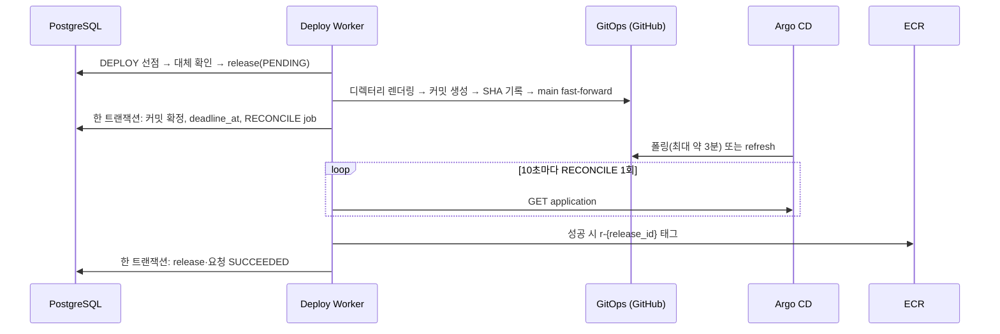
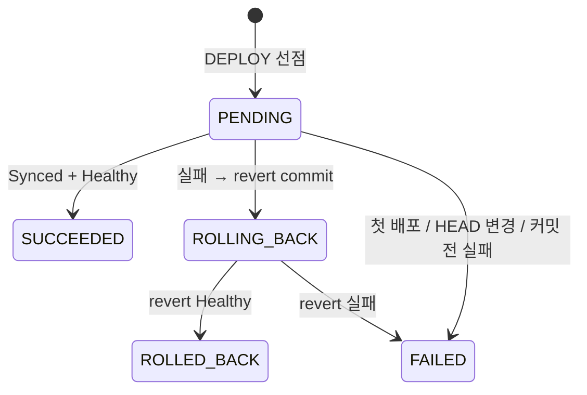

# Deploy Worker 구현 계획 — ECR 이미지 → GitOps → Prod

> 기준일: 2026-10-01 · 대상 레포: iris-was
> 근거: [설계 원문](control-plane-build-deploy-flow.md), [용어 사전](../rules/term-dictionary.md), Build 계획(build-worker-plan.md)
> 원본 계획에서 덜어낸 것과 이유는 [§9](#9-원본-대비-변경-ponytail) 에 모았다.

**Goal**: DEPLOY job 의 이미지를 GitOps 저장소에 커밋하고, Argo CD 가 Prod 에 반영한 결과로 release 를 확정한다. 실패하면 revert commit 으로 되돌린다. 서비스는 `{slug}.<BASE_DOMAIN>` 으로 열린다.

**MVP 범위 밖**: [런타임 환경변수](todo-runtime-variables.md), [pre-deploy command](todo-pre-deploy.md), [PORT 지정](todo-custom-port.md). 모두 Build 계획 Task 7(변수) 뒤에 붙인다(§9).

## 규칙

- Deploy Worker 는 Prod 에 접근하지 않는다. `gitops-environments` 에 커밋하고, Argo CD API 로 상태를 읽기만 한다.
- 서비스마다 `services/{service_id}/prod/values.yaml` 하나를 통째로 렌더링해 커밋한다(§3). manifest 는 Argo CD 가 플랫폼 Helm chart 로 만든다. ApplicationSet 이 디렉터리마다 Application 을 만든다.
- 배포 기준은 `image_ref = {image_repository}@sha256:...` 다. manifest 에 tag 를 쓰지 않는다.
- GitOps 는 새 커밋 + fast-forward 로만 바꾼다. force push 금지.
- 서비스당 진행 중 release 는 하나다. 부분 unique index `(service_id) WHERE status IN ('PENDING','ROLLING_BACK')` 로 강제하고 따로 잠금을 두지 않는다.
- 외부에 쓰기 전에 결과 ID(커밋 SHA)를 먼저 기록하고, 재개할 때 그 ID 로 확인한다.
- job 은 짧게 끝난다. 기다려야 하면 job 을 잡고 있지 않고 snooze 한다.
- 바뀌면 안 되는 이름(namespace·Application·GitOps 경로·ECR)은 `service_id` 로, 도메인만 `slug` 로 만든다.
- 컨테이너 포트는 8080 고정, `PORT=8080` 을 주입한다(사용자 변수가 생기면 그때 덮어쓰기 허용).

## 0. 구현 전 준비

| 구분 | 항목 |
|---|---|
| GitOps 저장소 `gitops-environments` (private) | `platform/`(관리자) · `services/{service_id}/prod/`(bot). ruleset: main PR 필수(bypass 는 `iris-gitops` App 만), push ruleset "Restrict file paths" 로 `platform/**` 차단(bypass 는 관리자 팀만) |
| GitHub App `iris-gitops` | `contents:write`·`metadata:read`, `gitops-environments` 에만 설치. Build 용 App 과 분리 |
| Argo CD (Master) | 3.x 버전 고정. Prod 클러스터 등록(`awsAuthConfig.roleARN`), 저장소 자격증명(읽기 전용), AppProject·ApplicationSet `iris-services`(§3.1), project role `deploy-reader` 토큰(만료 90일) |
| Prod EKS | VPC CNI NetworkPolicy, 노드 IMDSv2 hop limit 1, AWS LB Controller(ALB Ingress group `iris-services`), 노드 IAM 에 ECR pull(`iris/services/*`) |
| AWS (Terraform, iris-infra) | `BASE_DOMAIN` 은 Control Plane 과 다른 등록 도메인(쿠키·피싱 격리). Route 53 `*.<BASE_DOMAIN>` → 공유 ALB(ACM 와일드카드, 컨트롤러가 생성). Deploy Worker IAM(§6), Argo application-controller → Prod access entry. Secrets Manager: `iris-gitops` private key, Argo 토큰 |
| 앱 설정 | `DeployWorkerSettings`(`BuildWorkerSettings` 와 같은 방식): `AWS_REGION`, `GITOPS_REPOSITORY`, `GITOPS_APP_ID`, `GITOPS_APP_PRIVATE_KEY`(SecretStr), `GITOPS_INSTALLATION_ID`, `ARGOCD_SERVER_URL`, `ARGOCD_TOKEN`(SecretStr). 브랜치(`main`)·리소스 기본값은 코드 상수 |
| 선행 작업 | Control API 가 같은 서비스의 새 요청을 받을 때 이전 요청에 `cancel_requested_at` 을 기록해야 한다(대체 판정에 재사용, §2.2) |

## 1. 흐름



## 2. job 처리

### 2.1 job 생성

| job | 만드는 곳 | payload |
|---|---|---|
| DEPLOY | `BuildService._close` (이미 있음) | `{"build_id"}` |
| RECONCILE | DEPLOY 커밋 확정 · ROLLBACK revert 확정 트랜잭션 | `{"release_id"}` |
| ROLLBACK | RECONCILE 실패 판정 트랜잭션. 이전 정상 release 가 있을 때만 | `{"release_id"}` |

### 2.2 DEPLOY

1. **대체**: 요청에 `cancel_requested_at` 이 있으면 요청은 `SUPERSEDED`, job 은 `SUCCEEDED`. Build Worker 와 같은 판정이다.
2. **직렬화**: 이 요청의 release 가 이미 있으면(재시도·재개) 그것을 쓴다. 없으면 `PENDING` 으로 insert(`previous_good_release_id = lastKnownGood`). in-flight index 에 걸리면 snooze(15초). 먼저 조회하지 않으면 재시도한 job 이 자기 release 의 `deployment_request_id` unique 에 걸려 영영 snooze 한다.
3. **커밋**: 렌더링(§3) → `create_tree` → `create_commit` → `gitops_commit_sha` 기록 → `update_branch`.
4. **확정**: 한 트랜잭션에서 커밋 확정, `deadline_at` 계산(§2.3), RECONCILE 생성.

- 재개: 기록된 SHA 가 main 에 이미 있으면 4번으로. 없으면 fast-forward 를 다시 시도한다.
- non-fast-forward: HEAD 를 다시 읽고 커밋을 다시 만든다(최대 5회). 기록한 SHA 도 바꾼다.
- 커밋 전 외부 오류(GitHub): `DEPLOY_INFRA_ERROR`. `BuildService.retry_or_fail` 과 같은 지수 백오프, `max_attempts` 를 넘으면 FAILED. Git 은 바뀌지 않는다.
- 이미 커밋된 release 는 새 요청이 와도 중단하지 않는다.

### 2.3 RECONCILE — `evaluate_release` (순수 함수)

`contained(rev)` = rev 가 목표 커밋과 같거나 그 이후 커밋이다(GitHub compare). main 은 fast-forward 만 하므로 선형이다.

| 순서 | 조건 | 판정 |
|---|---|---|
| 1 | `contained(operationState.syncResult.revision)` + phase `Failed`·`Error` | 실패 `DEPLOY_FAILED` |
| 2 | `contained(sync.revision)` + Synced + Healthy | 성공 |
| 3 | `contained(sync.revision)` + health `Degraded` (progressDeadlineSeconds 초과) | 실패 `DEPLOY_FAILED` |
| 4 | `now > deadline_at` | 실패 `DEPLOY_TIMED_OUT` |
| 5 | 그 밖 (Application 없음, Argo 가 목표 커밋을 아직 못 봄, Progressing) | 대기 |

- **모든 대기가 4행 deadline 에 걸린다**(원본 표는 "Application 없음"·"sync 미포함"을 먼저 판정해 영영 대기할 수 있었다). sync revision 이 목표를 포함하지 않으면 같은 확인 안에서 `?refresh=normal` 로 한 번 더 읽는다.
- 1행에서 operation revision 을 따로 보는 이유: 직전 release 의 Failed operation 으로 잘못 판정하지 않기 위해서다. compare 는 phase 가 Failed·Error 일 때만 호출한다.
- 2행은 operation 을 보지 않는다. sync revision 이 목표를 포함하고 Synced 면 live 가 목표 manifest 와 같고, Argo 의 Deployment Healthy 는 rollout 완료를 뜻한다.
- **성공**: digest 에 `r-{release_id}` 태그(BatchGetImage → PutImage, 이미 있으면 통과). 그다음 한 트랜잭션에서 release·요청을 `SUCCEEDED`.
- **실패**: 이전 정상 release 가 있으면 ROLLBACK job 생성, 없으면(첫 배포) release·요청을 `FAILED`. 한 트랜잭션.
- Argo·GitHub 호출 오류: snooze 후 다시 확인. deadline 이 지나면 4행에 걸린다. ECR 태그 오류는 WARNING 로그만 남기고 성공 처리를 계속한다(태그는 보호장치라 배포 결과를 바꾸지 않는다).
- 시간 한도: `progressDeadlineSeconds = deploy.healthcheckTimeout`(기본 300초, 30~3600초). `deadline_at = 커밋 시각 + healthcheckTimeout + 10분`(첫 배포의 ApplicationSet 폴링 약 3분 + App 폴링 최대 약 3분 여유, Task 0 측정치로 조정). revert 확정 때 `revert 시각 + A 의 healthcheckTimeout + 10분` 으로 다시 계산한다.

### 2.4 ROLLBACK

1. **멱등**: `revert_commit_sha` 가 이미 main 에 있으면 4번으로.
2. **검사**: HEAD 의 `services/{id}/prod` subtree SHA ≠ B 커밋의 subtree SHA 면 B 는 FAILED, 요청은 `MANUAL_INTERVENTION`. 용어 사전의 나머지 조건(lastKnownGood == A, 더 최신 진행 배포 없음)은 B 가 in-flight 인 동안 index 가 보장한다.
3. **revert commit**: HEAD 트리에서 `services/{id}/prod` 를 A 커밋의 subtree SHA 로 바꾼 커밋을 만든다. SHA 를 `revert_commit_sha` 에 기록한 뒤 fast-forward. non-fast-forward 면 2번부터(최대 5회).
4. **확정**: 한 트랜잭션에서 B 를 `ROLLING_BACK`, `deadline_at` 재계산, RECONCILE(목표 = revert 커밋) 생성. 성공하면 `ROLLED_BACK`, 실패하면 FAILED + `MANUAL_INTERVENTION`.

- 새 요청 C 는 rollback 이 끝날 때까지 in-flight index 에 걸려 snooze 한다. 그동안 A Pod 가 트래픽을 받는다(`maxUnavailable: 0`).
- 외부 오류는 `max_attempts` 까지 재시도, 그래도 안 되면 `MANUAL_INTERVENTION`.
- 첫 배포 실패는 ROLLBACK 을 만들지 않는다. Git 과 CrashLoop Pod 를 그대로 두고 다음 배포가 덮어쓴다.

### 2.5 job 최종 실패와 release

job 을 FAILED·MANUAL_INTERVENTION 으로 닫는 `DeployService` 실패 경로가 **같은 트랜잭션에서** release 도 닫는다(`BuildService.fail` 과 같은 방식). 커밋 전이면 FAILED(`DEPLOY_INFRA_ERROR`), 커밋 후면 요청 `MANUAL_INTERVENTION` + ERROR 로그(`action=rollback_blocked`). lease 만료 job 은 `claim_next_job` 이 다시 가져가므로 job 이 "사라지는" 경로는 없다. 별도 sweeper 를 두지 않는다.

## 3. GitOps 커밋 형태 — Helm values (2026-10-02 결정)

Deploy Worker 는 K8s manifest 를 렌더링하지 않는다. 플랫폼 Helm chart `iris-service`(iris-infra `helm/charts/iris-service`) 의 **values 파일 하나**를 서비스·환경 디렉터리에 커밋하고, manifest 는 Argo CD 가 chart 로 만든다.

```text
gitops-environments/
  platform/argocd/              # ApplicationSet·AppProject (관리자, Worker 쓰기 차단)
  services/{service_id}/prod/
    values.yaml                 # Deploy Worker 가 배포마다 통째로 쓴다 (유일한 파일)
```

### 3.1 values 계약 (Deploy Worker → chart)

```json
{
  "containerPort": 8080,
  "command": ["node", "dist/main.js"],
  "health": { "path": "/health", "timeoutSeconds": 300 },
  "image": { "repository": "<ACCOUNT>.dkr.ecr.<REGION>.amazonaws.com/iris/services/12", "digest": "sha256:<DIGEST>" },
  "release": { "id": 345, "sourceSha": "<SOURCE_SHA>" },
  "route": { "host": "my-app.<BASE_DOMAIN>" }
}
```

| 필드 | 출처 | chart 가 할 일 |
|---|---|---|
| `image.repository`·`image.digest` | `builds.image_repository`·`releases.image_digest` | `image: {repository}@{digest}`. tag 사용 금지 |
| `release.id` | `releases.id` | Pod annotation `iris/release-id` (digest 가 같아도 rollout) |
| `release.sourceSha` | `builds.source_sha` | env `IRIS_GIT_COMMIT_SHA` |
| `containerPort` | 상수 8080 | containerPort·Service targetPort·probe 포트, env `PORT` |
| `command` | `deploy.startCommand` (Dockerfile 빌드만, `shlex.split`) | 있으면 container `command` (ENTRYPOINT·CMD 덮어쓰기, Railway 와 같음) |
| `health.path` | `deploy.healthcheckPath` | 있으면 readiness `httpGet`(Host = `route.host`), 없으면 `tcpSocket` |
| `health.timeoutSeconds` | `deploy.healthcheckTimeout` (30~3600, 기본 300) | Deployment `progressDeadlineSeconds` |
| `route.host` | `{services.slug}.{targets.domain_suffix}` | ALB Ingress host, env `IRIS_PUBLIC_DOMAIN` |

- 파일 내용은 JSON 이다(키 정렬·2칸 들여쓰기). JSON 은 YAML 이라 Helm 이 그대로 읽고, Worker 는 YAML 라이브러리가 필요 없다.
- 리소스·replicas·rolling update(maxUnavailable 0)·`automountServiceAccountToken: false`·ALB Ingress 설정(group·HTTPS·health check)·NetworkPolicy 는 **chart·타겟 기본값**이 정한다. Worker 는 배포마다 달라지는 값만 쓴다.
- values 합성 순서는 iris-infra 계약대로 chart 기본값 → 타겟 기본값(`clusters/aws-dev-workload/values/service-defaults.yaml`) → 이 파일이다.
- 경계: chart `values.schema.json`(최종 검증) + AppProject(kind·namespace 제한). Worker 가 잘못된 값을 쓰면 Argo 가 렌더링을 거부해 sync 되지 않고 `DEPLOY_TIMED_OUT` 으로 끝난다. 이전 Pod 는 그대로다.
- `iris.json` 의 `deploy` 는 `builder_detection.DeployConfig`(`extra="forbid"`)로 빌드 전에 검증해 `BUILD_CONFIG_REQUIRED` 로 끝낸다. 지원하지 않는 `preDeployCommand` 도 여기서 거절한다.

### 3.2 ApplicationSet (multi-source, `platform/argocd/`)

```yaml
apiVersion: argoproj.io/v1alpha1
kind: ApplicationSet
metadata: { name: iris-services, namespace: argocd }
spec:
  goTemplate: true
  generators:
    - git:
        repoURL: https://github.com/<ORG>/gitops-environments.git
        revision: main
        directories: [{ path: "services/*/prod" }]
  syncPolicy:
    applicationsSync: create-update   # 디렉터리가 사라져도 Application·리소스를 지우지 않는다
  template:
    metadata: { name: 'svc-{{ index .path.segments 1 }}' }
    spec:
      project: iris-services
      sources:
        - repoURL: https://github.com/<ORG>/iris-infra.git     # chart 원본 (§3.3)
          path: helm/charts/iris-service
          targetRevision: iris-service-0.2.0                     # 전 서비스 공통 고정 tag
          helm:
            valueFiles: ['$values/{{ .path.path }}/values.yaml']
        - repoURL: https://github.com/<ORG>/gitops-environments.git
          targetRevision: main
          ref: values
      destination: { name: prod, namespace: 'svc-{{ index .path.segments 1 }}' }
      syncPolicy:
        automated: { prune: true, selfHeal: true }
        syncOptions: [CreateNamespace=true, PruneLast=true]
        managedNamespaceMetadata:
          labels:
            pod-security.kubernetes.io/enforce: baseline
            elbv2.k8s.aws/pod-readiness-gate-inject: enabled   # rollout 이 ALB target health 를 기다린다
```

- multi-source Application 은 `status.sync.revisions`·`operationState.syncResult.revisions` 에 **소스별 revision 배열**을 준다. `ArgoCdClient` 는 `spec.sources` 에서 `GITOPS_REPOSITORY` 위치를 찾아 그 revision 으로 판정한다(§2.3). 단일 소스면 `revision` 을 쓴다.
- **AppProject `iris-services`**: sourceRepos 는 `gitops-environments`·chart 저장소만, destinations 는 `{name: prod, namespace: "svc-*"}`. namespaceResourceWhitelist 는 chart 가 만드는 kind(Deployment, Service, Ingress, NetworkPolicy)만. Secret 은 넣지 않는다. role `deploy-reader`: `p, proj:iris-services:deploy-reader, applications, get, iris-services/*, allow`
- **Prod ClusterRole (Argo access entry)**: 위 kind 의 쓰기, namespaces create/get, 위 kind·Pod·ReplicaSet·Namespace 의 get/list/watch. Argo `resource.inclusions` 를 같은 kind 로 제한. ClusterRoleBinding·CRD·Node 권한 없음.

### 3.3 iris-infra 반영 (2026-10-02)

iris-infra ADR 0002 로 확정했다: GitOps 배포, chart 는 **Git tag `iris-service-<version>`**(OCI 없음), 외부 트래픽은 **ALB Ingress group**(ALB 하나 공유, ACM 와일드카드 자동 탐색). chart(`iris-service` 0.2.0)·`contracts/deployment.md`·`release.md` 가 이 문서 §3.1 계약을 따른다. `examples/`·`clusters/*/service-defaults.yaml` 은 정리하지 않아 옛 필드가 남아 있다.

## 4. 상태



| release | 요청 상태 |
|---|---|
| (생성 전 대체됨) | `SUPERSEDED` |
| PENDING·ROLLING_BACK | `DEPLOYING` |
| SUCCEEDED / ROLLED_BACK | 같은 값 |
| FAILED: 첫 배포, 커밋 전 실패 | `FAILED` |
| FAILED: HEAD 변경, revert 실패, 커밋 후 job 최종 실패 | `MANUAL_INTERVENTION` |

- 실패 코드: `DEPLOY_INFRA_ERROR`(커밋 전 외부 오류, 재시도) · `DEPLOY_FAILED` · `DEPLOY_TIMED_OUT`. 커밋 이후의 실패는 재시도하지 않고 §2.4 로 간다.
- lastKnownGood: 컬럼 없이 그 서비스에서 가장 최근 `SUCCEEDED` release 를 조회한다.
- 도메인 연결 여부는 `SUCCEEDED` release 존재로 판단한다(그 전엔 503). `MANUAL_INTERVENTION` 은 새 배포를 막지 않는다.

## 5. 도메인 · slug

새 서비스에 필요한 것은 `values.yaml` 의 `route.host` 뿐이다. chart 의 Ingress 가 공유 ALB 에 host 규칙을 더한다. DNS·인증서는 바꾸지 않는다.

Deploy Worker 는 `services.slug` 를 읽기만 한다. slug 생성·검증은 서비스 등록(Build 계획 Task 3)에서 한다. 그쪽에 넘길 규칙:

- 생성: 소문자 → `[a-z0-9]` 외는 `-` → 연속 `-` 하나로 → 32자로 자름 → 앞뒤 `-` 제거. 비면 `svc-{4자}`.
- 검증(신뢰 경계): `^[a-z0-9](?:[a-z0-9-]{0,30}[a-z0-9])?$`, `xn--` 시작 거절, 점 금지(와일드카드 인증서는 1단계만 보호), 예약어 `www, api, app, admin, dashboard, docs, status, mail, iris, argocd`.
- 충돌: 자동 생성이면 `services.slug` unique 위반 시 앞 27자에 `-{4자}` 를 붙여 3회까지 재시도, 사용자가 입력했으면 409. MVP 에서 slug 변경 불가.

서비스 삭제는 이 계획 밖이다(디렉터리를 지워도 리소스가 남는다).

## 6. 데이터 모델 · 권한

| 테이블 | 변경 |
|---|---|
| `releases` (신규) | 용어 사전 §4.5 중 `deployment_request_id`(unique)·`service_id`·`image_digest`·`gitops_commit_sha`·`previous_good_release_id`·`status` + `build_id`, `revert_commit_sha`, `failure_code`, `deadline_at`, `finished_at`. in-flight 부분 unique index, `(service_id, status, id)` index |
| `services`·`builds`·`jobs` | 변경 없음 |

| 주체 | 허용 (그 외 금지) |
|---|---|
| Deploy Worker | DB, Argo `applications get`, ECR `BatchGetImage`·`PutImage`(`iris/services/*`, 태그만). Prod·CodeBuild 접근 없음 |
| `iris-gitops` App | `gitops-environments` 의 contents:write (`platform/**` 는 ruleset 으로 차단) |
| Argo CD | GitOps·chart 저장소 읽기, Prod ClusterRole(§3.2) |
| 사용자 Pod | SA 토큰 없음, IMDS 차단, NetworkPolicy, PSA baseline |

## 7. 작업 현황

Task 1~7 구현 완료(코드·테스트는 레포 참조). Task 0(인프라 검증)과 iris-infra chart 구현(§3.3)이 남았다.

- Task 0 — 기술 검증: `platform/` 을 실제로 구성하고 샘플 2개(정상·크래시)를 손으로 커밋한다. 커밋→Healthy 시간(refresh 유무별), Application 생성까지 시간, 실패 시 `operationState`·`syncResult` 모양을 기록하고 §8 을 확인한다.
- 계획과 다른 이름: `get_head` → `get_branch_sha` 재사용, `get_subtree_sha` → `find_subtree_sha`, `tag_release` → `EcrClient.tag_image`, `run_deploy` 등 → `DeployService.run` 이 kind 로 분기, 상태 전이는 `Release` 모델 메서드. Worker 루프는 job 을 하나씩 처리한다(`ponytail:` 주석).

## 8. Task 0 확인 항목 · 위험

- **Argo**: `applications get` 권한만으로 `?refresh=normal` 이 되는지 · CreateNamespace 에 Namespace cluster 권한이 필요한지 · PruneLast 에서 Degraded 일 때 operation 이 Failed 로 끝나는지 Running 에 머무는지 · `applicationsSync: create-update` 가 controller policy override 설정 없이 적용되는지(안 되면 디렉터리 삭제 시 리소스도 삭제된다) · multi-source 의 `status.sync.revisions` 순서가 `spec.sources` 와 같은지 · chart 가 schema 위반 values 를 받으면 Application 상태가 어떻게 보이는지(ComparisonError 로 대기 → deadline)
- **GitHub**: create-tree 가 중첩 경로(`services/12/prod`) 항목을 받는지 · non-fast-forward 응답 코드(409·422) · push ruleset 을 우리 플랜·private 레포에서 쓸 수 있는지
- **네트워크**: ALB group 공유·ACM 자동 탐색이 host 별로 되는지, readiness gate 로 rollout 이 ALB health 를 기다리는지, ALB 규칙 수 한도 · VPC CNI NetworkPolicy(`allowedCidrs`)가 kubelet probe 를 막지 않는지
- **기타**: ECR lifecycle 에서 `r-*` 상위 규칙이 `b-*` 규칙의 삭제를 막는지 · Railpack 이미지가 PSA baseline 에서 도는지

**위험**
- 신뢰할 수 없는 코드가 공유 노드에서 돈다. 격리는 PSA baseline·NetworkPolicy·IMDS 차단·SA 토큰 미마운트까지다. gVisor 등은 계획 밖이다.
- 반영 지연은 Argo 폴링 120초 + jitter 60초, ApplicationSet 폴링 3분이다. 느리면 Argo `/api/webhook` 에 GitHub webhook 을 연결한다(외부 노출 필요).
- GitHub API: RECONCILE 마다 compare 를 1회(Failed 일 때 2회) 호출한다. 많아지면 확인한 revision 을 캐시한다.

## 부록 — 원문 · 용어 사전 반영

반영 완료: 설계 원문 §6·§8, 용어 사전 §2·§4.5·§5·§6.

## 9. 원본 대비 변경 (ponytail)

원본 계획에 없던 판단이다. 되돌릴 근거가 생기면 해당 항목만 원본대로 복구한다.

| 덜어낸 것 | 대신 | 다시 넣을 때 |
|---|---|---|
| Sealed Secrets·kubeseal·`SecretSealer`·KMS·이전 버전 Secret 복사·키 관리 | 변수 없이 배포 | Build Task 7(변수) 구현 후, 한 계획으로 |
| pre-deploy Job·`PRE_DEPLOY_FAILED`·Task 9 | `preDeployCommand` 를 빌드 전 거절 | 변수와 같이. DB 접속 정보 없는 pre-deploy 는 쓸 데가 없다 |
| `exists_newer_deploy` | 기존 `cancel_requested_at` (Build Worker 와 같은 판정) | — |
| ROLLBACK 의 "새 DEPLOY 대기 시 rollback 생략" 분기 | 항상 rollback, 새 요청은 in-flight index 로 대기 | rollback 대기 시간이 문제 될 때 |
| sweeper `close_orphaned` | job 최종 실패 트랜잭션에서 release 도 닫음(`BuildService.fail` 패턴) | — |
| 성공 판정의 operation revision 확인 | Synced + Healthy + sync revision 포함 | hook 을 다시 넣을 때 |
| 별도 `gitops_client.py`·`create_restore_commit`·`read_file` | `GitHubClient` 에 메서드 추가, subtree 교체 커밋 하나로 DEPLOY·ROLLBACK 공용 | — |
| `secret_sealer.py`·`slug.py`·`manifest_renderer.py`·`release_evaluator.py` 파일 분리 | `deploy_service.py` 안 순수 함수 | 파일이 커지면 |
| (Helm 계획) 서비스별 `service.yaml`(ApplicationSet 입력) | directory generator `services/*/prod` + 전 서비스 공통 chart 버전 | 서비스마다 chart 버전(workload-v2 이행)을 달리할 때 files generator 로 |
| (Helm 계획) values 를 읽어 허용 필드만 patch | 파일 전체를 매번 렌더링(읽기·병합·YAML 파서 없음). 경계는 chart schema + AppProject | 관리자가 서비스별로 values 를 손으로 덮어써야 할 때. 그 값은 DB(서비스 설정)에 두는 쪽을 먼저 검토 |
| (Helm 계획) Worker 에서 `helm template` + schema 검증 | Argo 가 렌더링 때 schema 로 거부 → sync 안 됨 → deadline | Worker 이미지에 helm·chart 를 넣을 이유가 생길 때. 먼저 chart schema 로 values 를 검증하는 계약 테스트를 둔다 |
| (Helm 계획) values 의 `resources`·`scaling`·`variablesVersion` | chart·타겟 기본값 / 변수 기능(todo) | 서비스별 리소스 설정·HPA 를 제공할 때 |
| slug Task 3 | 서비스 등록(Build Task 3)으로 이관, 규칙만 §5 에 남김 | — |
| `services.domain_connected_at` | SUCCEEDED release 존재로 판단 | 연결 시각 자체가 필요할 때 |
| `releases.image_repository`·`variables_version`·`started_at`·`environment`·`argo_*_status` | `builds`·`created_at`·요청 조인, 로그 | 조회 성능·이력 요구가 생길 때 |
| `GITOPS_BRANCH`·예약어 Settings, 리소스 기본값 | 코드 상수 / chart·타겟 기본값 | 환경마다 달라질 때 |
| 사용자 `PORT` 변수 반영(`resolve_port`) | 8080 고정 | 변수 도입 때 |
