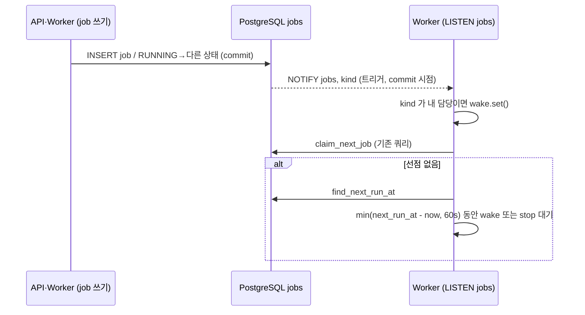

# Build·Deploy Worker 를 PostgreSQL LISTEN/NOTIFY 로 깨우는 계획

> 대상: iris-was 만 (iris-infra·Control API 변경 없음)
> 기준: [설계 원문 §5](control-plane-build-deploy-flow.md) "`LISTEN/NOTIFY` 는 즉시 깨우기 용도로만", `app/workers/*`, `app/repositories/job_repository.py`
> 대안 검토: [SQS 전환 계획](sqs-job-dispatch-plan.md) (보류)
> 작성: 2026-10-03 · **구현 결과는 [ADR 0019](../../docs/adr/0019-job-wakeup-listen-notify.md) 를 따른다.** 트리거 조건(DEPLOY 계열 종료는 알리지 않음)·대기 규칙(DB 시계, 리스너 ping, 오류 시 5초)이 이 계획에서 바뀌었다.

## 1. 결정

- **`jobs` 테이블이 계속 진실 원본이고 선점 쿼리(`claim_next_job`)도 그대로다.** 바뀌는 것은 "언제 선점을 시도하나"뿐이다.
- 지금은 Worker 가 5초마다 선점 쿼리를 실행한다(전역 advisory lock 포함). 전환 후에는 아래 셋 중 가장 먼저 오는 때에 실행한다.
  1. `jobs` 트리거가 보낸 NOTIFY
  2. 가장 이른 미래 `run_after` (재시도 backoff·RECONCILE 10초 snooze)
  3. 60초 fallback (알림 유실·lease 만료 회수)
- **NOTIFY 는 앱 코드가 아니라 DB 트리거가 보낸다.** job 생성·상태 변경 지점이 API·두 Worker 에 7곳 넘게 흩어져 있다. 트리거 하나면 발행 지점을 손대지 않고, 알림이 commit 시점에만 나가는 것도 DB 가 보장한다.

## 2. 흐름



## 3. 변경 내용

### 3.1 트리거 (Alembic revision 1개 + `db-schema.sql`)

```sql
CREATE FUNCTION notify_job_change() RETURNS trigger LANGUAGE plpgsql AS $$
BEGIN
  PERFORM pg_notify('jobs', NEW.kind);
  RETURN NULL;
END $$;

CREATE TRIGGER trg_jobs_notify_insert AFTER INSERT ON jobs
  FOR EACH ROW EXECUTE FUNCTION notify_job_change();

CREATE TRIGGER trg_jobs_notify_release AFTER UPDATE OF status ON jobs
  FOR EACH ROW WHEN (OLD.status = 'RUNNING' AND NEW.status <> 'RUNNING')
  EXECUTE FUNCTION notify_job_change();
```

알림이 나가는 경우와 이유:

| 변경 | 알림 | 이유 |
|---|---|---|
| job INSERT | O | 새 작업 (API 의 BUILD·DEPLOY, Worker 의 DEPLOY·RECONCILE·ROLLBACK) |
| RUNNING → QUEUED·RETRY_WAIT | O | 반납·snooze·재시도. 대기 시간은 Worker 가 `run_after` 로 다시 계산한다 |
| RUNNING → SUCCEEDED·FAILED·MANUAL_INTERVENTION | O | 사용자별 동시 빌드 제한에 막혀 있던 BUILD 가 선점 가능해진다 |
| QUEUED·RETRY_WAIT → RUNNING (선점) | X | 다른 Worker 를 헛되이 깨우지 않는다 |
| lease 갱신·`external_id` 기록 | X | status 가 바뀌지 않는다 |

- autogenerate 가 트리거를 감지하지 못하므로 `op.execute` 로 직접 쓰고, downgrade 에서 트리거 2개와 함수를 지운다(db-migration.md 의 ENUM 수동 작성과 같은 방식).
- 같은 트랜잭션에서 같은 채널·payload 로 보낸 알림은 1건으로 합쳐진다. 중복 걱정이 없다.

### 3.2 리스너 (`app/core/database.py`)

SQLAlchemy 풀과 별개인 asyncpg 연결 1개를 Worker 프로세스마다 연다. 풀 연결은 트랜잭션에 묶여 반납되므로 LISTEN 을 유지할 수 없다.

```python
async def listen_jobs(kinds: frozenset[JobKind], wake: asyncio.Event) -> asyncpg.Connection:
    dsn = make_url(get_settings().database_url).set(drivername="postgresql")
    conn = await asyncpg.connect(dsn.render_as_string(hide_password=False))
    await conn.add_listener("jobs", lambda _c, _pid, _ch, kind: kind in kinds and wake.set())
    return conn
```

- TLS 는 asyncpg 가 `PGSSLMODE`·`PGSSLROOTCERT` 환경변수를 읽으므로 chart 설정을 그대로 따른다(SQLAlchemy 엔진과 같은 경로).
- 연결이 끊기면(`conn.is_closed()`) 대기 루프에서 다시 연다. 다시 열지 못해도 60초 fallback 으로 계속 동작한다.

### 3.3 Worker 대기 루프 (`app/workers/build_worker.py`, `deploy_worker.py`)

```python
wake.clear()                     # 선점 전에 비운다. 선점 중 도착한 알림을 놓치지 않는다.
job = await _claim(service)
if job is None:
    next_run_at = await service.find_next_run_at()
    await _wait(stop, wake, timeout=_wait_seconds(next_run_at))   # min(남은 초, 60)
```

- `POLL_INTERVAL_SECONDS = 5.0` → `FALLBACK_SECONDS = 60.0`.
- Build Worker 의 `Semaphore` 구조, Deploy Worker 의 1건씩 처리는 그대로다.
- `BuildWorkerSettings.poll_interval_seconds`(CodeBuild 상태 조회 간격)는 이번 변경과 무관하다.

### 3.4 다음 실행 시각 조회 (`JobRepository.find_next_run_at`)

```sql
SELECT min(run_after) FROM jobs
WHERE kind = ANY(:kinds) AND status IN ('QUEUED', 'RETRY_WAIT') AND run_after > now();
```

- 미래 시각만 본다. 이미 지난 job 이 선점되지 않았다면 사용자 빌드 제한에 막힌 것이므로, 실행 중 BUILD 가 끝날 때 오는 알림(§3.1)을 기다린다. 과거 시각을 포함하면 대기 시간이 0이 돼 바쁜 루프가 된다.
- `BuildService`·`DeployService` 에 `find_next_run_at()` 을 `claim_next_job()` 과 같은 모양으로 둔다.

## 4. 작업 단계 (PR 하나)

1. ADR `docs/adr/0019-job-wakeup-listen-notify.md`: §1 결정, SQS 대안을 보류한 이유(인프라·IAM·Control API 권한 변경 없이 같은 목적 달성).
2. Alembic revision(§3.1) + `db-schema.sql`·`db-schema-changelog.md` 반영.
3. `listen_jobs`, `find_next_run_at`, 두 Worker 대기 루프 변경.
4. 테스트(§5).
5. 문서: README Worker 설명("폴링 루프" 문장), 설계 원문 §5 의 "Worker 는 lease 를 주기적으로 갱신…" 아래에 깨우기 규칙 한 줄.
6. dev 배포: "Deploy platform" 워크플로로 `api`(PreSync migration 포함) → `build_worker`·`deploy_worker` 순서. 트리거가 먼저 생겨도 기존 Worker 는 알림을 무시하므로 순서가 바뀌어도 안전하다.

dev 확인 항목:

- 배포 요청 직후 BUILD 시작까지 1초 안팎 (Worker 로그 `worker started` 이후 첫 선점 시각).
- RECONCILE 이 약 10초 간격으로 계속 실행된다.
- 빌드 중 Build Worker Pod 삭제 → 반납 알림으로 다른 Pod 가 즉시 이어 받는다.
- idle 상태에서 RDS Performance Insights(또는 `pg_stat_statements`) 기준 선점 쿼리 빈도가 Worker 당 분당 약 12회 → 1회 수준으로 줄어든다.

## 5. 테스트

- 단위: `_wait_seconds` — `next_run_at` 이 없거나 60초 넘게 남으면 60, 10초 남으면 10.
- 통합(`integration`, 실제 DB, 트리거는 `alembic upgrade head` 로 생긴다): 별도 연결로 `LISTEN jobs` 후
  - INSERT → 알림 1건, payload 는 kind
  - 선점(QUEUED → RUNNING)·lease 갱신 → 알림 없음
  - RUNNING → SUCCEEDED → 알림 1건
- 기존 Worker 통합 시나리오는 그대로 통과해야 한다(선점 쿼리를 바꾸지 않았다).

## 6. 롤백

**주의: 이전 이미지에는 새 Alembic revision 파일이 없다.** digest 만 되돌리면 PreSync migration Job 의 `alembic upgrade head` 가 "알 수 없는 revision" 으로 실패해 Argo sync 가 멈춘다(ADR 0013 과 같은 원리).

1. 새 이미지로 `alembic downgrade -1` 실행 → 트리거·함수 삭제 (DDL 만이라 데이터 영향 없음).
2. 그다음 gitops `platform/aws-dev-management/was.yaml` 의 digest 를 이전 값으로 되돌린다.

트리거만 남아 있는 상태는 무해하다(듣는 쪽이 없으면 `pg_notify` 비용이 거의 없다). 급할 때는 1번 없이 Worker digest 만 되돌리고 `api` digest 는 유지한다.

## 7. 리스크

- **알림은 저장되지 않는다.** 리스너 재연결 중이나 Pod 재시작 중의 알림은 사라진다. 60초 fallback 이 최대 지연을 정한다.
- **lease 만료 회수 지연**: Pod 강제 종료 후 lease 5분 + 최대 60초. 지금(5분 + 5초)보다 약 1분 늘어난다.
- **연결 수**: Worker 프로세스당 연결이 1개 늘어난다. 현재 replica 1~2개라 RDS `max_connections` 에 영향이 없다.
- **PgBouncer 도입 시**: transaction pooling 을 거치면 LISTEN 이 동작하지 않는다. 리스너만 RDS 에 직접 붙여야 한다.

## 부록. 원문에 없이 추가한 판단

- 트리거 대신 앱 코드에서 `pg_notify` 를 호출하는 방식도 가능하지만, 발행 지점 7곳 이상을 고쳐야 하고 하나만 빠뜨려도 그 경로는 60초 지연이 된다. 트리거를 택했다.
- `find_next_run_at` 쿼리는 인덱스를 추가하지 않는다. `jobs` 는 작고 idle 루프에서만 실행된다. 느려지면 `(kind, run_after) WHERE status IN ('QUEUED','RETRY_WAIT')` 부분 인덱스를 추가한다.
- 모든 replica 가 알림마다 깨어나 선점을 시도한다. replica 1~2개에서는 무시할 수준이다. 늘어나서 문제가 되면 payload 에 job id 를 넣고 해당 job 만 선점한다.
- 60초 fallback 값은 상수로 둔다. 운영에서 조정할 일이 생기면 Settings 로 올린다.
