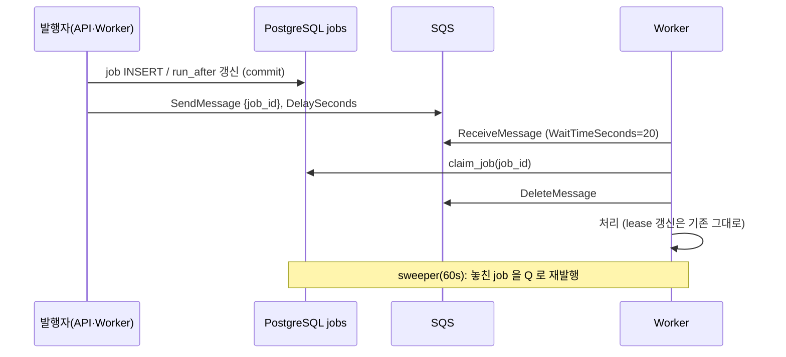

# Build·Deploy Worker 작업 전달을 DB polling 에서 SQS 로 전환하는 계획

> 대상: iris-was(Control API·Worker), iris-infra(SQS·IAM·chart)
> 기준: [설계 원문 §5](control-plane-build-deploy-flow.md), `app/workers/*`, `app/repositories/job_repository.py`
> 작성: 2026-10-03 (2차 검토: 과설계 제거)

## 1. 결정

**`jobs` 테이블은 진실 원본으로 그대로 두고, SQS 는 `{job_id}` 를 전달하는 깨우기 신호로만 쓴다.**

- SQS 를 진실 원본으로 바꾸지 않는다. 사용자별 동시 빌드 제한(실행 중 job 을 세는 쿼리), lease·재개(`codebuild_build_id`), 빌드 성공 → 상태 전이 → DEPLOY job 생성 트랜잭션(`BuildService._close`)을 SQS 로는 표현할 수 없다.
- 그래서 **스키마 변경이 없고**, 롤백은 이전 이미지 digest 로 되돌리기만 하면 된다. 이전 이미지는 DB 를 polling 하고 DB 상태는 그대로다.
- 바뀌는 것: Worker 마다 5초 간격 `claim_next_job`(전역 advisory lock) → SQS long polling + 받은 `job_id` 1건 선점. 남는 DB polling 은 60초 주기 sweeper 하나다.

## 2. 흐름



- 발행은 **commit 뒤**. 발행 실패는 경고 로그만 남기고 sweeper 가 복구한다.
- 메시지 본문은 `{"job_id": int}` 뿐이다. 중복 메시지는 선점 조건이 걸러낸다(at-least-once 는 지금과 같다).

## 3. 큐 (iris-infra)

| 큐 | 소비 | 발행 |
|---|---|---|
| `iris-dev-build-jobs` | Build Worker | API, Build Worker(재시도·반납) |
| `iris-dev-deploy-jobs` | Deploy Worker | API(이미지 재사용 배포), Build Worker(빌드 성공), Deploy Worker |

- Standard 큐. FIFO 는 메시지 단위 `DelaySeconds` 를 지원하지 않는다.
- `visibility_timeout_seconds = 60`, `message_retention_seconds = 86400`, `sqs_managed_sse_enabled = true`. 나머지는 기본값.
- DLQ 없음 (§7).

## 4. 수신 (iris-was)

`claim_next_job` 을 `claim_job(job_id, ...)` 로 바꾼다. 기존 WHERE 조건(상태·`run_after`·만료 lease·사용자별 제한·advisory lock)에 `Job.id == job_id` 를 더하고 `ORDER BY`/`LIMIT` 은 뺀다.

| 선점 결과 | 처리 |
|---|---|
| 성공 | 삭제 → 기존 `service.run(job)` |
| 아직 실행할 수 없음 (`run_after` 미래, 사용자 빌드 제한) | `DelaySeconds = max(run_after - now, 30)` (최대 900) 재발행 후 삭제 |
| 그 밖의 실패 (없음·종료·다른 Worker 가 lease 보유) | 중복. 삭제만 |
| DB 오류 | 삭제하지 않음. 60초 뒤 재수신 |

- Build Worker: 빈 슬롯 수만큼 `MaxNumberOfMessages`(최대 10). 기존 `Semaphore` 유지.
- Deploy Worker: 1건씩. 기존 구조 유지.

## 5. 발행 지점

`app/clients/aws_clients.py` 에 `JobQueueClient.send(job_id, kind, delay)` 하나를 둔다(AWS 호출 한곳 규칙). kind 로 큐를 고르고 `delay` 는 900초로 자른다. 현재 최대 backoff 는 240초(30초 × 2³)라 자를 일은 없다.

| 파일 | 지점 | 지연 |
|---|---|---|
| `services/deployment_request_service.py` | BUILD job 생성, 이미지 재사용 DEPLOY job 생성 | 0 |
| `services/build_service.py` | `retry_later`, 종료 신호 `release`, `_close` 의 DEPLOY job | backoff / 0 / 0 |
| `services/deploy_service.py` | `retry_later`, `_snooze`, `_add_job` 3곳 | backoff / snooze / 0 |

- `_add_job` 은 `session.add` 만 하므로 `flush` 후 id 를 돌려주게 바꾼다.
- 구현 전 `grep -rn "Job(" app/` 로 위 표 밖의 생성 지점(웹훅·수동 배포 경로)이 없는지 확인한다.

## 6. Sweeper

Worker 프로세스 안의 백그라운드 태스크. 60초마다 자기 kind 에 대해 아래를 조회해 지연 0으로 재발행한다. DB 는 바꾸지 않고, replica 간 중복 발행은 선점이 걸러내므로 lock 을 두지 않는다.

```sql
SELECT id FROM jobs
WHERE kind = ANY(:kinds) AND (
  (status IN ('QUEUED','RETRY_WAIT') AND run_after < now() - interval '5 minutes')
  OR (status = 'RUNNING' AND locked_until < now())
)
LIMIT 100;
```

- 발행 유실·Pod 강제 종료 후 lease 만료·전환 시점에 이미 쌓여 있던 job 을 모두 이 하나로 복구한다. 최대 지연 약 6분(현재 polling 도 lease 만료 5분을 기다리므로 동급).

## 7. 작업 단계

iris-infra 먼저 적용, 그다음 iris-was PR 하나.

### P1. iris-infra

| 순서 | 위치 | 내용 | 적용 |
|---|---|---|---|
| 1 | `terraform/account/aws/ci-foundation.tf` | CI apply 역할: `arn:aws:sqs:<region>:<account>:iris-dev-*` 대상 `sqs:CreateQueue·DeleteQueue·GetQueueAttributes·SetQueueAttributes·TagQueue·UntagQueue·ListQueueTags` | 관리자 선적용 |
| 2 | `terraform/account/aws/ci-eks.tf` | `runtime_role_arns`·`PassPodIdentityRoles` 에 `iris-dev-api` | 관리자 선적용 |
| 3 | `foundation/queue.tf` (신규) | §3 큐 2개 | CI |
| 4 | `foundation/build.tf`·`platform-identity.tf` | Build Worker: build 큐 Receive·Delete·Send + deploy 큐 Send / Deploy Worker: deploy 큐 Receive·Delete·Send | CI |
| 5 | `foundation/platform-identity.tf`·`outputs.tf` | `iris-dev-api` 역할(신뢰: `iris-platform` ns, SA `iris-platform-api`), 두 큐 `SendMessage` 만. 큐 URL·역할 ARN output | CI |
| 6 | `management/identity.tf` | `iris-platform-api` Pod Identity 연결 | CI |
| 7 | `helm/charts/iris-platform` + `clusters/aws-dev-management/values/platform.yaml` | `queues.buildUrl`·`queues.deployUrl` → api·두 Worker 에 `BUILD_QUEUE_URL`·`DEPLOY_QUEUE_URL`, api 에 `AWS_REGION`. schema 갱신 | Argo |
| 8 | `foundation/tests/access.tftest.hcl` | api 역할이 `SendMessage` 만 갖는지 단언 1개 | — |

- 네트워크 변경 없음(baseline NetworkPolicy 443 허용, NAT 경유).
- 완료 조건: plan 이 큐 2·역할 1·정책 변경·Pod Identity 1 만 보인다. 적용 후 api Pod 에서 `aws sqs get-queue-url` 성공, `aws sqs receive-message` 는 `AccessDenied`.

### P2. iris-was (PR 하나)

- `Settings`: `aws_region`·`build_queue_url`·`deploy_queue_url` 추가(필수).
- `JobQueueClient`, §4 수신 루프, §5 발행 지점, §6 sweeper.
- `claim_next_job`·`POLL_INTERVAL_SECONDS` 삭제. polling 모드 플래그는 두지 않는다(롤백은 digest 되돌리기).
- 로컬: `docker-compose.dev.yml` 에 ElasticMQ(`softwaremill/elasticmq-native`) 추가, `SQS_ENDPOINT_URL` 로 boto3 endpoint 지정.
- ADR `docs/adr/0016-sqs-job-dispatch.md`: §1 결정, **Control API 에 처음 생기는 AWS 권한(`sqs:SendMessage`)**, 대안(`LISTEN/NOTIFY`) 기록. README·CLAUDE.md 권한 경계 문장, 설계 원문 §5, 용어 사전(sweeper) 갱신.

### P3. dev 검증

- 배포 1건이 QUEUED → SUCCEEDED, 시작 지연 수 초.
- 빌드 중 Build Worker Pod 삭제 → 다른 Pod 가 `codebuild_build_id` 로 이어 받음.
- job 을 DB 에만 INSERT → 6분 안에 sweeper 가 처리.

## 8. 테스트

- 단위: 가짜 `JobQueueClient` 로 §5 지점이 commit 뒤 올바른 큐·지연으로 발행하는지, §4 표 4행.
- 통합(`integration`, 실제 DB): `claim_job` 이 lease 보유·사용자 제한 초과 job 을 거르고 만료 lease 를 회수하는지. 기존 Worker 통합 시나리오는 `claim_job` 경로로 그대로 통과해야 한다.

## 9. 롤백

- 앱: gitops `platform/aws-dev-management/was.yaml` 의 digest 를 이전 값으로 되돌린다. 진행 중 job 은 이전 이미지의 polling 이 이어 받는다.
- 인프라: 큐·역할은 남겨도 비용이 없다. 지울 때는 chart 의 큐 URL 을 먼저 빼고 plan 확인 후 apply.

## 10. 리스크

- **Control API 권한 확대**: 지금은 AWS 역할이 없다. 두 큐 `SendMessage` 로만 좁힌다.
- **CI apply 권한**: main 자동 apply 가 이미 IAM 부족으로 실패 중이다. P1-1·2 는 관리자 로컬 적용이 먼저다.
- **backlog 중복 메시지**: 빌드 슬롯이 5분 넘게 가득 차면 sweeper 재발행으로 중복이 생긴다. 무해하고 로그만 는다.

## 부록. 원문에 없이 추가한 판단

- **목적 재확인**: 목적이 "지연 단축·DB 부하 감소"뿐이라면 설계 원문이 이미 적어 둔 `LISTEN/NOTIFY` 로 인프라 변경 없이 같은 효과를 낸다. SQS 를 택하는 이유를 ADR 에 남긴다.
- 비용: 수신 루프는 Pod 당 월 약 13만 요청(20초 long polling). replica 2~4개면 SQS 무료 티어(월 100만 요청) 안이다. VPC interface endpoint 는 AZ 당 시간 과금이라 두지 않는다.
- 2차 검토로 뺀 것과 추가 시점:
  - DLQ — 메시지는 진실 원본이 아니고 sweeper 가 복구한다. 본문 파싱 실패가 실제로 반복되면 추가.
  - `poll|sqs` 플래그·발행 선행 단계·정리 단계 — DB 가 원본이라 digest 롤백으로 충분하다. 운영 트래픽이 생겨 무중단 단계 전환이 필요해지면 추가.
  - `dispatched_at` 컬럼 — backlog 중복이 실제로 문제 되면 추가.
  - DLQ·큐 지연 CloudWatch 알람 — 알림 채널이 정해지면 추가.
  - `priority` 컬럼 정리 — 코드에서 0 외에 쓰지 않는다. 제거는 별도 마이그레이션에서.
