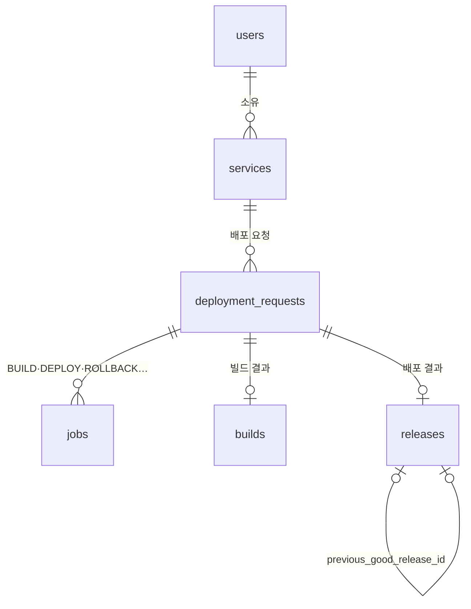

# AnyDeploy 개발자 용어 사전 (Developer Term Dictionary)

> Railway 와 비슷한 배포 서비스 **AnyDeploy** 의 Control Plane(이 레포)에서 쓰는 용어·식별자 사전이다. 용어 → 코드 식별자(case·타입·Enum) 매핑과 도메인 모델을 다룬다.
> - **근거 문서**: [control-plane-build-deploy-flow.md](../docs/control-plane-build-deploy-flow.md) (이하 "원문")
> - **물리 스키마**: [db-schema.sql](db-schema.sql) 이 DDL 단일 출처다. 이 문서와 어긋나면 둘을 함께 고친다.
> - **`*` 표시**: 원문에 없어서 새로 제안한 항목이다. 구현하면서 확정되면 `*` 를 지운다.

---

## 1. 표기 규칙

- **하나의 표준 영문 용어**를 정하고, 언어별로 **표기법(case)만** 바꾼다. Python·SQL 은 `snake_case`, API JSON 은 `camelCase`(스키마 alias)를 쓴다.
- **테이블명은 `snake_case` 복수형**(`jobs`, `builds`)이다. 원문 테이블명을 따르며, backend-conventions §2.5 의 단수형 규칙보다 이 규칙이 우선한다. Model 클래스명은 `PascalCase` 단수형(`Job`)이다.
- **Enum 코드** 규칙
  - 내부 상태·종류: `UPPER_SNAKE` (`QUEUED`, `BUILD`)
  - 사용자 설정 파일에서 온 값: 설정 파일 표기 그대로 소문자 (`dockerfile`)
  - 외부 시스템 값(Argo CD 상태): 원본 표기 그대로 저장 (`Healthy`)
- **시각** 필드는 `*_at` 이름에 `timestamptz`(UTC) 타입을 쓴다.
- **외부 시스템 ID** 는 `{시스템}_{대상}_id` 형식이다 (`codebuild_build_id`). Git SHA 필드는 `*_sha` 로 끝난다 (`source_sha`, `gitops_commit_sha`).
- **이미지 참조**
  - `image_digest`: `sha256:...` 값만 담는다.
  - `image_repository`\*: ECR 저장소 URI 를 담는다.
  - 둘을 합친 배포 참조가 `image_ref`\* = `{image_repository}@{image_digest}` 다.
  - **tag 필드는 두지 않는다.**

---

## 2. 컴포넌트

| 용어 | 코드 위치 | 비고 |
|---|---|---|
| Control Plane | 이 레포 전체 | Control API + Build Worker + Deploy Worker |
| Control API | `app/main.py`, `app/routers/` | 원문 §8 의 `deploy-api` 와 같은 것. 이름을 Control API 로 통일한다 |
| Build Worker | `app/workers/build_worker.py` | 원문 §8 의 `build-dispatcher` 와 같은 것. 이름을 Build Worker 로 통일한다 |
| Deploy Worker | `app/workers/deploy_worker.py` | DEPLOY·ROLLBACK·RECONCILE job 처리 |
| Master Cluster | — | Control Plane·Argo CD 가 도는 EKS |
| Prod Cluster | — | 사용자 서비스가 도는 EKS. Argo CD 만 접근한다 |
| GitOps 저장소 | `gitops-environments` (별도 레포) | 서비스·환경별 `services/{service_id}/prod/values.yaml`(플랫폼 Helm chart `iris-service` 의 values). Deploy Worker 가 파일 전체를 렌더링해 커밋하고, manifest 는 Argo CD 가 chart 로 만든다. Prod namespace 는 `svc-{service_id}` |

---

## 3. 도메인 모델

---

## 4. 엔티티·테이블

### 4.0 사용자 (User) — `users`\*

GitHub 로그인 사용자. `github_user_id`(unique), `login`.

### 4.1 서비스 (Service) — `services`\*

사용자가 배포하는 앱 하나다. 빌더는 등록 때 확정하지 않고 빌드마다 정한다(원문 §4 와 다름). 우선순위는 코드 설정(`{root_directory}/iris.json`) > 서비스 설정 > 자동 감지다. 플랫폼(`linux/amd64`)·Railpack 버전은 CodeBuild buildspec(iris-infra)에 고정한다.

| 필드 | 설명 |
|---|---|
| `owner_user_id`\* | 소유 사용자. 사용자별 동시 빌드 한도의 기준 |
| `name`\* | 표시 이름 |
| `slug`\* | 고유 식별 이름 |
| `github_repository_id`\* | 소스 레포 ID. 레포 이름이 바뀌어도 유지된다 |
| `repository_full_name`\* | `{owner}/{repo}` |
| `github_installation_id`\* | GitHub App installation ID. 없으면 공개 레포로 보고 우리 조직 설치 토큰을 쓴다 |
| `root_directory`\* | 모노레포 안 서비스 경로 (기본 `.`) |
| `builder` | `builder` Enum (§5). 기본 `auto` |
| `dockerfile_path` | Dockerfile 경로 (`root_directory` 기준, 기본 `Dockerfile`) |
| `auto_deploy`\* | default 브랜치 push 때 자동 배포 |

### 4.2 배포 요청 (DeploymentRequest) — `deployment_requests`

사용자의 배포 요청 1건이다. 빌드부터 배포 완료까지 전체 흐름의 최상위 단위다.

| 필드 | 설명 |
|---|---|
| `service_id` | 대상 서비스 |
| `environment` | `environment` Enum (§5) |
| `trigger`\* | `deployment_trigger` Enum (§5) |
| `source_sha` | 빌드할 소스 커밋 SHA. 수동 배포는 비워 두고 Build Worker 가 default 브랜치 HEAD 로 확정한다 |
| `idempotency_key` | 중복 요청 차단 키. unique 제약을 건다\* |
| `requested_by`\* | 요청자 |
| `status` | `deployment_status` Enum (§5). 원문의 "최종 상태" |
| `failure_code`\* | 실패 사유 코드 (§5) |
| `cancel_requested_at`\* | 같은 서비스에 새 요청이 들어와 중단을 요청한 시각. Worker 가 보고 `SUPERSEDED` 로 끝낸다 |

### 4.3 작업 (Job) — `jobs`

PostgreSQL 기반 큐의 작업 1건이다. 전달 보장은 at-least-once 다.

| 필드 | 설명 |
|---|---|
| `deployment_request_id`\* | 소속 배포 요청 |
| `kind` | `job_kind` Enum (§5) |
| `status` | `job_status` Enum (§5) |
| `payload` | 작업 입력 (jsonb). BUILD·DEPLOY 는 `{"build_id": int}` |
| `priority` | 높을수록 먼저 선점된다 |
| `run_after` | 이 시각 이후에만 선점할 수 있다. 재시도 백오프에 쓴다 |
| `attempts` | 선점될 때마다 +1 |
| `max_attempts`\* | 재시도 한도. 넘으면 `FAILED` |
| `locked_by` | 선점한 Worker 식별자 |
| `locked_until` | lease 만료 시각 |
| `external_id`\* | 외부 작업 ID (CodeBuild ID·commit SHA). **외부 호출 직후 먼저 기록**한다 |
| `last_error`\* | 마지막 실패 메시지 |

### 4.4 빌드 (Build) — `builds`

| 필드 | 설명 |
|---|---|
| `deployment_request_id`\* | 소속 배포 요청 (1:1) |
| `status`\* | `build_status` Enum (§5) |
| `builder` | 실제로 사용한 빌더 (`dockerfile`·`railpack`) |
| `source_sha`\* | 확정한 소스 커밋 SHA |
| `codebuild_build_id` | CodeBuild 빌드 ID. 있으면 재시도 때 스냅샷·StartBuild 를 건너뛴다 |
| `attempt`\* | CodeBuild 시작 차수. FAULT 로 다시 빌드할 때 +1. StartBuild idempotencyToken 에 쓴다 |
| `image_repository`\* | ECR 저장소 URI (`iris/services/{service_id}`) |
| `image_tag`\* | `b-{build_id}`. 불변 태그 |
| `image_digest` | 빌드 결과 digest |
| `deploy_config`\* | `iris.json` 의 `deploy.*` 원본 (jsonb). Deploy Worker 가 읽는다 |
| `failure_code`\* | 실패 사유 코드 (§5) |
| `log_url` | CodeBuild 로그 URL |
| `started_at`\*, `finished_at`\* | 처리 시작·종료 시각 |

원문 §6 은 SBOM·스캔 결과도 저장한다고 한다. 해당 필드는 구현 순서 7단계(SBOM·이미지 서명)에서 정한다.

### 4.5 릴리스 (Release) — `releases`

GitOps 에 반영된 배포 결과 1건이다.

| 필드 | 설명 |
|---|---|
| `deployment_request_id` | 소속 배포 요청 (1:1) |
| `build_id` | 배포한 빌드 |
| `service_id` | 대상 서비스. 진행 중(`PENDING`·`ROLLING_BACK`) release 는 서비스당 하나다(부분 unique index) |
| `image_digest` | 배포한 digest |
| `gitops_commit_sha` | 서비스 디렉터리를 바꾼 GitOps 커밋. fast-forward 전에 먼저 기록한다 |
| `revert_commit_sha` | 실패 후 이전 정상 release 로 되돌린 커밋 |
| `previous_good_release_id` | 이 릴리스 직전의 정상 릴리스(lastKnownGood). 원문의 "이전 정상 release" |
| `status` | `release_status` Enum (§5) |
| `failure_code` | 실패 사유 코드 (§5) |
| `deadline_at` | Argo CD 반영 기한. 값이 있으면 커밋이 main 에 올라간 것이다 |
| `finished_at` | 종료 시각 |

environment 는 배포 요청에서, Argo CD 상태는 로그(`argo_sync_status`·`argo_health_status`)에서 본다. release 에 저장하지 않는다.

---

## 5. Enum 값 정의

### 작업 종류 (`job_kind`) — `jobs.kind`

| 코드 | 처리 주체 | 의미 |
|---|---|---|
| `BUILD` | Build Worker | CodeBuild 를 시작하고 결과(digest)를 기록한다 |
| `DEPLOY` | Deploy Worker | 서비스 디렉터리를 렌더링해 GitOps `main` 에 커밋한다(PR 없음, fast-forward) |
| `RECONCILE` | Deploy Worker | Argo CD 상태를 한 번 확인해 release 를 판정한다. 미완료면 snooze |
| `ROLLBACK` | Deploy Worker | 서비스 디렉터리를 이전 정상 release 로 되돌리는 revert commit 을 만든다 |

### 작업 상태 (`job_status`) — `jobs.status`

| 코드 | 의미 |
|---|---|
| `QUEUED` | 선점 대기 |
| `RUNNING` | Worker 가 lease 를 잡고 실행 중 |
| `SUCCEEDED` | 성공 |
| `RETRY_WAIT` | 재시도 가능한 실패. `run_after` 이후 `QUEUED` 로 돌아간다 |
| `FAILED` | 재시도를 소진했거나 정책 오류 |
| `MANUAL_INTERVENTION` | 비가역 변경이나 복구 불가 상황. 운영자 판단이 필요하다 |

### 빌더 (`builder`) — `services.builder`, `builds.builder`

`auto`\*(Dockerfile 이 있으면 `dockerfile`, 없으면 `railpack`. 서비스 설정에만 쓴다) · `dockerfile`(지정한 Dockerfile 로 BuildKit 빌드) · `railpack`(Railpack + BuildKit 으로 이미지 생성)

### 환경 (`environment`)

`prod` (원문에는 prod 만 있다. staging 등은 필요할 때 추가한다)

### 배포 요청 상태 (`deployment_status`)\* — `deployment_requests.status`

`QUEUED` → `INITIALIZING`(소스 스냅샷) → `BUILDING` → `DEPLOYING` → `SUCCEEDED` / `FAILED` / `ROLLED_BACK` / `MANUAL_INTERVENTION` / `SUPERSEDED`(새 요청에 밀려 중단)

### 빌드 상태 (`build_status`)\* — `builds.status`

`PENDING` → `SNAPSHOTTING` → `BUILDING` → `SUCCEEDED` / `FAILED` / `CANCELLED`. 배포 요청 상태와 차례로 `QUEUED`·`INITIALIZING`·`BUILDING`·`DEPLOYING`·`FAILED`·`SUPERSEDED` 에 대응한다.

### 배포 트리거 (`deployment_trigger`)\* — `deployment_requests.trigger`

`MANUAL`(사용자 요청) · `PUSH`(default 브랜치 push webhook)

### 릴리스 상태 (`release_status`) — `releases.status`

`PENDING`(커밋·동기화 대기) · `SUCCEEDED`(Synced + Healthy) · `FAILED` · `ROLLING_BACK`(revert commit 반영 대기) · `ROLLED_BACK`

### 실패 코드 (`failure_code`) — `deployment_requests.failure_code`\*

| 코드 | 의미 |
|---|---|
| `SOURCE_NOT_ACCESSIBLE`\* | 레포 권한이 없거나 레포가 없다 |
| `SOURCE_REF_NOT_FOUND`\* | 소스 커밋이 없다 |
| `SOURCE_TOO_LARGE`\* | 소스 스냅샷이 250MB 를 넘는다 |
| `BUILD_CONFIG_REQUIRED` | 빌더 설정이 없거나 소스와 맞지 않는다 (원문 §4). buildspec pre_build 단계 실패 포함 (build·post_build 실패는 `BUILD_FAILED`, install 등 그 밖의 단계 실패는 재시도) |
| `BUILD_TIMED_OUT`\* | 빌드가 15분을 넘었다 |
| `BUILD_INFRA_ERROR`\* | CodeBuild FAULT·AWS·GitHub 오류가 재시도 한도까지 반복됐다 |
| `BUILD_FAILED` | 빌드·테스트·스캔 실패. GitOps 는 바꾸지 않는다 (원문 §6) |
| `DEPLOY_FAILED` | Sync operation 실패 또는 Degraded(readiness·progressDeadlineSeconds 초과) |
| `DEPLOY_TIMED_OUT` | `releases.deadline_at` 까지 Argo CD 반영이 끝나지 않았다 |
| `DEPLOY_INFRA_ERROR` | GitHub·Argo CD·ECR 오류가 재시도 한도까지 반복됐다 |

### Argo CD 상태 (외부 값, 원본 표기 그대로. DB 에 저장하지 않고 판정·로그에만 쓴다)

- `argo_sync_status`: `Synced` · `OutOfSync` · `Unknown`
- `argo_health_status`: `Healthy` · `Progressing` · `Degraded` · `Suspended` · `Missing` · `Unknown`

---

## 6. 동작·개념 용어

| 용어 | 코드 식별자 | 정의 |
|---|---|---|
| 선점 (claim) | `claim_next_job`\* | `FOR UPDATE SKIP LOCKED` 로 job 1건을 `RUNNING` 으로 바꾸고 lease 를 잡는다 |
| lease | `locked_by`, `locked_until` | 선점한 Worker 의 작업 점유 기한 |
| lease 갱신 | `renew_lease`\* | 실행 중인 Worker 가 `locked_until` 을 주기적으로 연장한다 |
| lease 회수 | `claim_next_job`\* | lease 가 만료된 `RUNNING` 작업도 선점 대상이다. 별도 회수 작업은 두지 않는다 |
| 멱등성 키 | `idempotency_key` | 같은 요청을 다시 보내도 이미지·release 가 중복 생성되지 않게 하는 키 |
| image digest | `image_digest` | 이미지 내용 해시 (`sha256:...`). 배포의 유일한 기준 |
| desired state | — | GitOps 저장소 manifest 의 내용. Argo CD 가 Prod 를 이 상태로 맞춘다 |
| Sync | `argo_sync_status` | Argo CD 가 desired state 를 클러스터에 적용하는 것. Control Plane 은 직접 호출하지 않고 Git 변경으로 유도한다 |
| lastKnownGood | `find_last_known_good` | 서비스에서 마지막으로 `SUCCEEDED` 된 release (파생 개념, 컬럼 없음) |
| revert commit | `revert_commit_sha` | `services/{service_id}/prod` 를 이전 정상 release 커밋의 디렉터리로 되돌리는 새 커밋. force push 는 쓰지 않는다 |
| 자동 rollback 조건 | — | HEAD 의 `services/{service_id}/prod` subtree = 실패 release 커밋의 subtree. "lastKnownGood = 이전 release"·"더 최신 진행 배포 없음"은 진행 중 release 를 서비스당 하나로 막는 index 가 보장한다 |
| snooze | `JobRepository.release(job_id, delay)` | job 을 실패로 세지 않고 `run_after` 뒤로 미뤄 반납한다. 진행 중 release 대기·Argo CD 반영 대기에 쓴다 |
| release 판정 | `evaluate_release` | Argo CD 상태 → 대기·성공·실패·기한 초과. 목표 커밋을 포함한 revision 의 상태만 본다 |
| 배포 이미지 태그 | `r-{release_id}` | 성공한 release 의 digest 에 붙이는 ECR 태그. lifecycle 최우선 규칙이 최근 5개를 보존해 `b-*` 정리에 지워지지 않는다 |
| 빌드 설정 | `iris.json` | 서비스 소스 저장소 `{root_directory}` 에 두는 설정 파일. 없어도 된다. 원문의 `.anydeploy/build.yaml` 을 대체한다 |

---

## 7. 혼동 주의 (동음이의어)

| 단어 | 이 레포에서의 뜻 | 헷갈리기 쉬운 대상 | 코드 규칙 |
|---|---|---|---|
| Service | 사용자 앱 (`Service` 모델) | 레이어 접미사 `Service`, K8s `Service` | 도메인 서비스 레이어 클래스는 `ServiceRegistryService`\*. K8s 리소스는 `k8s_service` |
| Deployment | 배포 요청 (`DeploymentRequest`) | K8s `Deployment` 리소스 | 도메인은 항상 `deployment_request`. K8s 리소스는 `k8s_deployment` |
| Deploy | job 종류 `DEPLOY` (GitOps 변경 단계) | 배포 요청 전체 | 전체 흐름을 가리킬 때는 `deployment_request` |
| Application | Argo CD `Application` 리소스 | 사용자 앱 | `argo_application`. 사용자 앱은 Service |
| Build | `Build` 레코드 | CodeBuild 의 빌드 실행 | 외부 ID 는 `codebuild_build_id` |
| Release | GitOps 반영 결과 (`Release`) | Helm release | Helm 쪽은 `helm_release` |
| Environment | 배포 대상 환경 (`prod`) | 환경변수 | 환경변수는 `env_vars` |
| Rollback | job `ROLLBACK` = revert commit | Argo Rollouts 의 트래픽 자동 복귀 | Rollouts 쪽은 `rollout_abort` 등으로 구분 |
