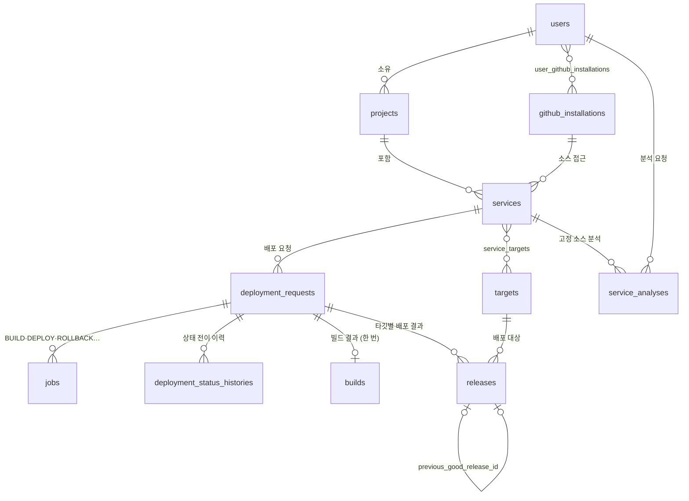

# AnyDeploy 개발자 용어 사전 (Developer Term Dictionary)

> Railway 와 비슷한 배포 서비스 **AnyDeploy** 의 Control Plane(이 레포)에서 쓰는 용어·식별자 사전이다. 용어 → 코드 식별자(case·타입·Enum) 매핑과 도메인 모델을 다룬다.
> - **근거 문서**: [control-plane-build-deploy-flow.md](../docs/control-plane-build-deploy-flow.md) (이하 "원문")
> - **물리 스키마**: [db-schema.sql](db-schema.sql) 이 DDL 단일 출처다. 이 문서와 어긋나면 둘을 함께 고친다.
> - **`*` 표시**: 원문에 없어서 새로 제안한 항목이다. 구현하면서 확정되면 `*` 를 지운다.

---

## 1. 표기 규칙

- **하나의 표준 영문 용어**를 정하고, 언어별로 **표기법(case)만** 바꾼다. Python·SQL 은 `snake_case`, API JSON 은 `camelCase`(스키마 alias)를 쓴다.
- **테이블명은 `snake_case` 복수형**(`jobs`, `builds`)이다. 원문 테이블명을 따르며, backend-conventions §2.5 의 단수형 규칙보다 이 규칙이 우선한다. Model 클래스명은 `PascalCase` 단수형(`Job`)이다.
- **Enum 코드** 규칙
  - 내부 상태·종류: `UPPER_SNAKE` (`QUEUED`, `BUILD`)
  - 사용자 설정 파일에서 온 값: 설정 파일 표기 그대로 소문자 (`dockerfile`)
  - 외부 시스템 값(Argo CD 상태): 원본 표기 그대로 저장 (`Healthy`)
- **시각** 필드는 `*_at` 이름에 `timestamptz`(UTC) 타입을 쓴다.
- **외부 시스템 ID** 는 `{시스템}_{대상}_id` 형식이다 (`codebuild_build_id`). Git SHA 필드는 `*_sha` 로 끝난다 (`source_sha`, `gitops_commit_sha`).
- **이미지 참조**
  - `image_digest`: `sha256:...` 값만 담는다.
  - `image_repository`\*: ECR 저장소 URI 를 담는다.
  - 둘을 합친 배포 참조가 `image_ref`\* = `{image_repository}@{image_digest}` 다.
  - **tag 필드는 두지 않는다.**

---

## 2. 컴포넌트

| 용어 | 코드 위치 | 비고 |
|---|---|---|
| Control Plane | 이 레포 전체 | Control API + Build Worker + Deploy Worker |
| Control API | `app/main.py`, `app/routers/` | 원문 §8 의 `deploy-api` 와 같은 것. 이름을 Control API 로 통일한다 |
| Build Worker | `app/workers/build_worker.py` | 원문 §8 의 `build-dispatcher` 와 같은 것. 이름을 Build Worker 로 통일한다 |
| Deploy Worker | `app/workers/deploy_worker.py` | DEPLOY·ROLLBACK·RECONCILE job 처리 |
| Master Cluster | — | Control Plane·Argo CD 가 도는 EKS |
| Prod Cluster | — | 사용자 서비스가 도는 EKS. Argo CD 만 접근한다 |
| GitOps 저장소 | `gitops-environments` (별도 레포) | 서비스·환경별 manifest. image digest 만 바뀐다 |

---

## 3. 도메인 모델

> 빌드는 요청마다 한 번, 배포(release)는 타깃마다 한 번이다. 같은 이미지를 여러 타깃에 배포한 이력이 그대로 남는다.

---

## 4. 엔티티·테이블

### 4.1 서비스 (Service) — `services`\*

사용자가 배포하는 앱 하나다. 원문은 "서비스 등록 시 빌더를 확정해 저장"한다고만 하고 테이블은 정의하지 않는다. 빌더 필드는 서비스 저장소의 `.anydeploy/build.yaml` 에서 가져온다.

| 필드 | 설명 |
|---|---|
| `project_id`\* | 소속 프로젝트 |
| `name`\* | 서비스 식별 이름 (slug). 프로젝트 안에서 유일하다 (삭제되지 않은 것끼리) |
| `source_repository_url`\* | 서비스 소스 저장소 |
| `github_installation_id`\* | 소스 저장소에 접근하는 GitHub App 설치 |
| `source_branch`\* | 배포할 브랜치. 자동 배포의 기준이다 |
| `root_directory`\* | 저장소 안의 서비스 위치. 없으면 저장소 루트 |
| `is_auto_deploy`\* | 브랜치에 push 가 오면 자동으로 배포할지 |
| `analysis_plan`\* | 코드 분석 결과(jsonb). 빌더·포트·실행 명령의 근거 |
| `port`\*, `build_command`\*, `start_command`\* | 서비스 실행 설정 |
| `builder` | `builder` Enum (§5). 코드 분석으로 확정하기 전까지 비어 있고, 비어 있으면 배포하지 않는다 |
| `dockerfile_path` | `builder=dockerfile` 일 때 Dockerfile 경로 |
| `platform` | 빌드 플랫폼 (`linux/amd64`) |
| `railpack_version` | `builder=railpack` 일 때 고정할 Railpack 버전 |

### 4.2 배포 요청 (DeploymentRequest) — `deployment_requests`

사용자의 배포 요청 1건이다. 빌드부터 배포 완료까지 전체 흐름의 최상위 단위다.

| 필드 | 설명 |
|---|---|
| `service_id` | 대상 서비스 |
| `environment` | `environment` Enum (§5) |
| `source_sha` | 빌드할 소스 커밋 SHA |
| `idempotency_key` | 중복 요청 차단 키. unique 제약을 건다\* |
| `source_commit_message`\* | 소스 커밋 메시지. 이력 화면 표시용 |
| `trigger_type`\* | `deployment_trigger` Enum (§5). 어떻게 시작된 요청인지 |
| `requested_by`\* | 요청자 (`users.id`). push 웹훅 요청은 비어 있다 |
| `status` | `deployment_status` Enum (§5). 원문의 "최종 상태" |
| `failure_code`\* | 실패 사유 코드 (§5) |
| `variables_snapshot`\* | 요청 시점의 환경변수(jsonb). 재배포·롤백에 쓴다 |

서비스·환경마다 진행 중(`QUEUED`·`BUILDING`·`DEPLOYING`)인 요청은 하나만 둘 수 있다 (부분 unique index).

`status` 는 `DeploymentStatusService.transition_status` 로만 바꾼다. 허용된 전이인지 검사하고 이력을 남긴다 (§5 전이 표, ADR 0010).

### 4.3 작업 (Job) — `jobs`

PostgreSQL 기반 큐의 작업 1건이다. 전달 보장은 at-least-once 다.

| 필드 | 설명 |
|---|---|
| `deployment_request_id`\* | 소속 배포 요청 |
| `kind` | `job_kind` Enum (§5) |
| `status` | `job_status` Enum (§5) |
| `payload` | 작업 입력 (jsonb\*). 스키마는 `app/schemas/` 에 정의한다 |
| `priority` | 높을수록 먼저 선점된다 |
| `run_after` | 이 시각 이후에만 선점할 수 있다. 재시도 백오프에 쓴다 |
| `attempts` | 선점될 때마다 +1 |
| `max_attempts`\* | 재시도 한도. 넘으면 `FAILED` |
| `locked_by` | 선점한 Worker 식별자 |
| `locked_until` | lease 만료 시각 |
| `external_id`\* | 외부 작업 ID (CodeBuild ID·commit SHA). **외부 호출 직후 먼저 기록**한다 |
| `last_error`\* | 마지막 실패 메시지 |

### 4.4 빌드 (Build) — `builds`

| 필드 | 설명 |
|---|---|
| `deployment_request_id`\* | 소속 배포 요청 |
| `builder` | 실제로 사용한 빌더 |
| `codebuild_build_id` | CodeBuild 빌드 ID |
| `image_repository`\* | ECR 저장소 URI |
| `image_digest` | 빌드 결과 digest |
| `log_url` | CodeBuild 로그 URL |
| `started_at`\*, `finished_at`\* | 빌드 시작·종료 시각 |

원문 §6 은 SBOM·스캔 결과도 저장한다고 한다. 해당 필드는 구현 순서 7단계(SBOM·이미지 서명)에서 정한다.

### 4.5 릴리스 (Release) — `releases`

GitOps 에 반영된 배포 결과 1건이다. 같은 요청이라도 타깃마다 한 건씩 만든다.

| 필드 | 설명 |
|---|---|
| `deployment_request_id`\* | 소속 배포 요청 |
| `service_id`\*, `environment`\*, `target_id`\* | 대상. `last_known_good` 조회 기준 |
| `image_digest` | 배포한 digest |
| `gitops_commit_sha` | digest 를 바꾼 GitOps 커밋 |
| `argo_sync_status` | Argo CD Sync 상태 (외부 값) |
| `argo_health_status` | Argo CD Health 상태 (외부 값) |
| `previous_good_release_id` | 이 릴리스 직전의 정상 릴리스. 원문의 "이전 정상 release" |
| `status`\* | `release_status` Enum (§5) |

### 4.6 사용자 (User) — `users`\*

GitHub 계정으로 로그인한 사람이다. 이메일 로그인은 없다. GitHub 사용자 토큰은 저장하지 않는다 (로그인할 때 한 번만 쓴다).

| 필드 | 설명 |
|---|---|
| `github_id`\* | GitHub 사용자 ID. unique |
| `login`\* | GitHub 로그인 이름 |
| `avatar_url`\* | 프로필 이미지 URL |

### 4.7 GitHub App 설치 (GithubInstallation) — `github_installations`\*, `user_github_installations`\*

| 필드 | 설명 |
|---|---|
| `installation_id`\* | GitHub 가 부여한 설치 ID. unique |
| `account_login`\*, `account_type`\* | 설치된 계정(`User`·`Organization`, GitHub 값 그대로) |

`user_github_installations` 는 사용자와 설치의 N:M 연결이다. 조직 설치를 여러 명이 쓰기 때문이다. 로그인할 때마다 GitHub 의 `GET /user/installations` 기준으로 맞춘다.

### 4.8 프로젝트 (Project) — `projects`\*

서비스를 묶는 단위다. 소유자(`owner_id`)만 접근한다. 이름은 소유자 안에서 유일하다 (삭제되지 않은 것끼리).

| 필드 | 설명 |
|---|---|
| `name`\*, `description`\* | 이름·설명 |
| `owner_id`\* | 소유 사용자 |

### 4.9 타깃 (Target) — `targets`\*, `service_targets`\*

같은 이미지를 배포할 대상이다 (Railway 의 환경과 다르다. 이 서비스의 `environment` 는 `prod` 하나뿐이다).

| 필드 | 설명 |
|---|---|
| `name`\* | 타깃 이름. unique (`aws`·`local`) |
| `kind`\* | `target_kind` Enum (§5) |
| `region`\*, `domain_suffix`\* | 리전, 서비스 도메인 접미사 |
| `cluster_ref`\* | 클러스터 접속 정보의 비밀 저장소 참조 이름. 접속 정보 자체는 담지 않는다 |

`service_targets` 는 서비스가 배포되는 타깃을 잇는다.

### 4.10 배포 상태 이력 (DeploymentStatusHistory) — `deployment_status_histories`\*

배포 요청의 상태 전이 1건이다. 쌓기만 하고 고치지 않는다. 단계별 소요 시간은 이 행들의 `created_at` 차이로 계산한다.

| 필드 | 설명 |
|---|---|
| `deployment_request_id`\* | 소속 배포 요청 |
| `from_status`\* | 이전 상태. 요청을 만들 때 남기는 첫 행은 비어 있다 |
| `to_status`\* | 바뀐 상태 (`deployment_status` Enum, §5) |
| `failure_code`\* | `FAILED` 로 바뀐 전이에만 있다 (§5) |
| `created_at` | 전이 시각 |

> 프로젝트·서비스·타깃의 삭제는 소프트 삭제(`is_deleted`, `deleted_at`)를 쓴다. 배포 이력(`deployment_requests`·`deployment_status_histories`·`jobs`·`builds`·`releases`)은 지우지 않는다.

---

### 4.11 서비스 분석 (ServiceAnalysis) — `service_analyses`

서비스의 고정 소스 분석 요청 1건이다. 배포 요청·작업과 별도의 상태를 갖는다. 같은 서비스에서 대기·실행 중인 분석은 하나만 허용하며 기존 결과를 덮어쓰지 않는다.

| 필드 | 설명 |
|---|---|
| `id` | 서버가 생성하는 UUID 문자열 작업 ID |
| `service_id`, `requested_by` | 분석 대상 서비스와 요청 사용자. 각각 로컬 `services.id`, `users.id` 참조 |
| `source_repository_url`, `source_branch`, `source_sha`, `root_directory` | 접수 시 고정한 소스 식별자와 저장소 기준 서비스 루트 |
| `github_installation_id` | 소스 조회에 쓰는 외부 GitHub installation ID 스냅샷. 로컬 설치 PK가 아니며 FK도 아니다 |
| `mode`, `status`, `stage` | 요청 실행 모드, 분석 작업 상태, 현재 진행 단계 |
| `model_selection` | 접수 시 고정한 provider·model·outputMode·timeoutSeconds 등 허용된 비밀이 아닌 실행 설정(JSONB). static에서는 null이며 자격증명은 포함하지 않는다 |
| `source_snapshot_id`, `context_hash`, `result_digest` | 분석 소스·입력·결과의 무결성 식별자 |
| `analysis_status` | 코드 분석 내용 상태: complete / needs_input / unsupported. 작업 상태와 구분 |
| `analysis_result`, `verification_report`, `source_readiness`, `deployment_dossier`, `run_report` | JSONB 분석·검증·준비·계획·실행 기록. 원문 소스와 자격증명은 저장하지 않는다 |
| `evidence` | JSONB 마스킹 근거와 출처 위치. 사용자가 결과를 확인하는 자료 |
| `builder_recommendation`, `review_required` | 서비스 소유자가 확인할 추천 빌더와 검토 여부 |
| `error_code` | 실패 안내용 정제된 오류 코드 |
| `attempts`, `lease_token`, `locked_until` | 선점 횟수, 선점마다 바뀌는 UUID token, 실행 점유 만료 시각 |
| `confirmed_at`, `selected_service_candidate_id` | 사용자 확인 시각과 고정 분석 결과에서 선택한 서비스 candidate |

## 5. Enum 값 정의

### 분석 작업 상태 (`analysis_job_status`) — `service_analyses.status`

`QUEUED` · `RUNNING` · `SUCCEEDED` · `FAILED` · `CANCELLED`

SUCCEEDED는 분석 실행이 정상 종료됐다는 뜻이다. 분석 정보 부족·미지원, 사용자 서비스 설정 확정, 빌드 성공, 배포 승인을 의미하지 않는다. 분석 작업의 실패·취소는 배포 요청 상태를 변경하지 않는다.

### 작업 종류 (`job_kind`) — `jobs.kind`

| 코드 | 처리 주체 | 의미 |
|---|---|---|
| `BUILD` | Build Worker | CodeBuild 를 시작하고 결과(digest)를 기록한다 |
| `DEPLOY` | Deploy Worker | GitOps manifest 의 digest 를 바꾸는 PR·commit 을 만든다 |
| `RECONCILE` | Deploy Worker | Argo CD 상태를 수집해 release 상태를 맞춘다\* |
| `ROLLBACK` | Deploy Worker | 실패한 digest 를 되돌리는 revert commit 을 만든다 |

### 작업 상태 (`job_status`) — `jobs.status`

| 코드 | 의미 |
|---|---|
| `QUEUED` | 선점 대기 |
| `RUNNING` | Worker 가 lease 를 잡고 실행 중 |
| `SUCCEEDED` | 성공 |
| `RETRY_WAIT` | 재시도 가능한 실패. `run_after` 이후 `QUEUED` 로 돌아간다 |
| `FAILED` | 재시도를 소진했거나 정책 오류 |
| `MANUAL_INTERVENTION` | 비가역 변경이나 복구 불가 상황. 운영자 판단이 필요하다 |

### 빌더 (`builder`) — `services.builder`, `builds.builder`

`dockerfile`(지정한 Dockerfile 로 BuildKit 빌드) · `railpack`(Railpack + BuildKit 으로 이미지 생성)

### 환경 (`environment`)

`prod` (원문에는 prod 만 있다. staging 등은 필요할 때 추가한다)

### 배포 시작 방식 (`deployment_trigger`)\* — `deployment_requests.trigger_type`

`MANUAL`(화면에서 직접) · `PUSH`(연결 브랜치 push 웹훅) · `CLI` · `REDEPLOY`(같은 값으로 다시) · `ROLLBACK`(이전 release 로 되돌림)

### 타깃 종류 (`target_kind`)\* — `targets.kind`

`AWS`(클러스터) · `LOCAL`(로컬 머신·VM, 터널로 노출)

### 배포 요청 상태 (`deployment_status`)\* — `deployment_requests.status`

`QUEUED` → `BUILDING` → `DEPLOYING` → `SUCCEEDED` / `FAILED` / `ROLLED_BACK` / `MANUAL_INTERVENTION`

화면 용어는 Initializing = `QUEUED`, Active = `SUCCEEDED` 다. 실패는 `FAILED` 하나이고 타임아웃·에러·`CrashLoopBackOff` 도 모두 `FAILED` 다. 원인은 상태가 아니라 `failure_code` 로 구분한다.

허용되는 전이 (표에 없는 이동은 `INVALID_STATUS_TRANSITION`, 이미 그 상태면 아무것도 하지 않는다):

| from | 허용 to |
|---|---|
| `QUEUED` | `BUILDING`, `FAILED` |
| `BUILDING` | `DEPLOYING`, `FAILED` |
| `DEPLOYING` | `SUCCEEDED`, `FAILED`, `ROLLED_BACK`, `MANUAL_INTERVENTION` |
| `FAILED` | `ROLLED_BACK`, `MANUAL_INTERVENTION` |
| `SUCCEEDED` · `ROLLED_BACK` · `MANUAL_INTERVENTION` | (끝) |

### 릴리스 상태 (`release_status`)\* — `releases.status`

`PENDING`(Git 반영, 동기화 대기) · `SUCCEEDED`(원문. Sync·Health·smoke test 모두 통과) · `FAILED` · `ROLLED_BACK`

### 실패 코드 (`failure_code`) — `deployment_requests.failure_code`\*

| 코드 | 의미 |
|---|---|
| `BUILD_CONFIG_REQUIRED` | 빌더 설정이 없거나 소스와 맞지 않는다 (원문 §4) |
| `BUILD_FAILED` | 빌드·테스트·스캔 실패. GitOps 는 바꾸지 않는다 (원문 §6) |
| `DEPLOY_FAILED`\* | Sync·readiness·smoke test 실패 |

### Argo CD 상태 (외부 값, 원본 표기 그대로 저장)

- `argo_sync_status`: `Synced` · `OutOfSync` · `Unknown`
- `argo_health_status`: `Healthy` · `Progressing` · `Degraded` · `Suspended` · `Missing` · `Unknown`

---

## 6. 동작·개념 용어

| 용어 | 코드 식별자 | 정의 |
|---|---|---|
| 선점 (claim) | `claim_next_job`\* | `FOR UPDATE SKIP LOCKED` 로 job 1건을 `RUNNING` 으로 바꾸고 lease 를 잡는다 |
| lease | `locked_by`, `locked_until` | 선점한 Worker 의 작업 점유 기한 |
| lease 갱신 | `renew_lease`\* | 실행 중인 Worker 가 `locked_until` 을 주기적으로 연장한다 |
| lease 회수 | `reclaim_expired_jobs`\* | lease 가 만료된 작업을 다른 Worker 가 다시 가져간다 |
| 멱등성 키 | `idempotency_key` | 같은 요청을 다시 보내도 이미지·release 가 중복 생성되지 않게 하는 키 |
| image digest | `image_digest` | 이미지 내용 해시 (`sha256:...`). 배포의 유일한 기준 |
| desired state | — | GitOps 저장소 manifest 의 내용. Argo CD 가 Prod 를 이 상태로 맞춘다 |
| Sync | `argo_sync_status` | Argo CD 가 desired state 를 클러스터에 적용하는 것. Control Plane 은 직접 호출하지 않고 Git 변경으로 유도한다 |
| lastKnownGood | `last_known_good`\* | service + environment 에서 마지막으로 `SUCCEEDED` 된 release (파생 개념) |
| revert commit | `create_revert_commit`\* | 실패한 digest 만 이전 digest 로 되돌리는 새 커밋. force push 는 쓰지 않는다 |
| 자동 rollback 조건 | — | 현재 manifest digest = 실패 digest, lastKnownGood = 이전 digest, 더 최신 진행 배포 없음. 셋 다 만족해야 한다 |
| 빌드 설정 | `.anydeploy/build.yaml` | 서비스 소스 저장소에 두는 빌더 설정 파일 |

---

## 7. 혼동 주의 (동음이의어)

| 단어 | 이 레포에서의 뜻 | 헷갈리기 쉬운 대상 | 코드 규칙 |
|---|---|---|---|
| Service | 사용자 앱 (`Service` 모델) | 레이어 접미사 `Service`, K8s `Service` | 도메인 서비스 레이어 클래스는 `ServiceRegistryService`\*. K8s 리소스는 `k8s_service` |
| Deployment | 배포 요청 (`DeploymentRequest`) | K8s `Deployment` 리소스 | 도메인은 항상 `deployment_request`. K8s 리소스는 `k8s_deployment` |
| Deploy | job 종류 `DEPLOY` (GitOps 변경 단계) | 배포 요청 전체 | 전체 흐름을 가리킬 때는 `deployment_request` |
| Application | Argo CD `Application` 리소스 | 사용자 앱 | `argo_application`. 사용자 앱은 Service |
| Build | `Build` 레코드 | CodeBuild 의 빌드 실행 | 외부 ID 는 `codebuild_build_id` |
| Release | GitOps 반영 결과 (`Release`) | Helm release | Helm 쪽은 `helm_release` |
| Environment | 배포 환경 (`prod`) | 환경변수, 배포 대상(Target) | 환경변수는 `env_vars`, 배포 대상은 `target` |
| Project | 서비스를 묶는 단위 (`Project`) | GitHub·Argo CD 의 project | Argo CD 쪽은 `argo_project` |
| Rollback | job `ROLLBACK` = revert commit | Argo Rollouts 의 트래픽 자동 복귀 | Rollouts 쪽은 `rollout_abort` 등으로 구분 |
