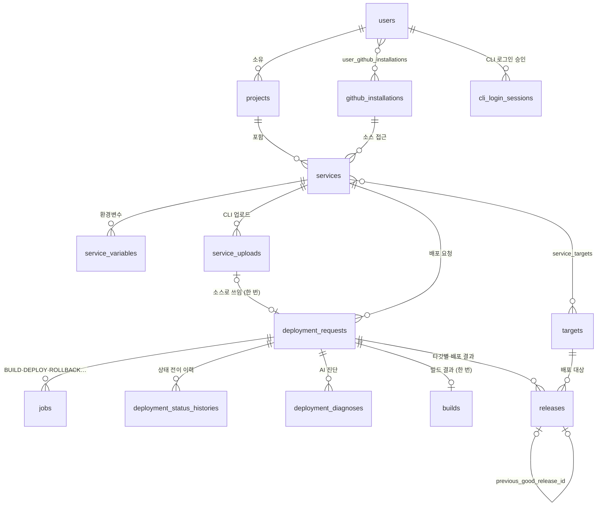

# AnyDeploy 개발자 용어 사전 (Developer Term Dictionary)

> Railway 와 비슷한 배포 서비스 **AnyDeploy** 의 Control Plane(이 레포)에서 쓰는 용어·식별자 사전이다. 용어 → 코드 식별자(case·타입·Enum) 매핑과 도메인 모델을 다룬다.
> - **근거 문서**: [control-plane-build-deploy-flow.md](../docs/control-plane-build-deploy-flow.md) (이하 "원문")
> - **물리 스키마**: [db-schema.sql](db-schema.sql) 이 DDL 단일 출처다. 이 문서와 어긋나면 둘을 함께 고친다.
> - **`*` 표시**: 원문에 없어서 새로 제안한 항목이다. 구현하면서 확정되면 `*` 를 지운다.

---

## 1. 표기 규칙

- **하나의 표준 영문 용어**를 정하고, 언어별로 **표기법(case)만** 바꾼다. Python·SQL 은 `snake_case`, API JSON 은 `camelCase`(스키마 alias)를 쓴다.
- **테이블명은 `snake_case` 복수형**(`jobs`, `builds`)이다. 원문 테이블명을 따르며, backend-conventions §2.5 의 단수형 규칙보다 이 규칙이 우선한다. Model 클래스명은 `PascalCase` 단수형(`Job`)이다.
- **Enum 코드** 규칙
  - 내부 상태·종류: `UPPER_SNAKE` (`QUEUED`, `BUILD`)
  - 사용자 설정 파일에서 온 값: 설정 파일 표기 그대로 소문자 (`dockerfile`)
  - 외부 시스템 값(Argo CD 상태): 원본 표기 그대로 저장 (`Healthy`)
- **시각** 필드는 `*_at` 이름에 `timestamptz`(UTC) 타입을 쓴다.
- **외부 시스템 ID** 는 `{시스템}_{대상}_id` 형식이다 (`codebuild_build_id`). Git SHA 필드는 `*_sha` 로 끝난다 (`source_sha`, `gitops_commit_sha`).
- **이미지 참조**
  - `image_digest`: `sha256:...` 값만 담는다.
  - `image_repository`\*: ECR 저장소 URI 를 담는다.
  - 둘을 합친 배포 참조가 `image_ref`\* = `{image_repository}@{image_digest}` 다.
  - **tag 필드는 두지 않는다.**

---

## 2. 컴포넌트

| 용어 | 코드 위치 | 비고 |
|---|---|---|
| Control Plane | 이 레포 전체 | Control API + Build Worker + Deploy Worker |
| Control API | `app/main.py`, `app/routers/` | 원문 §8 의 `deploy-api` 와 같은 것. 이름을 Control API 로 통일한다 |
| Build Worker | `app/workers/build_worker.py` | 원문 §8 의 `build-dispatcher` 와 같은 것. 이름을 Build Worker 로 통일한다 |
| Deploy Worker | `app/workers/deploy_worker.py` | DEPLOY·ROLLBACK·RECONCILE job 처리 |
| Master Cluster | — | Control Plane·Argo CD 가 도는 EKS |
| Prod Cluster | — | 사용자 서비스가 도는 EKS. Argo CD 만 접근한다 |
| GitOps 저장소 | `gitops-environments` (별도 레포) | 서비스·환경별 manifest. image digest 만 바뀐다 |
| 에러 진단 에이전트 | `iris-error-check-agent` (별도 레포·서버) | 로그·소스를 받아 원인과 해결책을 제안한다. Control API 가 `POST /diagnose` 로 호출한다 (ADR 0020). 코드 식별자는 `diagnosis_agent` |
| 코드 분석 에이전트 | `iris-code-analyzer-agent` (별도 레포) | 소스를 분석해 빌더·포트·실행 명령·환경변수를 제안한다. 식별자는 `analyzer_agent` |

---

## 3. 도메인 모델

> 빌드는 요청마다 한 번, 배포(release)는 타깃마다 한 번이다. 같은 이미지를 여러 타깃에 배포한 이력이 그대로 남는다.

---

## 4. 엔티티·테이블

### 4.1 서비스 (Service) — `services`\*

사용자가 배포하는 앱 하나다. 원문은 "서비스 등록 시 빌더를 확정해 저장"한다고만 하고 테이블은 정의하지 않는다. 빌더 필드는 서비스 저장소의 `.anydeploy/build.yaml` 에서 가져온다.

| 필드 | 설명 |
|---|---|
| `project_id`\* | 소속 프로젝트 |
| `name`\* | 서비스 식별 이름 (slug). 프로젝트 안에서 유일하다 (삭제되지 않은 것끼리) |
| `source_repository_url`\* | 서비스 소스 저장소 |
| `github_installation_id`\* | 소스 저장소에 접근하는 GitHub App 설치 |
| `source_branch`\* | 배포할 브랜치. 자동 배포의 기준이다 |
| `root_directory`\* | 저장소 안의 서비스 위치. 없으면 저장소 루트 |
| `is_auto_deploy`\* | 브랜치에 push 가 오면 자동으로 배포할지 |
| `analysis_plan`\* | 코드 분석 결과(jsonb). 빌더·포트·실행 명령의 근거 |
| `port`\*, `build_command`\*, `start_command`\* | 서비스 실행 설정 |
| `builder` | `builder` Enum (§5). 코드 분석으로 확정하기 전까지 비어 있고, 비어 있으면 배포하지 않는다 |
| `dockerfile_path` | `builder=dockerfile` 일 때 Dockerfile 경로 |
| `platform` | 빌드 플랫폼 (`linux/amd64`) |
| `railpack_version` | `builder=railpack` 일 때 고정할 Railpack 버전 |

### 4.2 배포 요청 (DeploymentRequest) — `deployment_requests`

사용자의 배포 요청 1건이다. 빌드부터 배포 완료까지 전체 흐름의 최상위 단위다.

| 필드 | 설명 |
|---|---|
| `service_id` | 대상 서비스 |
| `environment` | `environment` Enum (§5) |
| `source_sha` | 빌드할 소스 커밋 SHA. `CLI` 요청은 Git SHA 가 아니라 `upload-` + 업로드 아카이브 sha256 의 앞 12자(예: `upload-3fa9c2d1b7e4`)다. Git SHA 는 16진수뿐이라 겹치지 않는다 |
| `idempotency_key` | 중복 요청 차단 키. unique 제약을 건다\* |
| `source_commit_message`\* | 소스 커밋 메시지. 이력 화면 표시용 |
| `trigger_type`\* | `deployment_trigger` Enum (§5). 어떻게 시작된 요청인지 |
| `requested_by`\* | 요청자 (`users.id`). push 웹훅 요청은 비어 있다 |
| `status` | `deployment_status` Enum (§5). 원문의 "최종 상태" |
| `failure_code`\* | 실패 사유 코드 (§5) |
| `variables_snapshot`\* | 요청 시점의 환경변수(jsonb, `{key: 암호문}`). 평문은 담지 않는다. 롤백은 원본 요청의 값을 그대로 가져오고, 그 밖의 요청(재배포·재시작 포함)은 그 시점의 서비스 변수를 담는다 (§4.11) |
| `source_deployment_request_id`\* | 재배포·롤백·재시작이 따라가는 원본 배포 요청 (`deployment_requests.id`). 직접 만든 요청은 비어 있다 |
| `service_upload_id`\* | `CLI` 요청이 GitHub 대신 소스로 쓰는 업로드 (`service_uploads.id`). 업로드 하나는 요청 하나에만 묶인다(UNIQUE). 다른 트리거의 요청은 비어 있다 |

서비스·환경마다 진행 중(`QUEUED`·`BUILDING`·`DEPLOYING`)인 요청은 하나만 둘 수 있다 (부분 unique index).

`REMOVE` 요청은 지금 떠 있는 배포(`source_deployment_request_id`)를 클러스터에서 내린다. 빌드·release 를 만들지 않고 REMOVE job 으로 시작하며, 서비스 정의는 남는다 (ADR 0016).

`CLI` 요청은 GitHub 대신 올린 아카이브(`service_uploads`)를 소스로 빌드한다. 업로드는 요청을 만드는 트랜잭션에서 한 번만 가져간다(§4.14). 그 소스는 GitHub 에서 다시 받을 수 없어, `CLI` 로 만든 배포(와 거기서 이미지를 이어받은 롤백·재시작 요청)를 원본으로 한 `REDEPLOY` 는 거절한다.

`ROLLBACK`·`RESTART` 요청은 소스를 다시 빌드하지 않는다. 원본 요청의 빌드가 만든 이미지를 가리키는 성공한 `builds` 행을 복사해 새 요청에 붙이고, BUILD 대신 DEPLOY job 으로 시작한다 (ADR 0015). 새 release 가 만들어지므로 같은 digest 라도 Pod 가 새로 뜬다.

`status` 는 `DeploymentStatusService.transition_status` 로만 바꾼다. 허용된 전이인지 검사하고 이력을 남긴다 (§5 전이 표, ADR 0010).

### 4.3 작업 (Job) — `jobs`

PostgreSQL 기반 큐의 작업 1건이다. 전달 보장은 at-least-once 다.

| 필드 | 설명 |
|---|---|
| `deployment_request_id`\* | 소속 배포 요청 |
| `kind` | `job_kind` Enum (§5) |
| `status` | `job_status` Enum (§5) |
| `payload` | 작업 입력 (jsonb\*). 스키마는 `app/schemas/` 에 정의한다 |
| `priority` | 높을수록 먼저 선점된다 |
| `run_after` | 이 시각 이후에만 선점할 수 있다. 재시도 백오프에 쓴다 |
| `attempts` | 선점될 때마다 +1 |
| `max_attempts`\* | 재시도 한도. 넘으면 `FAILED` |
| `locked_by` | 선점한 Worker 식별자 |
| `locked_until` | lease 만료 시각 |
| `external_id`\* | 외부 작업 ID (CodeBuild ID·commit SHA). **외부 호출 직후 먼저 기록**한다 |
| `last_error`\* | 마지막 실패 메시지 |

### 4.4 빌드 (Build) — `builds`

| 필드 | 설명 |
|---|---|
| `deployment_request_id`\* | 소속 배포 요청 |
| `status`\* | `build_status` Enum (§5). Worker 의 진행 단계 |
| `builder` | 실제로 사용한 빌더. Worker 가 소스를 보고 확정한 뒤에 채운다 |
| `source_sha`\* | 빌드한 소스 커밋 SHA |
| `codebuild_build_id` | CodeBuild 빌드 ID |
| `attempt`\* | CodeBuild 를 새로 시작할 때마다 +1. StartBuild 멱등 토큰에 쓴다 |
| `image_repository`\* | ECR 저장소 URI |
| `image_tag`\* | 빌드가 push 한 불변 태그. 배포 기준은 digest 이고 태그는 이미지를 찾는 데만 쓴다 |
| `image_digest` | 빌드 결과 digest |
| `deploy_config`\* | 서비스 레포 설정(`iris.json`)의 `deploy.*`. Deploy Worker 가 읽는다 |
| `failure_code`\* | 빌드 실패 사유 (§5) |
| `log_url` | CodeBuild 로그 URL |
| `log_tail`\* | 실패한 빌드의 로그 끝부분(jsonb, `{entries: [{timestamp, message}], is_truncated}`). Build Worker 가 CloudWatch 에서 읽어 비밀 패턴을 가리고 남긴다. AI 진단이 `build` 단계 로그로 쓴다 (ADR 0020) |
| `started_at`\*, `finished_at`\* | 빌드 시작·종료 시각 |

원문 §6 은 SBOM·스캔 결과도 저장한다고 한다. 해당 필드는 구현 순서 7단계(SBOM·이미지 서명)에서 정한다.

### 4.5 릴리스 (Release) — `releases`

GitOps 에 반영된 배포 결과 1건이다. 같은 요청이라도 타깃마다 한 건씩 만든다.

| 필드 | 설명 |
|---|---|
| `deployment_request_id`\* | 소속 배포 요청 |
| `build_id`\* | 이 release 의 이미지를 만든 빌드 |
| `service_id`\*, `environment`\*, `target_id`\* | 대상. `last_known_good` 조회 기준. 서비스·타깃마다 진행 중 release 는 하나다 |
| `image_digest` | 배포한 digest |
| `gitops_commit_sha` | digest 를 바꾼 GitOps 커밋 |
| `revert_commit_sha`\* | 실패한 release 를 되돌린 revert commit |
| `argo_sync_status` | Argo CD Sync 상태 (외부 값) |
| `argo_health_status` | Argo CD Health 상태 (외부 값) |
| `previous_good_release_id` | 이 릴리스 직전의 정상 릴리스. 원문의 "이전 정상 release" |
| `failure_code`\* | release 실패 사유 (§5) |
| `deadline_at`\* | Argo CD 가 이 시각까지 반영·정상화하지 못하면 실패로 본다. 값이 있으면 GitOps 커밋이 반영된 것이다 |
| `finished_at`\* | release 가 끝난 시각 |
| `status`\* | `release_status` Enum (§5) |

### 4.6 사용자 (User) — `users`\*

GitHub 계정으로 로그인한 사람이다. 이메일 로그인은 없다. GitHub 사용자 토큰은 저장하지 않는다 (로그인할 때 한 번만 쓴다).

| 필드 | 설명 |
|---|---|
| `github_id`\* | GitHub 사용자 ID. unique |
| `login`\* | GitHub 로그인 이름 |
| `avatar_url`\* | 프로필 이미지 URL |

### 4.7 GitHub App 설치 (GithubInstallation) — `github_installations`\*, `user_github_installations`\*

| 필드 | 설명 |
|---|---|
| `installation_id`\* | GitHub 가 부여한 설치 ID. unique |
| `account_login`\*, `account_type`\* | 설치된 계정(`User`·`Organization`, GitHub 값 그대로) |

`user_github_installations` 는 사용자와 설치의 N:M 연결이다. 조직 설치를 여러 명이 쓰기 때문이다. 로그인할 때마다 GitHub 의 `GET /user/installations` 기준으로 맞춘다.

### 4.8 프로젝트 (Project) — `projects`\*

서비스를 묶는 단위다. 소유자(`owner_id`)만 접근한다. 이름은 소유자 안에서 유일하다 (삭제되지 않은 것끼리).

| 필드 | 설명 |
|---|---|
| `name`\*, `description`\* | 이름·설명 |
| `owner_id`\* | 소유 사용자 |

### 4.9 타깃 (Target) — `targets`\*, `service_targets`\*

같은 이미지를 배포할 대상이다 (Railway 의 환경과 다르다. 이 서비스의 `environment` 는 `prod` 하나뿐이다).

| 필드 | 설명 |
|---|---|
| `name`\* | 타깃 이름. unique (`aws`·`onprem`) |
| `kind`\* | `target_kind` Enum (§5) |
| `region`\*, `domain_suffix`\* | 리전, 서비스 도메인 접미사. 점이 하나인 `likelion.uk` 꼴이다(와일드카드 인증서가 label 한 단계만 덮는다). 비어 있으면 그 타깃엔 도메인이 없다. 서비스 주소는 `{서비스 이름}-{service_id}.{domain_suffix}` 로 계산하며 저장하지 않는다 |
| `cluster_ref`\* | 클러스터 접속 정보의 비밀 저장소 참조 이름. 접속 정보 자체는 담지 않는다 |

`service_targets` 는 서비스가 배포되는 타깃을 잇는다. 서비스당 타깃 1개, 기본 `aws`. GitOps 경로 aws=`prod`, 그 외=타깃 이름(`services/{id}/onprem`).

### 4.10 배포 상태 이력 (DeploymentStatusHistory) — `deployment_status_histories`\*

배포 요청의 상태 전이 1건이다. 쌓기만 하고 고치지 않는다. 단계별 소요 시간은 이 행들의 `created_at` 차이로 계산한다.

| 필드 | 설명 |
|---|---|
| `deployment_request_id`\* | 소속 배포 요청 |
| `from_status`\* | 이전 상태. 요청을 만들 때 남기는 첫 행은 비어 있다 |
| `to_status`\* | 바뀐 상태 (`deployment_status` Enum, §5) |
| `failure_code`\* | `FAILED` 로 바뀐 전이에만 있다 (§5) |
| `created_at` | 전이 시각 |

### 4.11 서비스 변수 (ServiceVariable) — `service_variables`\*

서비스가 앱 컨테이너에 넘기는 환경변수 1건이다. 도메인 용어는 `variable` 이다(`variables_snapshot`·`VariableService` 와 같다). 서비스 하나에 키마다 한 건이고, 타깃·환경에 따라 나누지 않는다.

| 필드 | 설명 |
|---|---|
| `service_id`\* | 소속 서비스. `(service_id, key)` 는 유일하다 |
| `key`\* | 변수 이름. 영문·숫자·밑줄이고 숫자로 시작하지 않으며 128자 이하다. `PORT` 와 `IRIS_` 로 시작하는 이름은 플랫폼이 쓰므로 만들 수 없다 |
| `encrypted_value`\* | 값의 Fernet 암호문. 평문은 저장하지 않고 응답을 만들 때만 복호화한다 |

- 한 서비스에 최대 100개, 값은 최대 32KiB 다. 삭제는 소프트 삭제가 아니라 물리 삭제다(값을 남기지 않는다).
- **배포 스냅샷**: 배포 요청을 만들 때 `deployment_requests.variables_snapshot` 에 `{key: encrypted_value}` 를 복사한다. `ROLLBACK` 요청은 원본 요청의 스냅샷을, 그 밖의 요청(`MANUAL`·`PUSH`·`REDEPLOY`·`RESTART`)은 그 시점의 서비스 변수를 담는다. 그래서 변수를 고친 뒤 재배포하면 고친 값이 반영된다.
- **앱 전달**: Deploy Worker 가 스냅샷을 풀어 Sealed Secrets controller 공개 인증서로 다시 봉인한다(namespace `svc-{service_id}`, Secret 이름 `vars-r{release_id}`). (`SEALED_SECRETS_CERT` 를 설정해 이 기능을 켠 Worker 만. chart 0.6.0 이상이 필요하다.) 결과를 `values.yaml` 의 `variables.name`·`variables.encryptedData` 로 커밋하고, iris-service chart 가 SealedSecret 과 `envFrom` 을 만든다. 평문은 메모리에만 있고 Git 에 남지 않는다 (ADR 0017).
- **자동 주입 변수**(system variables): 플랫폼이 배포할 때 앱에 넣는다. 사용자 변수보다 우선해 덮어쓸 수 없다. 저장하지 않고 `build_system_variables`(`app/services/variable_service.py`)가 이름·설명을 만든다.

| 이름 | 값 | 주입 |
|---|---|---|
| `PORT` | `APP_PORT`(8080) | chart |
| `IRIS_SERVICE_NAME` | 서비스 이름 | chart 0.6.0 (values `iris.serviceName`) |
| `IRIS_TARGET_NAME` | 배포되는 타깃 이름 | chart 0.6.0 (values `iris.targetName`) |
| `IRIS_DEPLOYMENT_ID` | 앱을 띄운 배포 요청 id | chart 0.6.0 (values `iris.deploymentId`) |
| `IRIS_PUBLIC_DOMAIN` | 서비스의 공개 도메인 | chart |
| `IRIS_GIT_COMMIT_SHA` | 배포한 소스 커밋 SHA | chart |

> 프로젝트·서비스·타깃의 삭제는 소프트 삭제(`is_deleted`, `deleted_at`)를 쓴다. 배포 이력(`deployment_requests`·`deployment_status_histories`·`deployment_diagnoses`·`jobs`·`builds`·`releases`)은 지우지 않는다.

### 4.12 CLI 로그인 세션 (CliLoginSession) — `cli_login_sessions`\*

CLI 가 시작해 브라우저의 GitHub 로그인으로 승인받는 로그인 1건이다. 승인되면 CLI 가 폴링으로 세션 토큰을 받아 간다. 이 행은 토큰을 넘기기 위한 대기용이고, 토큰 자체는 저장하지 않는다 (ADR 0018).

| 필드 | 설명 |
|---|---|
| `public_id`\* | 인증 URL 에 들어가는 추측 불가한 공개 ID(256비트 무작위). unique. 비밀이 아니라 세션을 가리키는 주소다 |
| `poll_secret_hash`\* | 폴링 비밀(`pollSecret`)의 SHA-256(hex). 평문은 CLI 만 갖고, 비교는 상수 시간으로 한다 |
| `status`\* | `cli_login_session_status` Enum (§5) |
| `user_id`\* | 승인한 사용자. `APPROVED` 가 될 때 채운다 |
| `expires_at`\* | 만료 시각. 만든 때부터 10분 |
| `consumed_at`\* | 토큰을 내준 시각. 토큰은 한 번만 내주므로 값이 있으면 다시 주지 않는다 |
| `last_polled_at`\* | 마지막 폴링 시각. `interval`(2초)보다 빠른 폴링을 `429` 로 막는 기준이다 |

- 만료된 지 하루가 지난 행은 새 세션을 만들 때 지운다(인증 없이 만들 수 있는 행이라 쌓이지 않게 한다). 소프트 삭제를 쓰지 않는다.

### 4.13 배포 진단 (DeploymentDiagnosis) — `deployment_diagnoses`\*

실패한 배포 요청 1건을 에러 진단 에이전트로 진단한 기록 1회다. 배포가 `FAILED`·`ROLLED_BACK`·`MANUAL_INTERVENTION` 으로 확정되면(`REMOVE` 제외, 끝난 지 10분 안) 서버가 자동으로 시작하고, 사용자는 다시 시도·다시 진단·오래된 실패에 직접 시작한다. 도메인 용어는 `diagnosis` 다. 다시 진단하면 새 행이 쌓이고 조회는 가장 최근 행을 본다. 진단으로 배포 요청의 `status` 를 바꾸지 않는다 (ADR 0020).

| 필드 | 설명 |
|---|---|
| `deployment_request_id`\* | 진단한 배포 요청 |
| `requested_by`\* | 진단을 요청한 사용자 (`users.id`). 서버가 실패 확정 뒤 자동으로 시작한 진단은 비어 있다 |
| `status`\* | `diagnosis_status` Enum (§5). 배포 요청마다 `RUNNING` 은 하나만 둘 수 있다 (부분 unique index) |
| `result`\* | 에이전트가 돌려준 진단 결과(jsonb, `diagnosis-result.v3`). `SUCCEEDED` 일 때만 있다. 원인은 `analysis.hypotheses`, 해결책은 `analysis.remediation.plans`, 근거 로그는 `evidence` |
| `error_code`\* | `FAILED` 일 때의 사유. 이 서버의 코드(`DIAGNOSIS_LOGS_UNAVAILABLE`·`DIAGNOSIS_ABANDONED`)이거나 에이전트의 코드(`MODEL_TIMEOUT` 등)다. §5 `failure_code` 와 다르다 |
| `finished_at`\* | 진단이 끝난 시각 |

### 4.14 서비스 업로드 (ServiceUpload) — `service_uploads`\*

`likelion up` 이 올린 소스 아카이브(tar.gz) 1건이다. 아카이브는 S3 `uploads/{public_id}.tar.gz` 에 있고 이 행은 메타데이터만 담는다. 배포 요청이 가져가 소스로 쓴다 (ADR 0023).

| 필드 | 설명 |
|---|---|
| `public_id`\* | 업로드 응답·배포 요청이 가리키는 추측 불가한 ID(256비트 무작위). unique |
| `service_id`\* | 올린 서비스. 다른 서비스의 업로드는 쓸 수 없다 |
| `uploaded_by`\* | 올린 사용자 (`users.id`) |
| `size_bytes`\*, `sha256`\* | 올라온 아카이브(gzip)의 바이트 수와 sha256(hex). Build Worker 가 내려받으며 다시 확인한다 |
| `storage_key`\* | 버킷 안의 키. 버킷은 설정(`ARTIFACT_BUCKET`)이 정한다 |
| `expires_at`\* | 만료 시각. 올린 때부터 24시간. 지나면 쓸 수 없다 |
| `consumed_at`\* | 배포 요청이 가져간 시각. 값이 있으면 다시 쓸 수 없다. `UPDATE … WHERE consumed_at IS NULL AND expires_at > now` 한 문장으로 가져가고, 요청을 만들지 못하면 롤백으로 되돌아간다 |

- 아카이브의 루트가 서비스 소스의 루트다. `services.root_directory` 는 업로드에 적용하지 않는다.
- 쓰이지 못하고 만료된 지 1일이 지난 행은 새 업로드를 받을 때 지운다(쓰인 행은 배포 요청이 가리켜 남긴다). S3 객체는 버킷 lifecycle(1일)이 지운다.

---

## 5. Enum 값 정의

### 작업 종류 (`job_kind`) — `jobs.kind`

| 코드 | 처리 주체 | 의미 |
|---|---|---|
| `BUILD` | Build Worker | CodeBuild 를 시작하고 결과(digest)를 기록한다 |
| `DEPLOY` | Deploy Worker | GitOps manifest 의 digest 를 바꾸는 PR·commit 을 만든다 |
| `RECONCILE` | Deploy Worker | Argo CD 상태를 수집해 release 상태를 맞춘다\* |
| `ROLLBACK` | Deploy Worker | 실패한 digest 를 되돌리는 revert commit 을 만든다 |
| `REMOVE` | Deploy Worker | GitOps 의 서비스 디렉터리를 지우고 Argo CD Application 이 사라질 때까지 기다린다 |

### 작업 상태 (`job_status`) — `jobs.status`

| 코드 | 의미 |
|---|---|
| `QUEUED` | 선점 대기 |
| `RUNNING` | Worker 가 lease 를 잡고 실행 중 |
| `SUCCEEDED` | 성공 |
| `RETRY_WAIT` | 재시도 가능한 실패. `run_after` 이후 `QUEUED` 로 돌아간다 |
| `FAILED` | 재시도를 소진했거나 정책 오류 |
| `MANUAL_INTERVENTION` | 비가역 변경이나 복구 불가 상황. 운영자 판단이 필요하다 |

### 빌더 (`builder`) — `services.builder`, `builds.builder`

`dockerfile`(지정한 Dockerfile 로 BuildKit 빌드) · `railpack`(Railpack + BuildKit 으로 이미지 생성)

### 환경 (`environment`)

`prod` (원문에는 prod 만 있다. staging 등은 필요할 때 추가한다)

### 배포 시작 방식 (`deployment_trigger`)\* — `deployment_requests.trigger_type`

`MANUAL`(화면에서 직접) · `PUSH`(연결 브랜치 push 웹훅) · `CLI`(`likelion up` 이 올린 로컬 폴더를 빌드해 배포, `uploadId` 필수) · `REDEPLOY`(같은 커밋을 다시 빌드해 배포) · `ROLLBACK`(성공했던 이전 배포의 이미지를 빌드 없이 다시 배포) · `RESTART`(지금 떠 있는 배포의 이미지를 빌드 없이 다시 배포해 Pod 를 새로 시작) · `REMOVE`(지금 떠 있는 배포를 클러스터에서 내림)

사용자가 시작하는 `ROLLBACK`(이 값)과 Deploy Worker 가 실패한 release 를 자동으로 되돌리는 job `ROLLBACK` 은 다르다. 앞쪽은 새 배포 요청이고 뒤쪽은 revert commit 이다 (§7).

### 타깃 종류 (`target_kind`)\* — `targets.kind`

`AWS`(클러스터) · `ONPREM`(온프레미스 클러스터, Tailscale 경유)

### 배포 요청 상태 (`deployment_status`)\* — `deployment_requests.status`

`QUEUED` → `BUILDING` → `DEPLOYING` → `SUCCEEDED` / `FAILED` / `ROLLED_BACK` / `MANUAL_INTERVENTION` / `SUPERSEDED`

화면 용어는 Initializing = `QUEUED`, Active = `SUCCEEDED` 다. 실패는 `FAILED` 하나이고 타임아웃·에러·`CrashLoopBackOff` 도 모두 `FAILED` 다. 원인은 상태가 아니라 `failure_code` 로 구분한다. `SUPERSEDED` 는 진행 중에 더 새로운 요청이 대신해 중단된 것이다(`cancel_requested_at` 을 Worker 가 보고 끝낸다). 소스 스냅샷을 만드는 동안도 `QUEUED` 다(화면의 Initializing).

허용되는 전이 (표에 없는 이동은 `INVALID_STATUS_TRANSITION`, 이미 그 상태면 아무것도 하지 않는다):

| from | 허용 to |
|---|---|
| `QUEUED` | `BUILDING`, `DEPLOYING`, `FAILED`, `SUPERSEDED` |
| `BUILDING` | `DEPLOYING`, `FAILED`, `SUPERSEDED` |
| `DEPLOYING` | `SUCCEEDED`, `FAILED`, `ROLLED_BACK`, `MANUAL_INTERVENTION`, `SUPERSEDED` |
| `FAILED` | `ROLLED_BACK`, `MANUAL_INTERVENTION` |
| `SUCCEEDED` · `ROLLED_BACK` · `MANUAL_INTERVENTION` · `SUPERSEDED` | (끝) |

`QUEUED → DEPLOYING` 은 빌드를 건너뛰는 `ROLLBACK`·`RESTART`·`REMOVE` 요청이 만들어지는 순간에만 쓴다. 이 요청은 `BUILDING` 을 거치지 않는다. `REMOVE` 요청은 Application 이 사라지면 `SUCCEEDED`, 기한 안에 사라지지 않거나 GitOps 를 바꾼 뒤 실패하면 `MANUAL_INTERVENTION`, GitOps 를 바꾸기 전에 재시도를 소진하면 `FAILED` 다.

### 빌드 상태 (`build_status`)\* — `builds.status`

`PENDING`(Worker 대기) → `SNAPSHOTTING`(소스 스냅샷 중) → `BUILDING`(CodeBuild 실행 중) → `SUCCEEDED` / `FAILED` / `CANCELLED`. 요청의 `status` 는 빌드가 직접 바꾸지 않고 Worker 가 `DeploymentStatusService` 로 옮긴다.

### CLI 로그인 세션 상태 (`cli_login_session_status`)\* — `cli_login_sessions.status`

- `PENDING`(승인 대기) → `APPROVED`(브라우저에서 GitHub 로그인 승인) · `DENIED`(GitHub 에서 승인을 취소) · `EXPIRED`(10분 만료)
- `APPROVED` → `EXPIRED`: 토큰을 내줬을 때(`consumed_at` 이 채워진다). 토큰을 가져가기 전에 만료돼도 같다.
- `DENIED`·`EXPIRED` 는 끝이다. 한번 `APPROVED` 가 되면 다시 승인할 수 없다.
- API 응답의 `status` 도 같은 코드다. 만료는 읽을 때 `expires_at` 으로 판단하고, 폴링이 만료를 보면 `EXPIRED` 로 저장한다.

### 릴리스 상태 (`release_status`)\* — `releases.status`

`PENDING`(Git 반영, 동기화 대기) · `SUCCEEDED`(원문. Sync·Health·smoke test 모두 통과) · `FAILED` · `ROLLING_BACK`(revert commit 반영, 되돌림 대기) · `ROLLED_BACK`

### 진단 상태 (`diagnosis_status`)\* — `deployment_diagnoses.status`

`RUNNING`(에이전트 호출 중) → `SUCCEEDED`(결과 저장) / `FAILED`(`error_code` 에 사유). 4분 넘게 `RUNNING` 이면 서버가 죽어 남은 행으로 보고 `FAILED`(`DIAGNOSIS_ABANDONED`)로 닫는다.

### 실패 코드 (`failure_code`) — `deployment_requests.failure_code`·`builds.failure_code`·`releases.failure_code`\*

| 코드 | 의미 |
|---|---|
| `SOURCE_NOT_ACCESSIBLE`\* | GitHub 소스에 접근할 수 없다 (설치·권한) |
| `SOURCE_REF_NOT_FOUND`\* | 커밋·브랜치를 찾을 수 없다 |
| `SOURCE_TOO_LARGE`\* | 소스 스냅샷이 한도를 넘는다(업로드는 풀었을 때의 총 크기·항목 수도 본다) |
| `SOURCE_INVALID`\* | 올린 소스 아카이브가 손상됐거나 허용하지 않는 항목(경로 이탈·위험한 링크·장치 파일)을 담고 있다. 올린 뒤 체크섬이 달라진 경우도 같다 |
| `BUILD_CONFIG_REQUIRED` | 빌더 설정이 없거나 소스와 맞지 않는다 (원문 §4) |
| `BUILD_FAILED` | 빌드·테스트·스캔 실패. GitOps 는 바꾸지 않는다 (원문 §6) |
| `BUILD_TIMED_OUT`\* | 빌드 제한 시간 초과 |
| `BUILD_INFRA_ERROR`\* | 빌드 인프라 오류로 재시도를 소진했다 |
| `DEPLOY_FAILED`\* | Sync·readiness·smoke test 실패 |
| `DEPLOY_TIMED_OUT`\* | Argo CD 가 `deadline_at` 까지 정상화하지 못했다 |
| `DEPLOY_INFRA_ERROR`\* | 배포 인프라 오류로 재시도를 소진했다 |

### Argo CD 상태 (외부 값, 원본 표기 그대로 저장)

- `argo_sync_status`: `Synced` · `OutOfSync` · `Unknown`
- `argo_health_status`: `Healthy` · `Progressing` · `Degraded` · `Suspended` · `Missing` · `Unknown`

---

## 6. 동작·개념 용어

| 용어 | 코드 식별자 | 정의 |
|---|---|---|
| 선점 (claim) | `claim_next_job`\* | `FOR UPDATE SKIP LOCKED` 로 job 1건을 `RUNNING` 으로 바꾸고 lease 를 잡는다 |
| lease | `locked_by`, `locked_until` | 선점한 Worker 의 작업 점유 기한 |
| lease 갱신 | `renew_lease`\* | 실행 중인 Worker 가 `locked_until` 을 주기적으로 연장한다 |
| lease 회수 | `reclaim_expired_jobs`\* | lease 가 만료된 작업을 다른 Worker 가 다시 가져간다 |
| 멱등성 키 | `idempotency_key` | 같은 요청을 다시 보내도 이미지·release 가 중복 생성되지 않게 하는 키 |
| image digest | `image_digest` | 이미지 내용 해시 (`sha256:...`). 배포의 유일한 기준 |
| desired state | — | GitOps 저장소 manifest 의 내용. Argo CD 가 Prod 를 이 상태로 맞춘다 |
| Sync | `argo_sync_status` | Argo CD 가 desired state 를 클러스터에 적용하는 것. Control Plane 은 직접 호출하지 않고 Git 변경으로 유도한다 |
| lastKnownGood | `last_known_good`\* | service + environment 에서 마지막으로 `SUCCEEDED` 된 release (파생 개념). 그 뒤에 성공한 `REMOVE` 요청이 있으면 서비스가 내려간 것이라 없다 |
| revert commit | `create_revert_commit`\* | 실패한 digest 만 이전 digest 로 되돌리는 새 커밋. force push 는 쓰지 않는다 |
| 자동 rollback 조건 | — | 현재 manifest digest = 실패 digest, lastKnownGood = 이전 digest, 더 최신 진행 배포 없음. 셋 다 만족해야 한다 |
| 빌드 설정 | `.anydeploy/build.yaml` | 서비스 소스 저장소에 두는 빌더 설정 파일 |
| 소스 재패킹 | `repack_source_archive`\* | 업로드 아카이브를 항목마다 검사하며 GitHub tarball 처럼 최상위 디렉터리 아래로 다시 묶는 일. buildspec 이 `--strip-components=1` 로 풀기 때문이고, 경로 이탈·링크·압축 폭탄 방어선이다 (ADR 0023) |
| pollSecret | `poll_secret`\* | CLI 로그인 세션을 만든 CLI 만 아는 폴링 비밀. 서버에는 해시(`poll_secret_hash`)만 둔다 |
| 폴링 간격 | `interval`\* | CLI 가 `/token` 을 부르는 간격(2초). 이보다 빠르면 `429` 와 `Retry-After` 로 답한다 |

---

## 7. 혼동 주의 (동음이의어)

| 단어 | 이 레포에서의 뜻 | 헷갈리기 쉬운 대상 | 코드 규칙 |
|---|---|---|---|
| Service | 사용자 앱 (`Service` 모델) | 레이어 접미사 `Service`, K8s `Service` | 도메인 서비스 레이어 클래스는 `ServiceRegistryService`\*. K8s 리소스는 `k8s_service` |
| Deployment | 배포 요청 (`DeploymentRequest`) | K8s `Deployment` 리소스 | 도메인은 항상 `deployment_request`. K8s 리소스는 `k8s_deployment` |
| Deploy | job 종류 `DEPLOY` (GitOps 변경 단계) | 배포 요청 전체 | 전체 흐름을 가리킬 때는 `deployment_request` |
| Application | Argo CD `Application` 리소스 | 사용자 앱 | `argo_application`. 사용자 앱은 Service |
| Build | `Build` 레코드 | CodeBuild 의 빌드 실행 | 외부 ID 는 `codebuild_build_id` |
| Release | GitOps 반영 결과 (`Release`) | Helm release | Helm 쪽은 `helm_release` |
| Environment | 배포 환경 (`prod`) | 환경변수, 배포 대상(Target) | 환경변수는 `variable`(엔티티 `ServiceVariable`, §4.11), 배포 대상은 `target` |
| Project | 서비스를 묶는 단위 (`Project`) | GitHub·Argo CD 의 project | Argo CD 쪽은 `argo_project` |
| Session | 로그인 상태를 나르는 세션 토큰(JWT). 변수·함수는 `session_token`, `SessionService` | CLI 로그인 세션(`CliLoginSession`), DB 세션(`AsyncSession`) | CLI 로그인 세션은 토큰을 CLI 로 넘기려고 기다리는 행이라 항상 `cli_login_session`. DB 세션 변수는 `session`(Repository·Service 관례) |
| Rollback | job `ROLLBACK` = revert commit(자동). 트리거 `ROLLBACK` = 사용자가 이전 이미지로 시작한 새 배포 요청 | Argo Rollouts 의 트래픽 자동 복귀 | Rollouts 쪽은 `rollout_abort` 등으로 구분. 요청은 `deployment_request`, revert 는 `revert_commit` |
