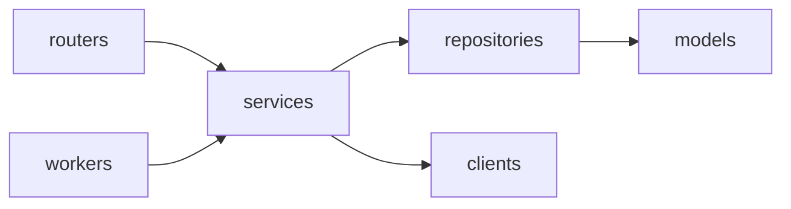

# AnyDeploy Control Plane (WAS)

Railway 처럼 무엇이든 간단히 배포해 주는 배포 서비스 **AnyDeploy** 의 Control Plane 이다. 배포 요청을 받아 AWS CodeBuild 로 이미지를 빌드하고, GitOps 저장소의 image digest 를 바꿔 Argo CD 가 Prod 에 배포하게 한다.

- **스택**: Python 3.13+, FastAPI, Pydantic v2, SQLAlchemy 2.0(async), PostgreSQL(asyncpg), Alembic
- **배경·환경변수·실행·세팅**: [README.md](README.md) 참조 (여기서 중복하지 않는다)

---

## 규칙 문서 (반드시 따른다)

작업 전 아래 문서를 우선한다. **충돌 시 우선순위: 용어 사전 > 컨벤션 가이드 > 일반 관례.**

| 문서 | 언제 본다 |
|---|---|
| [.claude/rules/term-dictionary.md](.claude/rules/term-dictionary.md) | 도메인 용어·엔티티·필드명·Enum 코드를 정할 때 — **표준 영문 용어/식별자의 단일 출처**. 동음이의어(Service·Deployment·Application·Release) 구분 규칙 포함 |
| [.claude/rules/db-schema.sql](.claude/rules/db-schema.sql) | 테이블·컬럼·타입·제약·인덱스 등 **물리 DB 스키마(DDL)의 단일 출처**. `app/models/*.py` 모델은 이 스키마와 일치해야 하며, 모델 변경은 자동으로 [.claude/logs/db-schema-changelog.md](.claude/logs/db-schema-changelog.md) 에 기록된다 |
| [.claude/rules/db-migration.md](.claude/rules/db-migration.md) | 스키마를 바꿀 때 — Alembic revision 생성·검토·downgrade 규칙, PostgreSQL 주의점 |
| [.claude/rules/backend-conventions.md](.claude/rules/backend-conventions.md) | 백엔드 코드(레이어·네이밍·비동기·예외·로깅·설정·테스트·린터)를 작성할 때 |
| [.claude/rules/git-conventions.md](.claude/rules/git-conventions.md) | 커밋 메시지·브랜치명·브랜치 전략(develop → release → main, 워크트리, 머지 방식)을 정할 때 |

## 동작 흐름 문서

| 문서 | 언제 본다 |
|---|---|
| [.claude/docs/control-plane-build-deploy-flow.md](.claude/docs/control-plane-build-deploy-flow.md) | 빌드·배포 흐름, jobs 큐·상태 전이, 실패 복구·자동 rollback 조건, 컴포넌트별 권한 경계를 다룰 때. **설계 기준 문서** |
| [docs/adr/README.md](docs/adr/README.md) | 설계 결정의 배경·대안을 확인하거나 새 결정을 기록할 때. 중요한 설계 결정은 ADR(`docs/adr/NNNN-제목.md`)로 남긴다 |

---

## 구조

한 Python 패키지(`app/`)에서 세 컴포넌트를 **실행 명령만 달리해** 띄운다. 원문 §8 의 `apps/`·`packages/` 분리는 `app/` 레이어 분리로 대신한다. backend-conventions §3 대신 이 구조를 따른다.

```text
app/
├─ main.py            # Control API 진입점 (FastAPI)
├─ routers/           # Control API 전용
├─ workers/           # Worker 진입점: build_worker.py, deploy_worker.py
├─ schemas/           # API 요청·응답, job payload 계약
├─ services/          # 상태 전이·멱등성·배포 정책 (API·Worker 공용)
├─ repositories/      # DB 접근. jobs 선점(claim)·lease 쿼리 포함
├─ models/            # SQLAlchemy
├─ clients/           # CodeBuild·ECR·GitOps(Git)·Argo CD 비동기 Client
├─ core/              # config, exceptions, logging
└─ enums.py           # JobKind·JobStatus·Builder 등 (용어 사전 §5)
alembic/              # 마이그레이션
tests/                # unit/ · integration/
```



- `routers/` 와 `workers/` 는 서로 import 하지 않는다. 둘 다 `services/` 만 호출한다.
- Control API 경로는 DB 기록·조회, 읽기 전용 Loki·Prometheus 관측 쿼리, 에러 진단 에이전트 서버 호출(`DiagnosisService`, 소스는 읽기 전용 S3 presigned URL 로만 넘긴다. 실패가 확정된 배포는 Control API 안의 `AutoDiagnosisRunner` 가 사용자 없이 시작한다. ADR 0020), 배포 상세 화면의 읽기 전용 CloudWatch Logs 빌드 로그 조회(`DeploymentLogService`, ADR 0021), `likelion up` 소스 업로드(`UploadService`, S3 `uploads/` 쓰기만. 아카이브 내용은 읽지 않고 Build Worker 가 검사한다. ADR 0023)를 처리한다. CodeBuild·Git·Argo CD Client 를 쓰는 서비스 로직은 Worker 에서만 호출한다(원문 §3 금지 권한).
- AWS 자원(CodeBuild·S3·IAM)과 CodeBuild buildspec 은 iris-infra 레포(`terraform/environments/aws/dev/foundation/`)가 소유한다. buildspec 환경변수 이름은 `app/services/build_service.py` 와의 계약이다.
- 레포 루트의 `deploy/helm/`, `deploy/argocd/`, `docker-compose.dev.yml` 은 원문 §8 위치대로 **필요해질 때** 만든다.

---

## 핵심 원칙 (요약)

코드를 쓰기 전 위 문서를 보되, 자주 어기는 핵심만 추린다.

### 네이밍·식별자
- 필드·변수·컬럼은 **`snake_case`**. camelCase 금지(프론트 경계에서만 alias 변환).
- 레이어는 접미사로 드러낸다: `_router` / `Service` / `Client` / `Repository` / Model·Schema.
- 약어는 클래스명에서 첫 글자만 대문자(`HttpClient`, `AwsClient`), 필드는 전부 소문자.
- 동사로 반환 형태를 고정: `get_*`(1건/없으면 예외) · `find_*`(nullable) · `search_*`(다건) · `check_*`/`validate_*`.

### 레이어 경계
- 흐름: `Router → Service → Repository → DB` / Service → Client(외부 API).
- Router는 얇게(로직 없음, Service 호출 + Schema 변환만). Repository는 Model만 반환. Model은 Schema를 모른다.
- 외부 호출은 반드시 **비동기 Client**를 통한다. Service가 `httpx`·SDK를 직접 부르지 않는다.
- 변환은 한 방향만, 대상 타입의 classmethod로(`Response.from_model`).
- 모든 JSON 응답은 공통 봉투 **`ApiResponse[T]`**로 감싼다(`response_model_exclude_none=True`). 파일 다운로드·204·SSE는 제외. 에러도 같은 봉투(`success=False`, 도메인 예외의 `code`, 검증 실패 시 `details: list[ErrorDetail]`)로 예외 핸들러가 만든다. 에러용 dict 를 따로 만들지 않는다. 요청 ID 는 본문이 아니라 `X-Request-ID` 헤더로 준다.

### API 문서 (엔드포인트를 추가·변경할 때마다 반드시)
- 데코레이터에 `summary="한 줄 설명"` 과 `responses=error_responses(...)` 를 단다(`app/schemas/response.py`). 라우터 `tags` 는 `app/main.py` 의 `OPENAPI_TAGS` 에 설명과 함께 등록한다.
- 인증이 필요한 API 는 401, 입력(경로·쿼리·본문)이 있으면 422, 도메인 예외를 던지면 그 상태(403·404·409·502·503 등)를 `error_responses` 에 포함한다.
- 요청·응답 스키마 필드에는 필요하면 `Field(description=..., examples=[...])` 로 의미를 적는다.
- 끝나면 `uv run python -m scripts.export_openapi` 로 `docs/openapi.json` 을 갱신해 함께 커밋한다.
- `tests/test_openapi.py` 가 위를 검사한다. 이 테스트를 건너뛰거나 삭제하지 않는다. 배경: [docs/adr/0007](docs/adr/0007-api-documentation-with-openapi.md)

### 공통 안전 규칙
- I/O는 전부 `async def` + `await`. 동기 블로킹 호출은 `asyncio.to_thread`로 감싼다.
- 시각은 항상 **timezone-aware UTC**(`datetime.now(UTC)`). `utcnow()` 금지.
- 스키마 변경은 **모델 → Alembic revision → db-schema.sql** 한 세트. DB에 직접 DDL 금지, 적용된 revision 수정 금지.
- 마이그레이션은 **앱 시작 시 실행하지 않는다**(lifespan·startup·initContainer 금지 — replica 동시 실행 충돌). 로컬은 `uv run alembic upgrade head`, 운영은 Argo CD PreSync Job 이 같은 이미지로 `alembic upgrade head` 를 한 번 실행한다(DDL 권한 계정 분리). 상세는 README §DB 마이그레이션.
- 시크릿은 `BaseSettings`로 주입. `os.getenv` 직접 호출·하드코딩 금지. 로그·예외에 시크릿 노출 금지.
- 예외는 `AppError` 계층(`app/core/exceptions.py`)으로 raise, HTTP 매핑은 `exception_handlers.py` 한곳에서. Service 에서 `HTTPException` 금지. 식별자는 메시지가 아니라 `fields`(`raise ConflictError("...", service_id=3)`)로. 빈 `except`·예외 뭉개기 금지.
- 로깅은 구조화형: message 는 고정 문구, 값은 `extra`(`action`·도메인 ID). `component`·`request_id` 는 자동으로 붙고, Worker 는 job 처리를 `with log_context(job_id=..., job_kind=..., deployment_request_id=...)` 로 감싼다. backend-conventions §6 의 `service` 필드는 쓰지 않는다(사용자 앱 `service_id` 와 혼동). 예외 로그는 경계(핸들러·미들웨어·job 루프)에서 한 번만. `print` 금지. 상세: [docs/api-response-logging-template.md](docs/api-response-logging-template.md)
- 모든 함수 시그니처에 타입 힌트. 신문법(`str | None`, `list[T]`) 사용.
- 주석·docstring에 규칙 문서 위치(`backend-conventions §3` 등)를 인용하지 않는다.

### 배포 도메인
- jobs 큐는 at-least-once 로 전달된다. Worker 작업은 **멱등**해야 한다. 외부 호출 직후 외부 ID(CodeBuild ID·commit SHA)를 먼저 기록하고, 재시도 시 그 ID 로 기존 결과를 조회한다.
- job 선점 트랜잭션은 짧게 끝낸다. CodeBuild·Git·Argo CD 대기는 트랜잭션 밖에서 한다.
- 서비스 host 는 저장하지 않고 `build_service_host`(`app/services/domain_service.py`) 한 곳에서 계산한다. API 조회와 Deploy Worker 가 같은 규칙을 쓴다.
- 배포 기준은 **image digest** 다. `latest` 같은 mutable tag 를 배포에 쓰지 않는다.
- GitOps 저장소는 revert commit 으로만 되돌린다. `git push --force` 는 금지다. 자동 rollback 은 용어 사전 §6 의 세 조건을 모두 만족할 때만 한다.
- 컴포넌트끼리 Secret·IAM Role·자격증명을 공유하지 않는다.

---

## 도구

- **패키지·실행**: `uv`. 명령은 `uv run <cmd>` — 린트 `uv run ruff check .` / 타입 `uv run mypy app` / 테스트 `uv run pytest` / Control API `uv run uvicorn app.main:app` / Worker `uv run python -m app.workers.build_worker`·`deploy_worker` / 마이그레이션 `uv run alembic upgrade head`.
- **린트·포맷**: `ruff`. **타입체크**: `mypy`. 설정은 `pyproject.toml` 한곳.
- **테스트**: `pytest` + `pytest-asyncio`. 함수명 `test_{대상}_{시나리오}_{기대}`.
- **로컬 DB**: PostgreSQL `softbank_iris`. 접속 정보는 `.env` 의 `DATABASE_URL`(gitignore 대상, 커밋·출력 금지). `.env` 가 없으면 앱이 시작하지 않는다. `pytest` 는 DB 없이 돌고(`tests/conftest.py`), `TEST_DATABASE_URL`(`alembic upgrade head` 를 끝낸 전용 DB `softbank_iris_test`. 데이터 테이블을 비운다)을 주면 jobs 큐·BuildService·DeployService 통합 테스트도 돈다. Deploy Worker 로컬 E2E 는 `docs/deploy-worker-test-guide.md`.
- **마이그레이션 검증**: revision 을 만들면 로컬 DB 에서 `upgrade head` → `alembic check`(차이 없음) → `downgrade -1` → `upgrade head` 까지 통과시킨다. 검증용 임시 테이블·revision 은 `downgrade` 후 파일까지 지워 레포에 남기지 않는다.
- **품질 게이트**: Claude Code PreToolUse 훅(`.claude/settings.json`)이 `git add`·`git commit` 전 `ruff`·`mypy`·`pytest`, `git push` 전 `ruff`를 돌려 실패 시 차단한다. `pyproject.toml`이 없으면 건너뛴다.
- **스키마 동기화**: `app/models/*.py` 변경 시 PostToolUse 훅(`.claude/hooks/db_schema_changelog.py`)이 변경을 `.claude/logs/db-schema-changelog.md`에 기록하고 Alembic revision 생성과 `.claude/rules/db-schema.sql` 동기화를 지시한다.
- **PR 본문**: `write-pr` 스킬(`.claude/skills/write-pr/`)이 `.github/PULL_REQUEST_TEMPLATE.md` 구조로 `docs/PR.md`를 작성한다.
