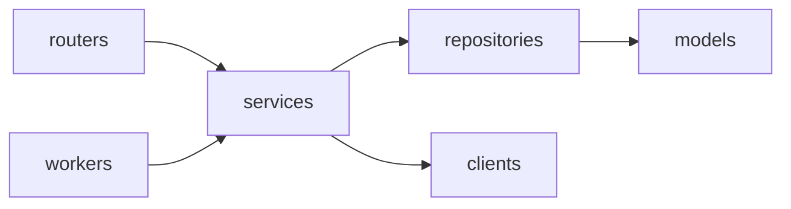

# AnyDeploy Control Plane (WAS)

Railway 처럼 무엇이든 간단히 배포해 주는 배포 서비스 **AnyDeploy** 의 Control Plane 이다. 배포 요청을 받아 AWS CodeBuild 로 이미지를 빌드하고, GitOps 저장소의 image digest 를 바꿔 Argo CD 가 Prod 클러스터에 배포하게 한다.

설계 기준: [.claude/docs/control-plane-build-deploy-flow.md](.claude/docs/control-plane-build-deploy-flow.md)

## 구성

한 Python 패키지(`app/`)에서 세 컴포넌트를 실행 명령만 달리해 띄운다. 운영에서는 모두 Master EKS 에서 돌고, Deployment·IAM Role 은 컴포넌트마다 따로 둔다.

| 컴포넌트 | 진입점 | 하는 일 |
|---|---|---|
| Control API | `app/main.py` | 배포 요청 접수·상태 조회, 로그·메트릭 조회 |
| Build Worker | `app/workers/build_worker.py` | `BUILD` job 을 선점해 CodeBuild 빌드를 시작하고 image digest 를 기록한다 |
| Deploy Worker | `app/workers/deploy_worker.py` | `DEPLOY`·`ROLLBACK`·`RECONCILE` job 을 선점해 GitOps 저장소를 바꾸고 Argo CD 상태를 수집한다 |

## 디렉터리 구조

```text
app/
├─ main.py         Control API 진입점 (FastAPI)
├─ routers/        Control API 전용 엔드포인트
├─ workers/        Worker 진입점: build_worker.py · deploy_worker.py
├─ schemas/        API 요청·응답, job payload
├─ services/       상태 전이·멱등성·배포 정책 (API·Worker 공용)
├─ repositories/   DB 접근. jobs 선점(claim)·lease 쿼리
├─ models/         SQLAlchemy 모델
├─ clients/        CodeBuild·ECR·GitOps(Git)·Argo CD 비동기 클라이언트
├─ core/           설정·예외·로깅
└─ enums.py        JobKind · JobStatus · Builder · BuildStatus · FailureCode 등
alembic/           DB 마이그레이션
tests/
```



- `routers/` 와 `workers/` 는 서로 참조하지 않고 `services/` 만 호출한다.
- CodeBuild·Git(GitOps)·Argo CD 를 호출하는 로직은 Worker 에서만 실행한다. Control API 는 이 시스템들의 권한을 갖지 않는다. 단, 로그인·저장소 조회를 위한 GitHub OAuth·App 호출과 읽기 전용 Loki·Prometheus 조회는 Control API 가 한다.

## 개발 환경

요구 사항: Python 3.13, [uv](https://docs.astral.sh/uv/), PostgreSQL (로컬 검증: 18)

```bash
uv sync

# 로컬 DB: Docker(OrbStack)로 PostgreSQL 18 을 띄우고 .env 의 DATABASE_URL 을 맞춘다
scripts/dev-db.sh                  # 켜기 (stop: 끄기, reset: 데이터까지 삭제)

cp -n .env.example .env            # .env 가 없을 때만. DB 외 값(GitHub App 등)을 채운다
uv run alembic upgrade head
uv run alembic current             # 접속·적용 revision 확인
```

- DB 는 `docker-compose.dev.yml`(`restart: unless-stopped`, named volume)로 상시 떠 있고 `127.0.0.1:5432` 에서만 접속된다. 비밀번호는 `scripts/dev-db.sh` 가 만들어 `.env` 에만 둔다.
- 직접 만든 PostgreSQL 을 쓰려면 스크립트 없이 `DATABASE_URL` 만 `.env` 에 넣어도 된다(DB 이름은 `softbank_iris` 로 통일).

`.env` 예:

```dotenv
DATABASE_URL=postgresql+asyncpg://<USER>:<PASSWORD>@localhost:5432/softbank_iris
LOG_LEVEL=INFO
```

- `DATABASE_URL` 이 없으면 Control API·Worker 는 시작하자마자 설정 오류로 종료한다.
- `pytest` 는 DB 없이 돈다(`tests/conftest.py` 가 접속되지 않는 URL 을 넣는다). 실제 DB 연결은 서버를 띄워 `GET /readyz` 가 204 인지로 확인한다.
- Repository 통합 테스트(`@pytest.mark.integration`)는 `alembic upgrade head` 가 끝난 DB 를 `TEST_DATABASE_URL` 로 주면 실행되고, 없으면 건너뛴다. 테스트는 트랜잭션을 롤백한다.

| 환경변수 | 설명 |
|---|---|
| `DATABASE_URL` | PostgreSQL 접속 URL. `postgresql+asyncpg://<USER>:<PASSWORD>@<HOST>:5432/<DB>` |
| `LOKI_URL`, `PROMETHEUS_URL` | 로그·메트릭 백엔드 내부 주소. 없으면 관측 API 503. [로그·메트릭 연결 및 API](docs/observability-api.md) |
| `LOG_LEVEL` | `DEBUG`·`INFO`·`WARNING`·`ERROR`. 기본 `INFO` |
| `WEB_BASE_URL` | 웹 프런트 주소. 로그인 후 이 주소로 돌려보낸다. 기본 `http://localhost:3000` |
| `API_BASE_URL` | Control API 의 공개 주소(예: `https://api.likelion.uk`). CLI 로그인의 `verificationUrl` 을 만든다. 없으면 요청의 Host 로 만든다. TLS 를 앞단에서 끝내는 운영에서는 꼭 설정한다 |
| `CORS_ALLOW_ORIGIN_REGEX` | CORS 허용 Origin 정규식(전체 일치). 기본은 `likelion.uk`·하위 도메인(https)과 `localhost`·`127.0.0.1` 모든 포트. 메서드·헤더는 전부 허용하고 쿠키(credentials)도 허용한다 |
| `SESSION_SECRET` | 세션·OAuth state 서명 키(HS256). 없으면 로그인·인증 API 가 `503 NOT_CONFIGURED` |
| `SESSION_TTL_MINUTES` | 세션 유효 시간(분). 기본 7일 |
| `IS_SESSION_COOKIE_SECURE` | 쿠키 Secure 속성. 기본 `true`, http 로컬 개발에서는 `false` |
| `GITHUB_APP_ID` · `GITHUB_APP_SLUG` | GitHub App ID, 설치 페이지 주소에 쓰는 slug |
| `GITHUB_APP_CLIENT_ID` · `GITHUB_APP_CLIENT_SECRET` | 로그인(사용자 인증)용. 없으면 `503 NOT_CONFIGURED` |
| `GITHUB_APP_PRIVATE_KEY` | App JWT 서명용 PEM. 줄바꿈은 `\n` 도 허용. 없으면 저장소·서비스 API 가 `503 NOT_CONFIGURED` |
| `GITHUB_WEBHOOK_SECRET` | 웹훅 서명 검증 키(App 설정의 Webhook secret 과 같은 값). 없으면 웹훅 API 가 `503 NOT_CONFIGURED` |
| `VARIABLES_ENCRYPTION_KEY` | 서비스 환경변수 값을 DB 에 암호화해 저장하는 Fernet 키. `uv run python -c "from cryptography.fernet import Fernet; print(Fernet.generate_key().decode())"` 로 만든다. 없으면 변수 API 가 `503 NOT_CONFIGURED`. 잃으면 저장된 값을 읽을 수 없다 |

## GitHub App

로그인과 저장소 접근을 GitHub App 하나로 처리한다. 사용자 토큰은 로그인 때 한 번만 쓰고 저장하지 않으며, 저장소 접근은 설치(installation) 토큰으로 한다.

App 설정에서 맞춰야 할 값:

- Callback URL: `<API 주소>/api/v1/auth/github/callback` (웹 로그인과 CLI 로그인 승인이 같은 콜백을 쓴다)
- **Request user authorization (OAuth) during installation** 켜기 (설치 직후 로그인으로 이어진다)
- 권한: Repository → Contents `Read-only`, Metadata `Read-only`
- 웹훅(push 자동 배포·설치 동기화): Webhook URL `<API 주소>/api/v1/webhooks/github`, Content type `application/json`, Secret 은 `GITHUB_WEBHOOK_SECRET` 과 같게, 이벤트는 Push 를 구독한다. 설계는 [ADR 0009](docs/adr/0009-github-webhook-receiver.md).
- 로컬에서 웹훅을 받으려면 터널로 `localhost:8000` 을 노출한다(예: `npx smee-client --url <smee 채널> --target http://localhost:8000/api/v1/webhooks/github`). 개발용 App 에서만 켠다.

## API (`/api/v1`)

서비스 런타임 로그 조회(`GET /services/{id}/logs`), 로그 SSE(`/services/{id}/logs/stream`), CPU·메모리·네트워크 메트릭(`/services/{id}/metrics`)는 [관측 API 문서](docs/observability-api.md)를 따른다.

서버를 띄우면 `/docs`(Swagger UI), `/redoc`, `/openapi.json` 에서 전체 명세를 볼 수 있다. 서버 없이 보려면 저장소의 [docs/openapi.json](docs/openapi.json) 을 쓴다(`uv run python -m scripts.export_openapi` 로 갱신, 엔드포인트를 바꾸면 반드시 갱신 — 테스트가 검사한다). Swagger 의 Authorize 에 Bearer 토큰을 넣으면 보호된 API 도 호출해 볼 수 있다.

인증은 쿠키(`anydeploy_session`, 웹) 또는 `Authorization: Bearer <token>`(CLI). 응답은 `ApiResponse` 봉투, JSON 은 camelCase 다.

| 메서드·경로 | 설명 |
|---|---|
| `GET /auth/github` · `GET /auth/github/callback` · `POST /auth/logout` | GitHub 로그인 시작·콜백·로그아웃 |
| `POST /auth/cli/sessions` · `GET /auth/cli/sessions/{sessionId}/authorize` · `POST /auth/cli/sessions/{sessionId}/token` | CLI 로그인: 세션 생성(인증 없음) · 브라우저 승인(GitHub 로그인으로 이동) · 폴링으로 토큰 수령(승인 뒤 처음 한 번만, `interval` 보다 빠르면 `429`). 계약은 iris-cli 의 `docs/login-contract.md`, 설계는 [ADR 0018](docs/adr/0018-cli-login-session-table-and-polling.md) |
| `GET /me` | 현재 사용자 (`likelion whoami`) |
| `GET /github/install` · `GET /github/installations` | GitHub App 설치 시작 · 내 설치 목록 |
| `GET /github/repos?q&installationId&page&size` | 접근 가능한 저장소 검색 |
| `GET /github/repos/resolve?url=` | 붙여넣은 GitHub 주소 해석·권한 확인 |
| `GET /github/repos/{owner}/{repo}/branches` | 브랜치 목록 |
| `POST·GET /projects` · `GET·PATCH·DELETE /projects/{id}` | 프로젝트 (목록은 서비스 수·online 수 포함) |
| `POST·GET /projects/{id}/services` | 서비스 생성(저장소 연결)·목록 |
| `GET·PATCH·DELETE /services/{id}` | 서비스 조회·설정 변경·삭제 |
| `POST·GET /services/{id}/deployments` | 배포 요청 생성(수동·재배포·롤백·재시작·삭제)·목록(최신순) |
| `GET /services/{id}/deployments/{deploymentId}` | 배포 요청 상세: 상태 이력·단계별 소요 시간 |
| `GET /targets` | 배포 타깃(aws·local) 목록 |
| `GET /services/{id}/domains` | 서비스 도메인: 연결한 타깃마다 `host`·`url`·`isConnected` |
| `GET·POST /services/{id}/variables` | 환경변수 목록(`variables` + 자동 주입 `systemVariables`)·추가 |
| `PUT /services/{id}/variables` | Raw(`.env`) 일괄 저장: 본문 `{raw}` 가 서비스의 변수 전체를 교체한다(없는 키는 삭제) |
| `PUT·DELETE /services/{id}/variables/{key}` | 환경변수 값 수정·삭제 |

- 프로젝트·서비스는 소유자만 접근한다. 남의 리소스는 `404` 로 답한다. 삭제는 소프트 삭제다.
- 배포 요청 생성은 `triggerType` 이 `MANUAL`(브랜치 최신 커밋 또는 `sourceSha`)·`REDEPLOY`(`sourceDeploymentId` 의 커밋을 다시 빌드)·`ROLLBACK`(성공한 `sourceDeploymentId` 가 만든 이미지를 빌드 없이 배포)·`RESTART`(지금 떠 있는 배포의 이미지를 빌드 없이 다시 배포해 Pod 를 새로 시작, 원본은 보내지 않는다)·`REMOVE`(지금 떠 있는 배포를 클러스터에서 내림, 원본은 보내지 않는다)이다. 롤백·재시작·삭제는 요청이 곧바로 `DEPLOYING` 이 되고 `QUEUED → BUILDING` 이 없다([ADR 0015](docs/adr/0015-rollback-and-restart-reuse-built-image.md)·[ADR 0016](docs/adr/0016-remove-service-deployment.md)). 삭제는 iris-infra ApplicationSet 이 디렉터리 삭제로 Application 을 정리하도록 설정돼 있어야 끝난다. `Idempotency-Key` 헤더로 중복 전송을 막고, 진행 중인 배포가 있으면 `409 DEPLOYMENT_IN_PROGRESS` 다. 상태는 `QUEUED → BUILDING → DEPLOYING → SUCCEEDED`(실패는 `FAILED`)이며 바꾸는 방법은 [ADR 0010](docs/adr/0010-deployment-status-transitions-and-history.md).
- 서비스 생성 때 `targetIds` 를 생략하면 등록된 모든 타깃에 배포한다.
- 서비스 이름은 소문자·숫자·하이픈(DNS 레이블)이다. 이후 도메인에 쓰인다.
- 환경변수 값은 `VARIABLES_ENCRYPTION_KEY` 로 암호화해 저장하고 소유자에게만 복호화해 돌려준다. 키는 영문·숫자·밑줄이고 `PORT`·`IRIS_*` 는 플랫폼 예약이다. 배포 요청을 만들 때 변수가 `variables_snapshot` 에 암호문으로 복사된다(롤백은 원본 요청의 변수, 재배포·재시작은 지금 변수). **아직 앱 컨테이너에 전달되지는 않는다** — chart·Prod Secret 경로가 필요하다. 설계는 [ADR 0017](docs/adr/0017-service-variables-encrypted-storage-and-deploy-snapshot.md).
- 도메인은 저장하지 않고 `{서비스 이름}-{service_id}.{타깃의 domainSuffix}` 로 계산해 보여 준다. 접미사가 없는 타깃(지금은 `local`)은 `host` 가 비어 있다. 서비스 이름·도메인 변경은 MVP 범위가 아니다. 이름을 바꾸면 주소도 바뀐다. 설계는 [ADR 0014](docs/adr/0014-service-domain-lookup.md).

Build Worker 만 쓰는 값(`BuildWorkerSettings`). Control API 에는 넣지 않는다.

| 환경변수 | 설명 |
|---|---|
| `GITHUB_APP_ID` · `GITHUB_APP_PRIVATE_KEY` | Iris GitHub App ID·private key(PEM). 운영은 Secrets Manager → K8s Secret 으로 주입 |
| `AWS_REGION` | CodeBuild·ECR·S3 리전 |
| `CODEBUILD_PROJECT` · `ARTIFACT_BUCKET` | iris-infra `aws/dev/foundation` 출력값. dev: `iris-dev-build` · `iris-dev-build-artifacts-<ACCOUNT_ID>-ap-northeast-2` |
| `CONCURRENCY` | Worker 1개가 동시에 처리할 BUILD job 수. 기본 4 |
| `USER_CONCURRENT_BUILD_LIMIT` · `BUILD_TIMEOUT_MINUTES` · `SNAPSHOT_MAX_BYTES` | 사용자별 동시 빌드 2 · 빌드 15분 · 스냅샷 250MB |

Deploy Worker 만 쓰는 값(`DeployWorkerSettings`). Build Worker 와 GitHub App·자격증명을 공유하지 않는다.

| 환경변수 | 설명 |
|---|---|
| `AWS_REGION` | ECR 리전 (`r-*` 태그) |
| `BASE_DOMAIN` | 사용자 서비스 도메인. 서비스는 `{서비스 이름}-{service_id}.<BASE_DOMAIN>` 으로 열린다. 도메인 조회 API 는 `targets.domain_suffix`(`aws` 는 `likelion.uk`)로 같은 주소를 계산하므로 두 값을 같게 둔다 |
| `GITOPS_REPOSITORY` | `{owner}/gitops-environments`. `main` 에 fast-forward 커밋만 한다 |
| `GITOPS_APP_ID` · `GITOPS_APP_PRIVATE_KEY` · `GITOPS_INSTALLATION_ID` | `iris-gitops` GitHub App(contents:write, GitOps 저장소에만 설치) |
| `ARGOCD_SERVER_URL` · `ARGOCD_TOKEN` | Argo CD API 주소, project role `deploy-reader` 토큰(applications get) |

## 실행

```bash
uv run uvicorn app.main:app --reload          # Control API (GET /healthz: 생존, GET /readyz: DB 연결 — 정상 204, 실패 503)
uv run python -m app.workers.build_worker     # Build Worker
uv run python -m app.workers.deploy_worker    # Deploy Worker
```

Worker 는 SIGTERM·SIGINT 를 받으면 폴링 루프를 끝내고 종료한다. Build Worker 는 CodeBuild 를 기다리던 job 을 반납하고, 다른 Worker 가 기록된 `codebuild_build_id` 로 이어서 처리한다. 스냅샷(최대 250MB 다운로드·업로드) 중에는 반납하지 않으므로 Pod `terminationGracePeriodSeconds` 를 120 이상으로 둔다.

Build Worker 흐름: BUILD job 선점 → GitHub tarball(S3 스냅샷) → 빌더 결정(`iris.json` > 서비스 설정 > Dockerfile 유무) → CodeBuild(buildspec 은 iris-infra `terraform/environments/aws/dev/foundation/buildspec.yml`. 환경변수 이름이 계약이다) → ECR digest 조회 → 같은 트랜잭션에서 `builds=SUCCEEDED`·요청 `DEPLOYING`·DEPLOY job 생성.

Deploy Worker 흐름: DEPLOY 선점 → release(PENDING) 생성(서비스·타깃마다 1개, 진행 중이면 snooze) → `services/{service_id}/prod/values.yaml`(플랫폼 Helm chart values) 렌더링 → 커밋 SHA 기록 → `main` fast-forward → RECONCILE 이 10초마다 Argo CD 상태 확인(대기 중에는 job 을 잡지 않고 snooze) → 성공이면 ECR `r-{release_id}` 태그·`SUCCEEDED`, 실패면 이전 정상 release 의 디렉터리로 되돌리는 revert commit(ROLLBACK). 상세는 [.claude/docs/deploy-worker-plan.md](.claude/docs/deploy-worker-plan.md), 로컬 테스트는 [docs/deploy-worker-test-guide.md](docs/deploy-worker-test-guide.md).

로그는 stdout 에 JSON 한 줄씩 나간다. 로컬에서는 `... | jq` 로 보면 편하다. 로깅·응답·예외 구조는 [docs/api-response-logging-template.md](docs/api-response-logging-template.md) 참조.

## DB 마이그레이션

Control API·Worker 는 시작할 때 마이그레이션을 실행하지 않는다. 여러 replica 가 동시에 뜨면 마이그레이션도 동시에 돌아 충돌하므로, 항상 별도로 한 번만 실행한다.

```bash
# 로컬
uv run alembic upgrade head                 # 최신까지 적용
uv run alembic downgrade -1                 # 한 단계 되돌리기
uv run alembic current                      # 현재 적용된 revision
uv run alembic upgrade head --sql           # DB 없이 실행될 SQL 만 출력

# 컨테이너 (API·Worker 와 같은 이미지)
docker build -t was .
docker run --rm -e DATABASE_URL=<DATABASE_URL> was alembic upgrade head
```

운영에서는 Argo CD **PreSync hook Job** 이 앱 배포 직전에 같은 이미지 digest 로 `alembic upgrade head` 를 한 번 실행한다. 이 Job 은 DDL 권한 DB 계정을 쓰고, API·Worker 는 DML 권한 계정만 쓴다.

```yaml
metadata:
  annotations:
    argocd.argoproj.io/hook: PreSync
    argocd.argoproj.io/hook-delete-policy: BeforeHookCreation
spec:
  backoffLimit: 0
  template:
    spec:
      restartPolicy: Never
      containers:
        - name: migrate
          image: <ECR_REPO>@sha256:<DIGEST>
          command: ["alembic", "upgrade", "head"]
```

새 revision 은 로컬 DB 에서 아래 순서로 검증한 뒤 커밋한다.

```bash
uv run alembic revision --autogenerate -m "..."   # 생성 후 파일을 열어 검토
uv run alembic upgrade head
uv run alembic check                              # "No new upgrade operations detected" 여야 한다
uv run alembic downgrade -1 && uv run alembic upgrade head
```

마이그레이션 작성 규칙은 [.claude/rules/db-migration.md](.claude/rules/db-migration.md) 를 따른다.

## 배포 (management EKS)

GitHub Actions **Deploy platform**(`workflow_dispatch`, main 전용)으로만 배포한다.

1. 실행 시 `api`(Control API, DB migration 포함)·`build_worker`·`deploy_worker` 중 배포할 것을 고른다.
2. 이미지를 한 번 빌드해 ECR `iris/was`에 push 하고, 고른 컴포넌트의 digest 만 `iris-gitops-environments`의 이 레포 전용 파일 `platform/aws-dev-management/was.yaml`(`api`·`buildWorker`·`deployWorker` 의 `digest`)에 커밋한다.
3. management EKS의 Argo CD(`iris-platform`)가 반영한다. DB 스키마 변경은 api 배포의 migration 으로만 적용된다.

GitHub 설정은 secret `GITOPS_APP_PRIVATE_KEY`(GitHub App `softbank-iris-github-app`, ID `5148916`) 하나다. 계정·ECR 역할(`iris-dev-github-ecr-was`)·저장소 이름은 workflow 상수다.

Secret·RDS·rollback 절차는 iris-infra `docs/runbooks/deploy-platform.md`를 본다.

## 자주 쓰는 명령

```bash
uv run ruff check . && uv run ruff format --check .   # 린트·포맷
uv run mypy app                                       # 타입 검사
uv run pytest                                         # 테스트
TEST_DATABASE_URL=postgresql+asyncpg://<USER>:<PASSWORD>@localhost:5432/softbank_iris_test uv run pytest  # 통합 테스트 포함. `alembic upgrade head` 를 끝낸 전용 DB 여야 한다(데이터 테이블을 비운다)
uv run alembic revision --autogenerate -m "..."       # 마이그레이션 생성
```
