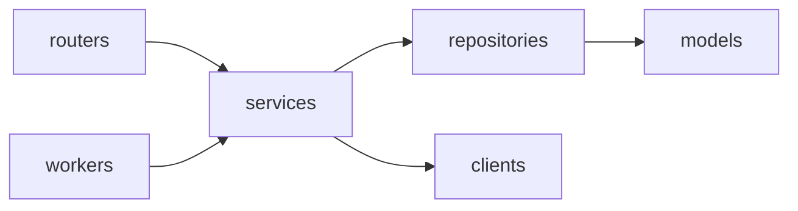

# AnyDeploy Control Plane (WAS)

Railway 처럼 무엇이든 간단히 배포해 주는 배포 서비스 **AnyDeploy** 의 Control Plane 이다. 배포 요청을 받아 AWS CodeBuild 로 이미지를 빌드하고, GitOps 저장소의 image digest 를 바꿔 Argo CD 가 Prod 클러스터에 배포하게 한다.

설계 기준: [.claude/docs/control-plane-build-deploy-flow.md](.claude/docs/control-plane-build-deploy-flow.md)

## 구성

한 Python 패키지(`app/`)에서 세 컴포넌트를 실행 명령만 달리해 띄운다. 운영에서는 모두 Master EKS 에서 돌고, Deployment·IAM Role 은 컴포넌트마다 따로 둔다.

| 컴포넌트 | 진입점 | 하는 일 |
|---|---|---|
| Control API | `app/main.py` | 배포 요청 접수·상태 조회. DB 기록만 한다 |
| Build Worker | `app/workers/build_worker.py` | `BUILD` job 을 선점해 CodeBuild 빌드를 시작하고 image digest 를 기록한다 |
| Deploy Worker | `app/workers/deploy_worker.py` | `DEPLOY`·`ROLLBACK`·`RECONCILE` job 을 선점해 GitOps 저장소를 바꾸고 Argo CD 상태를 수집한다 |

## 디렉터리 구조

```text
app/
├─ main.py         Control API 진입점 (FastAPI)
├─ routers/        Control API 전용 엔드포인트
├─ workers/        Worker 진입점: build_worker.py · deploy_worker.py
├─ schemas/        API 요청·응답, job payload
├─ services/       상태 전이·멱등성·배포 정책 (API·Worker 공용)
├─ repositories/   DB 접근. jobs 선점(claim)·lease 쿼리
├─ models/         SQLAlchemy 모델
├─ clients/        CodeBuild·ECR·GitOps(Git)·Argo CD 비동기 클라이언트
├─ core/           설정·예외·로깅
└─ enums.py        JobKind · JobStatus · Builder
alembic/           DB 마이그레이션
tests/
```



- `routers/` 와 `workers/` 는 서로 참조하지 않고 `services/` 만 호출한다.
- CodeBuild·Git(GitOps)·Argo CD 를 호출하는 로직은 Worker 에서만 실행한다. Control API 는 이 시스템들의 권한을 갖지 않는다. 단, 로그인·저장소 조회를 위한 GitHub OAuth·App 호출은 Control API 가 한다.

## 개발 환경

요구 사항: Python 3.13, [uv](https://docs.astral.sh/uv/), PostgreSQL (로컬 검증: 18)

```bash
uv sync

# 로컬 DB: Docker(OrbStack)로 PostgreSQL 18 을 띄우고 .env 의 DATABASE_URL 을 맞춘다
scripts/dev-db.sh                  # 켜기 (stop: 끄기, reset: 데이터까지 삭제)

cp -n .env.example .env            # .env 가 없을 때만. DB 외 값(GitHub App 등)을 채운다
uv run alembic upgrade head
uv run alembic current             # 접속·적용 revision 확인
```

- DB 는 `docker-compose.dev.yml`(`restart: unless-stopped`, named volume)로 상시 떠 있고 `127.0.0.1:5432` 에서만 접속된다. 비밀번호는 `scripts/dev-db.sh` 가 만들어 `.env` 에만 둔다.
- 직접 만든 PostgreSQL 을 쓰려면 스크립트 없이 `DATABASE_URL` 만 `.env` 에 넣어도 된다(DB 이름은 `softbank_iris` 로 통일).

`.env` 예:

```dotenv
DATABASE_URL=postgresql+asyncpg://<USER>:<PASSWORD>@localhost:5432/softbank_iris
LOG_LEVEL=INFO
```

- `DATABASE_URL` 이 없으면 Control API·Worker 는 시작하자마자 설정 오류로 종료한다.
- `pytest` 는 DB 없이 돈다(`tests/conftest.py` 가 접속되지 않는 URL 을 넣는다). 실제 DB 연결은 서버를 띄워 `GET /readyz` 가 204 인지로 확인한다.
- Repository 통합 테스트(`@pytest.mark.integration`)는 `alembic upgrade head` 가 끝난 DB 를 `TEST_DATABASE_URL` 로 주면 실행되고, 없으면 건너뛴다. 테스트는 트랜잭션을 롤백한다.

| 환경변수 | 설명 |
|---|---|
| `DATABASE_URL` | PostgreSQL 접속 URL. `postgresql+asyncpg://<USER>:<PASSWORD>@<HOST>:5432/<DB>` |
| `LOG_LEVEL` | `DEBUG`·`INFO`·`WARNING`·`ERROR`. 기본 `INFO` |
| `WEB_BASE_URL` | 웹 프런트 주소. 로그인 후 이 주소로 돌려보낸다. 기본 `http://localhost:3000` |
| `SESSION_SECRET` | 세션·OAuth state 서명 키(HS256). 없으면 로그인·인증 API 가 `503 NOT_CONFIGURED` |
| `SESSION_TTL_MINUTES` | 세션 유효 시간(분). 기본 7일 |
| `IS_SESSION_COOKIE_SECURE` | 쿠키 Secure 속성. 기본 `true`, http 로컬 개발에서는 `false` |
| `GITHUB_APP_ID` · `GITHUB_APP_SLUG` | GitHub App ID, 설치 페이지 주소에 쓰는 slug |
| `GITHUB_APP_CLIENT_ID` · `GITHUB_APP_CLIENT_SECRET` | 로그인(사용자 인증)용. 없으면 `503 NOT_CONFIGURED` |
| `GITHUB_APP_PRIVATE_KEY` | App JWT 서명용 PEM. 줄바꿈은 `\n` 도 허용. 없으면 저장소·서비스 API 가 `503 NOT_CONFIGURED` |
| `GITHUB_WEBHOOK_SECRET` | 웹훅 서명 검증 키(App 설정의 Webhook secret 과 같은 값). 없으면 웹훅 API 가 `503 NOT_CONFIGURED` |

## GitHub App

로그인과 저장소 접근을 GitHub App 하나로 처리한다. 사용자 토큰은 로그인 때 한 번만 쓰고 저장하지 않으며, 저장소 접근은 설치(installation) 토큰으로 한다.

App 설정에서 맞춰야 할 값:

- Callback URL: `<API 주소>/api/v1/auth/github/callback`
- **Request user authorization (OAuth) during installation** 켜기 (설치 직후 로그인으로 이어진다)
- 권한: Repository → Contents `Read-only`, Metadata `Read-only`
- 웹훅(push 자동 배포·설치 동기화): Webhook URL `<API 주소>/api/v1/webhooks/github`, Content type `application/json`, Secret 은 `GITHUB_WEBHOOK_SECRET` 과 같게, 이벤트는 Push 를 구독한다. 설계는 [ADR 0009](docs/adr/0009-github-webhook-receiver.md).
- 로컬에서 웹훅을 받으려면 터널로 `localhost:8000` 을 노출한다(예: `npx smee-client --url <smee 채널> --target http://localhost:8000/api/v1/webhooks/github`). 개발용 App 에서만 켠다.

## API (`/api/v1`)

서버를 띄우면 `/docs`(Swagger UI), `/redoc`, `/openapi.json` 에서 전체 명세를 볼 수 있다. 서버 없이 보려면 저장소의 [docs/openapi.json](docs/openapi.json) 을 쓴다(`uv run python -m scripts.export_openapi` 로 갱신, 엔드포인트를 바꾸면 반드시 갱신 — 테스트가 검사한다). Swagger 의 Authorize 에 Bearer 토큰을 넣으면 보호된 API 도 호출해 볼 수 있다.

인증은 쿠키(`anydeploy_session`, 웹) 또는 `Authorization: Bearer <token>`(CLI). 응답은 `ApiResponse` 봉투, JSON 은 camelCase 다.

| 메서드·경로 | 설명 |
|---|---|
| `GET /auth/github` · `GET /auth/github/callback` · `POST /auth/logout` | GitHub 로그인 시작·콜백·로그아웃 |
| `GET /me` | 현재 사용자 |
| `GET /github/install` · `GET /github/installations` | GitHub App 설치 시작 · 내 설치 목록 |
| `GET /github/repos?q&installationId&page&size` | 접근 가능한 저장소 검색 |
| `GET /github/repos/resolve?url=` | 붙여넣은 GitHub 주소 해석·권한 확인 |
| `GET /github/repos/{owner}/{repo}/branches` | 브랜치 목록 |
| `POST·GET /projects` · `GET·PATCH·DELETE /projects/{id}` | 프로젝트 (목록은 서비스 수·online 수 포함) |
| `POST·GET /projects/{id}/services` | 서비스 생성(저장소 연결)·목록 |
| `GET·PATCH·DELETE /services/{id}` | 서비스 조회·설정 변경·삭제 |
| `GET /targets` | 배포 타깃(aws·local) 목록 |

- 프로젝트·서비스는 소유자만 접근한다. 남의 리소스는 `404` 로 답한다. 삭제는 소프트 삭제다.
- 서비스 생성 때 `targetIds` 를 생략하면 등록된 모든 타깃에 배포한다.
- 서비스 이름은 소문자·숫자·하이픈(DNS 레이블)이다. 이후 도메인에 쓰인다.

## 실행

```bash
uv run uvicorn app.main:app --reload          # Control API (GET /healthz: 생존, GET /readyz: DB 연결 — 정상 204, 실패 503)
uv run python -m app.workers.build_worker     # Build Worker
uv run python -m app.workers.deploy_worker    # Deploy Worker
```

Worker 는 SIGTERM·SIGINT 를 받으면 폴링 루프를 끝내고 종료한다.

로그는 stdout 에 JSON 한 줄씩 나간다. 로컬에서는 `... | jq` 로 보면 편하다. 로깅·응답·예외 구조는 [docs/api-response-logging-template.md](docs/api-response-logging-template.md) 참조.

## DB 마이그레이션

Control API·Worker 는 시작할 때 마이그레이션을 실행하지 않는다. 여러 replica 가 동시에 뜨면 마이그레이션도 동시에 돌아 충돌하므로, 항상 별도로 한 번만 실행한다.

```bash
# 로컬
uv run alembic upgrade head                 # 최신까지 적용
uv run alembic downgrade -1                 # 한 단계 되돌리기
uv run alembic current                      # 현재 적용된 revision
uv run alembic upgrade head --sql           # DB 없이 실행될 SQL 만 출력

# 컨테이너 (API·Worker 와 같은 이미지)
docker build -t was .
docker run --rm -e DATABASE_URL=<DATABASE_URL> was alembic upgrade head
```

운영에서는 Argo CD **PreSync hook Job** 이 앱 배포 직전에 같은 이미지 digest 로 `alembic upgrade head` 를 한 번 실행한다. 이 Job 은 DDL 권한 DB 계정을 쓰고, API·Worker 는 DML 권한 계정만 쓴다.

```yaml
metadata:
  annotations:
    argocd.argoproj.io/hook: PreSync
    argocd.argoproj.io/hook-delete-policy: BeforeHookCreation
spec:
  backoffLimit: 0
  template:
    spec:
      restartPolicy: Never
      containers:
        - name: migrate
          image: <ECR_REPO>@sha256:<DIGEST>
          command: ["alembic", "upgrade", "head"]
```

새 revision 은 로컬 DB 에서 아래 순서로 검증한 뒤 커밋한다.

```bash
uv run alembic revision --autogenerate -m "..."   # 생성 후 파일을 열어 검토
uv run alembic upgrade head
uv run alembic check                              # "No new upgrade operations detected" 여야 한다
uv run alembic downgrade -1 && uv run alembic upgrade head
```

마이그레이션 작성 규칙은 [.claude/rules/db-migration.md](.claude/rules/db-migration.md) 를 따른다.

## 자주 쓰는 명령

```bash
uv run ruff check . && uv run ruff format --check .   # 린트·포맷
uv run mypy app                                       # 타입 검사
uv run pytest                                         # 테스트
uv run alembic revision --autogenerate -m "..."       # 마이그레이션 생성
```

## 빌드 입력 준비

소스 분석 뒤 Dockerfile/Railpack 빌더를 추천하고 원본 소스 아카이브를 검증하는 Worker 연동은 [빌드 준비 단계](docs/build-preparation.md)를 참조합니다. Dockerfile이 없으면 Railpack을 추천하며, 서비스 담당자가 빌더 선택·CodeBuild·ECR 실행을 소유합니다. 분석기는 Dockerfile을 생성하지 않습니다.
