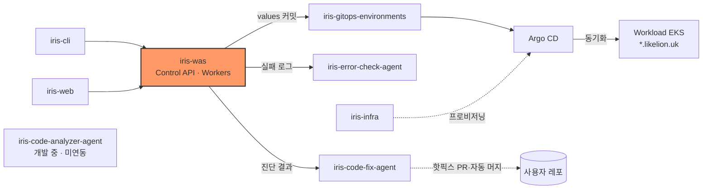
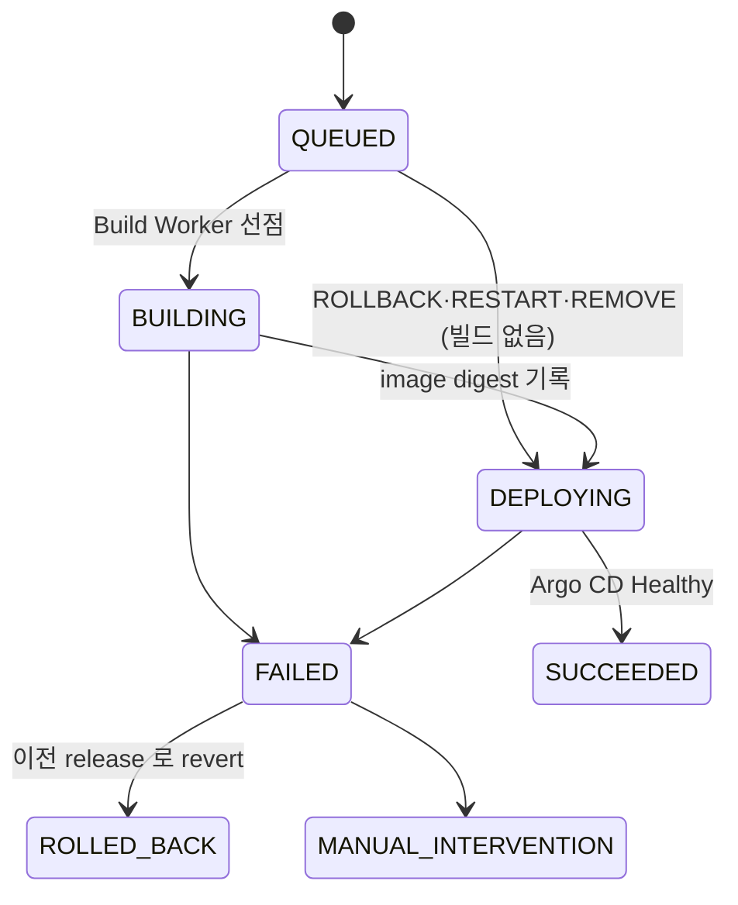
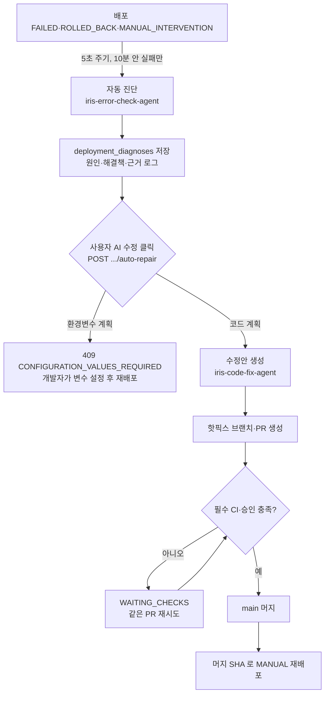

# iris-was

Likelion 의 Control Plane 이다. 배포 요청을 받아 AWS CodeBuild 로 이미지를 빌드하고, GitOps 저장소의 image digest 를 바꿔 Argo CD 가 Workload 클러스터에 배포하게 한다. 배포가 실패하면 AI 진단과 원클릭 수정까지 이어 준다.

   

## 시스템 내 위치



요청은 [iris-web](https://github.com/2026-softbank-1/iris-web) · [iris-cli](https://github.com/2026-softbank-1/iris-cli) 에서 받고, 결과는 [iris-gitops-environments](https://github.com/2026-softbank-1/iris-gitops-environments) 에 쓴다(chart·클러스터는 [iris-infra](https://github.com/2026-softbank-1/iris-infra)).

## 구성

한 Python 패키지(`app/`)에서 세 컴포넌트를 실행 명령만 달리해 띄운다. 운영에서는 모두 management EKS 에서 돌고, Deployment·IAM Role 은 컴포넌트마다 따로 둔다.

| 컴포넌트 | 진입점 | 하는 일 |
|---|---|---|
| Control API | `app/main.py` | 배포 요청 접수·상태 조회, 로그·메트릭 조회, AI 진단·수정 조정 |
| Build Worker | `app/workers/build_worker.py` | `BUILD` job 을 선점해 CodeBuild 빌드를 시작하고 image digest 를 기록한다. 서비스 생성 전 레포 구성 분석(`repository_analyses`)도 선점해 분석기(vendored `iris-analyzer` wheel)를 실행한다([ADR 0030](docs/adr/0030-repository-analysis-gate.md)) |
| Deploy Worker | `app/workers/deploy_worker.py` | `DEPLOY`·`ROLLBACK`·`RECONCILE` job 을 선점해 GitOps 저장소를 바꾸고 Argo CD 상태를 수집한다 |

CodeBuild·GitOps·Argo CD 호출은 Worker 에서만 한다. Control API 는 GitHub 로그인·저장소 조회, 읽기 전용 Loki·Prometheus 조회, 진단·수정 에이전트 호출, 온프레미스 서버용 ECR pull 자격증명 발급(STS AssumeRole)만 한다([ADR 0020](docs/adr/0020-ai-error-diagnosis-via-agent-server.md)).

## 배포 요청과 상태

트리거(`triggerType`):

- `MANUAL` — 브랜치 최신 커밋 또는 지정한 `sourceSha` 를 빌드
- `CLI` — `likelion up` 으로 올린 로컬 폴더를 빌드
- `PUSH` — GitHub App push webhook 으로 자동 배포
- `REDEPLOY` — 이전 배포의 커밋을 다시 빌드
- `ROLLBACK` — 성공한 배포의 이미지를 빌드 없이 배포
- `RESTART` — 지금 이미지로 Pod 만 새로 시작
- `REMOVE` — 클러스터에서 앱을 내림



진행 중에 새 요청이 대신하면 `SUPERSEDED` 로 끝난다. 전이 규칙은 [ADR 0010](docs/adr/0010-deployment-status-transitions-and-history.md), 빌드 없는 배포는 [ADR 0015](docs/adr/0015-rollback-and-restart-reuse-built-image.md)·[ADR 0016](docs/adr/0016-remove-service-deployment.md).

## 실패 → AI 진단 → 원클릭 수정



- 진단이 아직 없으면 클릭이 진단부터 시작한다. 자동 진단은 `DIAGNOSIS_AUTO_START_ENABLED=false` 로 끈다.
- 서버 runner 가 페이지를 닫아도 이어 처리하고, 30분 마감을 넘기면 `DEADLINE_EXCEEDED` 로 멈춘다. GitHub 보호 규칙은 우회하지 않는다.
- 설계: [ADR 0020](docs/adr/0020-ai-error-diagnosis-via-agent-server.md)(진단) · [ADR 0024](docs/adr/0024-durable-code-repair-candidate-api.md)·[0025](docs/adr/0025-web-code-repair-publication.md)·[0026](docs/adr/0026-one-click-automatic-repair.md)(수정). API 는 [진단](docs/diagnosis-api.md) · [수정](docs/repair-api.md) · [에이전트 계약](docs/repair-agent-integration.md).

## 기술 스택

Python 3.13 · uv · FastAPI · SQLAlchemy 2 (asyncio) · asyncpg · Alembic · PostgreSQL 18 · AWS CodeBuild·ECR·S3 · Argo CD · Sealed Secrets

## 디렉터리 구조

```text
app/        main.py · routers/ · workers/ · services/ · repositories/ · models/ · clients/ · schemas/ · core/
alembic/    DB 마이그레이션
docs/       API·설정·운영 문서, ADR
scripts/    로컬 DB, OpenAPI 내보내기
specs/      기능 명세
tests/
```

`routers/` 와 `workers/` 는 서로 참조하지 않고 `services/` 만 호출한다.

## 빠른 시작

요구 사항: Python 3.13, [uv](https://docs.astral.sh/uv/), Docker(로컬 PostgreSQL)

```bash
uv sync
scripts/dev-db.sh                              # PostgreSQL 18 켜기 (stop·reset)
cp -n .env.example .env                        # DATABASE_URL 외 값 채우기
uv run alembic upgrade head
uv run uvicorn app.main:app --reload           # Control API (GET /readyz 204 면 DB 연결 정상)
uv run python -m app.workers.build_worker      # Build Worker
uv run python -m app.workers.deploy_worker     # Deploy Worker
uv run pytest                                  # DB 없이 도는 테스트
```

필수 환경변수는 `DATABASE_URL` 하나다(없으면 바로 종료). 로그인은 `SESSION_SECRET`·`GITHUB_APP_*`, 변수 API 는 `VARIABLES_ENCRYPTION_KEY` 가 있어야 켜진다(없으면 `503 NOT_CONFIGURED`). 전체 목록과 GitHub App 설정은 [docs/configuration.md](docs/configuration.md).

## 인터페이스 요약

`/api/v1`, 인증은 쿠키(웹) 또는 `Authorization: Bearer`(CLI), 응답은 `ApiResponse` 봉투·camelCase JSON 이다.

| 메서드·경로 | 설명 |
|---|---|
| `POST /auth/cli/sessions` | CLI 로그인 세션 생성 (`likelion login`) |
| `POST /projects/{id}/services` | 서비스 생성(저장소 연결) |
| `POST /services/{id}/uploads` | `likelion up` 소스 업로드 |
| `POST·GET /services/{id}/deployments` | 배포 요청 생성·목록 |
| `GET /services/{id}/deployments/{deploymentId}/diagnosis` | 최근 AI 진단 조회 |
| `POST /services/{id}/deployments/{deploymentId}/auto-repair` | 원클릭 AI 수정 시작 |

- 전체 목록·규칙: [docs/api.md](docs/api.md). 명세: [Swagger](https://api.likelion.uk/docs) · [docs/openapi.json](docs/openapi.json)(엔드포인트를 바꾸면 `uv run python -m scripts.export_openapi` 로 갱신, 테스트가 검사한다).
- GitOps 계약: Deploy Worker 가 `iris-gitops-environments` 의 `services/{service_id}/{prod|onprem|onprem-{serverKey}}/values.yaml` 과 등록 서버의 `platform/onprem-servers/{serverKey}/values.yaml` 을 `main` 에 fast-forward 커밋한다.

## 배포

GitHub Actions **Deploy platform**(`workflow_dispatch`, main 전용)으로만 배포한다. 이미지를 ECR `iris/was` 에 push 하고, 고른 컴포넌트(api·build_worker·deploy_worker)의 digest 를 `iris-gitops-environments` 의 `platform/aws-dev-management/was.yaml` 에 커밋하면 management EKS 의 Argo CD 가 반영한다. DB 마이그레이션은 api 배포에 포함된다. 상세는 [docs/operations.md](docs/operations.md).

## 현재 상태 / 한계

- 서비스는 타깃(aws·onprem) 하나에만 배포한다([ADR 0027](docs/adr/0027-single-deploy-target-per-service.md)). 카나리·블루그린은 AWS 타깃에서 `DEPLOYMENT_STRATEGY_ENABLED` 를 켠 경우만 쓰고, on-prem 은 롤링만 한다([ADR 0028](docs/adr/0028-deployment-strategy-selection.md)).
- 한 레포 분석에서 만든 서비스(앱 + 개발용 관리형 DB)는 스택으로 묶여 DB → 앱 → 나머지 순서로 배포되고, push 는 바뀐 앱만 같은 순서로 다시 빌드하며 레포를 다시 분석해 구성 변경을 알린다. 앱 변수는 DB 연결 정보를 참조 변수로 받고, compose 호스트명은 호스트 별칭으로 풀린다. 배포 전 환경변수 검증이 확실히 실패할 설정을 `422 VARIABLES_INVALID` 로 막는다. DB·별칭·참조는 `PROJECT_NETWORKING_ENABLED`(chart 0.9.0) 를 켠 AWS 타깃에서만 쓴다([ADR 0031](docs/adr/0031-project-stacks-databases-and-variable-references.md)).
- 사용자는 설치 명령 한 줄로 자기 Ubuntu 서버를 배포 타깃으로 붙인다(`/onprem-servers`, 사용자당 5대). 서버마다 전용 타깃 `onprem-{serverKey}` 가 생기고, `CONNECTED` 일 때만 배포한다. Deploy Worker 가 서버 접속 정보를 봉인해 GitOps 에 커밋하고 probe Application 으로 연결을 확인한다([ADR 0029](docs/adr/0029-user-registered-onprem-servers.md), [계약](docs/onprem-server-registration-contract.md)).
- 사용자 환경변수는 Deploy Worker 에 `SEALED_SECRETS_CERT` 가 있어야 SealedSecret 으로 앱 컨테이너에 전달된다([ADR 0017](docs/adr/0017-service-variables-encrypted-storage-and-deploy-snapshot.md)).
- 원클릭 수정은 코드만 고친다. 환경변수 문제는 개발자가 직접 값을 넣고 재배포해야 한다.
- 서비스 이름·도메인 변경은 MVP 범위가 아니다([ADR 0014](docs/adr/0014-service-domain-lookup.md)).

## 문서

- [설정](docs/configuration.md) · [API](docs/api.md) · [온프레미스 서버 등록 계약](docs/onprem-server-registration-contract.md) · [운영](docs/operations.md) · [배포 상세 API](docs/deployment-details-api.md) · [관측 API](docs/observability-api.md) · [스케일링 API](docs/service-scaling-api.md) · [업로드 API](docs/upload-api.md)
- [ADR 목록](docs/adr/README.md) · [Deploy Worker 로컬 테스트](docs/deploy-worker-test-guide.md) · [로깅·응답 구조](docs/api-response-logging-template.md)
- 내부 설계 메모: [.claude/docs/control-plane-build-deploy-flow.md](.claude/docs/control-plane-build-deploy-flow.md)
