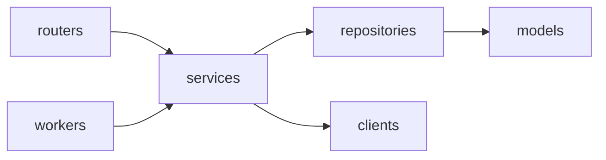

# AnyDeploy Control Plane (WAS)

Railway 처럼 무엇이든 간단히 배포해 주는 배포 서비스 **AnyDeploy** 의 Control Plane 이다. 배포 요청을 받아 AWS CodeBuild 로 이미지를 빌드하고, GitOps 저장소의 image digest 를 바꿔 Argo CD 가 Prod 클러스터에 배포하게 한다.

설계 기준: [.claude/docs/control-plane-build-deploy-flow.md](.claude/docs/control-plane-build-deploy-flow.md)

## 구성

한 Python 패키지(`app/`)에서 세 컴포넌트를 실행 명령만 달리해 띄운다. 운영에서는 모두 Master EKS 에서 돌고, Deployment·IAM Role 은 컴포넌트마다 따로 둔다.

| 컴포넌트 | 진입점 | 하는 일 |
|---|---|---|
| Control API | `app/main.py` | 배포 요청 접수·상태 조회. DB 기록만 한다 |
| Build Worker | `app/workers/build_worker.py` | `BUILD` job 을 선점해 CodeBuild 빌드를 시작하고 image digest 를 기록한다 |
| Deploy Worker | `app/workers/deploy_worker.py` | `DEPLOY`·`ROLLBACK`·`RECONCILE` job 을 선점해 GitOps 저장소를 바꾸고 Argo CD 상태를 수집한다 |

## 디렉터리 구조

```text
app/
├─ main.py         Control API 진입점 (FastAPI)
├─ routers/        Control API 전용 엔드포인트
├─ workers/        Worker 진입점: build_worker.py · deploy_worker.py
├─ schemas/        API 요청·응답, job payload
├─ services/       상태 전이·멱등성·배포 정책 (API·Worker 공용)
├─ repositories/   DB 접근. jobs 선점(claim)·lease 쿼리
├─ models/         SQLAlchemy 모델
├─ clients/        CodeBuild·ECR·GitOps(Git)·Argo CD 비동기 클라이언트
├─ core/           설정·예외·로깅
└─ enums.py        JobKind · JobStatus · Builder
alembic/           DB 마이그레이션
tests/
```



- `routers/` 와 `workers/` 는 서로 참조하지 않고 `services/` 만 호출한다.
- CodeBuild·Git·Argo CD 를 호출하는 로직은 Worker 에서만 실행한다. Control API 는 외부 시스템 권한을 갖지 않는다.

## 개발 환경

요구 사항: Python 3.13, [uv](https://docs.astral.sh/uv/), PostgreSQL

```bash
uv sync
cp .env.example .env               # DATABASE_URL 입력 (postgresql+asyncpg://...)
uv run alembic upgrade head
```

| 환경변수 | 설명 |
|---|---|
| `DATABASE_URL` | PostgreSQL 접속 URL. `postgresql+asyncpg://<USER>:<PASSWORD>@<HOST>:5432/<DB>` |
| `LOG_LEVEL` | `DEBUG`·`INFO`·`WARNING`·`ERROR`. 기본 `INFO` |

## 실행

```bash
uv run uvicorn app.main:app --reload          # Control API (GET /healthz: 생존, GET /readyz: DB 연결 — 정상 204, 실패 503)
uv run python -m app.workers.build_worker     # Build Worker
uv run python -m app.workers.deploy_worker    # Deploy Worker
```

Worker 는 SIGTERM·SIGINT 를 받으면 폴링 루프를 끝내고 종료한다.

로그는 stdout 에 JSON 한 줄씩 나간다. 로컬에서는 `... | jq` 로 보면 편하다. 로깅·응답·예외 구조는 [docs/api-response-logging-template.md](docs/api-response-logging-template.md) 참조.

## DB 마이그레이션

Control API·Worker 는 시작할 때 마이그레이션을 실행하지 않는다. 여러 replica 가 동시에 뜨면 마이그레이션도 동시에 돌아 충돌하므로, 항상 별도로 한 번만 실행한다.

```bash
# 로컬
uv run alembic upgrade head                 # 최신까지 적용
uv run alembic downgrade -1                 # 한 단계 되돌리기
uv run alembic current                      # 현재 적용된 revision
uv run alembic upgrade head --sql           # DB 없이 실행될 SQL 만 출력

# 컨테이너 (API·Worker 와 같은 이미지)
docker build -t was .
docker run --rm -e DATABASE_URL=<DATABASE_URL> was alembic upgrade head
```

운영에서는 Argo CD **PreSync hook Job** 이 앱 배포 직전에 같은 이미지 digest 로 `alembic upgrade head` 를 한 번 실행한다. 이 Job 은 DDL 권한 DB 계정을 쓰고, API·Worker 는 DML 권한 계정만 쓴다.

```yaml
metadata:
  annotations:
    argocd.argoproj.io/hook: PreSync
    argocd.argoproj.io/hook-delete-policy: BeforeHookCreation
spec:
  backoffLimit: 0
  template:
    spec:
      restartPolicy: Never
      containers:
        - name: migrate
          image: <ECR_REPO>@sha256:<DIGEST>
          command: ["alembic", "upgrade", "head"]
```

마이그레이션 작성 규칙은 [.claude/rules/db-migration.md](.claude/rules/db-migration.md) 를 따른다.

## 자주 쓰는 명령

```bash
uv run ruff check . && uv run ruff format --check .   # 린트·포맷
uv run mypy app                                       # 타입 검사
uv run pytest                                         # 테스트
uv run alembic revision --autogenerate -m "..."       # 마이그레이션 생성
```
