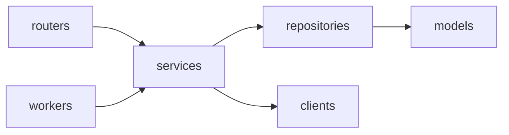

# AnyDeploy Control Plane (WAS)

Railway 처럼 무엇이든 간단히 배포해 주는 배포 서비스 **AnyDeploy** 의 Control Plane 이다. 배포 요청을 받아 AWS CodeBuild 로 이미지를 빌드하고, GitOps 저장소의 image digest 를 바꿔 Argo CD 가 Prod 클러스터에 배포하게 한다.

설계 기준: [.claude/docs/control-plane-build-deploy-flow.md](.claude/docs/control-plane-build-deploy-flow.md)

## 구성

한 Python 패키지(`app/`)에서 세 컴포넌트를 실행 명령만 달리해 띄운다. 운영에서는 모두 Master EKS 에서 돌고, Deployment·IAM Role 은 컴포넌트마다 따로 둔다.

| 컴포넌트 | 진입점 | 하는 일 |
|---|---|---|
| Control API | `app/main.py` | 배포 요청 접수·상태 조회. DB 기록만 한다 |
| Build Worker | `app/workers/build_worker.py` | `BUILD` job 을 선점해 CodeBuild 빌드를 시작하고 image digest 를 기록한다 |
| Deploy Worker | `app/workers/deploy_worker.py` | `DEPLOY`·`ROLLBACK`·`RECONCILE` job 을 선점해 GitOps 저장소를 바꾸고 Argo CD 상태를 수집한다 |

## 디렉터리 구조

```text
app/
├─ main.py         Control API 진입점 (FastAPI)
├─ routers/        Control API 전용 엔드포인트
├─ workers/        Worker 진입점: build_worker.py · deploy_worker.py
├─ schemas/        API 요청·응답, job payload
├─ services/       상태 전이·멱등성·배포 정책 (API·Worker 공용)
├─ repositories/   DB 접근. jobs 선점(claim)·lease 쿼리
├─ models/         SQLAlchemy 모델
├─ clients/        CodeBuild·ECR·GitOps(Git)·Argo CD 비동기 클라이언트
├─ core/           설정·예외·로깅
└─ enums.py        JobKind · JobStatus · Builder · BuildStatus · FailureCode 등
alembic/           DB 마이그레이션
tests/
```



- `routers/` 와 `workers/` 는 서로 참조하지 않고 `services/` 만 호출한다.
- CodeBuild·Git·Argo CD 를 호출하는 로직은 Worker 에서만 실행한다. Control API 는 외부 시스템 권한을 갖지 않는다.

## 개발 환경

요구 사항: Python 3.13, [uv](https://docs.astral.sh/uv/), PostgreSQL (로컬 검증: 18)

```bash
uv sync

# 로컬 DB 생성 (DB 이름은 softbank_iris 로 통일)
createdb -h localhost -U <USER> softbank_iris

cp .env.example .env               # DATABASE_URL 입력
uv run alembic upgrade head
uv run alembic current             # 접속·적용 revision 확인
```

`.env` 예:

```dotenv
DATABASE_URL=postgresql+asyncpg://<USER>:<PASSWORD>@localhost:5432/softbank_iris
LOG_LEVEL=INFO
```

- `DATABASE_URL` 이 없으면 Control API·Worker 는 시작하자마자 설정 오류로 종료한다.
- `pytest` 는 DB 없이 돈다(`tests/conftest.py` 가 접속되지 않는 URL 을 넣는다). 실제 DB 연결은 서버를 띄워 `GET /readyz` 가 204 인지로 확인한다.

| 환경변수 | 설명 |
|---|---|
| `DATABASE_URL` | PostgreSQL 접속 URL. `postgresql+asyncpg://<USER>:<PASSWORD>@<HOST>:5432/<DB>` |
| `LOG_LEVEL` | `DEBUG`·`INFO`·`WARNING`·`ERROR`. 기본 `INFO` |

Build Worker 만 쓰는 값(`BuildWorkerSettings`). Control API 에는 넣지 않는다.

| 환경변수 | 설명 |
|---|---|
| `GITHUB_APP_ID` · `GITHUB_APP_PRIVATE_KEY` | Iris GitHub App ID·private key(PEM). 운영은 Secrets Manager → K8s Secret 으로 주입 |
| `GITHUB_PUBLIC_INSTALLATION_ID` | 우리 조직의 App 설치 ID. 앱을 설치하지 않은 공개 레포를 받을 때 쓴다 |
| `AWS_REGION` | CodeBuild·ECR·S3 리전 |
| `CODEBUILD_PROJECT` · `ARTIFACT_BUCKET` | iris-infra `aws/dev/foundation` 출력값. dev: `iris-dev-build` · `iris-dev-build-artifacts-<ACCOUNT_ID>-ap-northeast-2` |
| `CONCURRENCY` | Worker 1개가 동시에 처리할 BUILD job 수. 기본 4 |
| `USER_CONCURRENT_BUILD_LIMIT` · `BUILD_TIMEOUT_MINUTES` · `SNAPSHOT_MAX_BYTES` | 사용자별 동시 빌드 2 · 빌드 15분 · 스냅샷 250MB |

Deploy Worker 만 쓰는 값(`DeployWorkerSettings`). Build Worker 와 GitHub App·자격증명을 공유하지 않는다.

| 환경변수 | 설명 |
|---|---|
| `AWS_REGION` | ECR 리전 (`r-*` 태그) |
| `BASE_DOMAIN` | 사용자 서비스 도메인. 서비스는 `{slug}.<BASE_DOMAIN>` 으로 열린다 |
| `GITOPS_REPOSITORY` | `{owner}/gitops-environments`. `main` 에 fast-forward 커밋만 한다 |
| `GITOPS_APP_ID` · `GITOPS_APP_PRIVATE_KEY` · `GITOPS_INSTALLATION_ID` | `iris-gitops` GitHub App(contents:write, GitOps 저장소에만 설치) |
| `ARGOCD_SERVER_URL` · `ARGOCD_TOKEN` | Argo CD API 주소, project role `deploy-reader` 토큰(applications get) |

## 실행

```bash
uv run uvicorn app.main:app --reload          # Control API (GET /healthz: 생존, GET /readyz: DB 연결 — 정상 204, 실패 503)
uv run python -m app.workers.build_worker     # Build Worker
uv run python -m app.workers.deploy_worker    # Deploy Worker
```

Worker 는 SIGTERM·SIGINT 를 받으면 폴링 루프를 끝내고 종료한다. Build Worker 는 CodeBuild 를 기다리던 job 을 반납하고, 다른 Worker 가 기록된 `codebuild_build_id` 로 이어서 처리한다. 스냅샷(최대 250MB 다운로드·업로드) 중에는 반납하지 않으므로 Pod `terminationGracePeriodSeconds` 를 120 이상으로 둔다.

Build Worker 흐름: BUILD job 선점 → GitHub tarball(S3 스냅샷) → 빌더 결정(`iris.json` > 서비스 설정 > Dockerfile 유무) → CodeBuild(buildspec 은 iris-infra `terraform/environments/aws/dev/foundation/buildspec.yml`. 환경변수 이름이 계약이다) → ECR digest 조회 → 같은 트랜잭션에서 `builds=SUCCEEDED`·요청 `DEPLOYING`·DEPLOY job 생성.

Deploy Worker 흐름: DEPLOY 선점 → release(PENDING) 생성(서비스당 1개, 진행 중이면 snooze) → `services/{service_id}/prod/values.yaml`(플랫폼 Helm chart values) 렌더링 → 커밋 SHA 기록 → `main` fast-forward → RECONCILE 이 10초마다 Argo CD 상태 확인(대기 중에는 job 을 잡지 않고 snooze) → 성공이면 ECR `r-{release_id}` 태그·`SUCCEEDED`, 실패면 이전 정상 release 의 디렉터리로 되돌리는 revert commit(ROLLBACK). 상세는 [.claude/docs/deploy-worker-plan.md](.claude/docs/deploy-worker-plan.md), 로컬 테스트는 [docs/deploy-worker-test-guide.md](docs/deploy-worker-test-guide.md).

로그는 stdout 에 JSON 한 줄씩 나간다. 로컬에서는 `... | jq` 로 보면 편하다. 로깅·응답·예외 구조는 [docs/api-response-logging-template.md](docs/api-response-logging-template.md) 참조.

## DB 마이그레이션

Control API·Worker 는 시작할 때 마이그레이션을 실행하지 않는다. 여러 replica 가 동시에 뜨면 마이그레이션도 동시에 돌아 충돌하므로, 항상 별도로 한 번만 실행한다.

```bash
# 로컬
uv run alembic upgrade head                 # 최신까지 적용
uv run alembic downgrade -1                 # 한 단계 되돌리기
uv run alembic current                      # 현재 적용된 revision
uv run alembic upgrade head --sql           # DB 없이 실행될 SQL 만 출력

# 컨테이너 (API·Worker 와 같은 이미지)
docker build -t was .
docker run --rm -e DATABASE_URL=<DATABASE_URL> was alembic upgrade head
```

운영에서는 Argo CD **PreSync hook Job** 이 앱 배포 직전에 같은 이미지 digest 로 `alembic upgrade head` 를 한 번 실행한다. 이 Job 은 DDL 권한 DB 계정을 쓰고, API·Worker 는 DML 권한 계정만 쓴다.

```yaml
metadata:
  annotations:
    argocd.argoproj.io/hook: PreSync
    argocd.argoproj.io/hook-delete-policy: BeforeHookCreation
spec:
  backoffLimit: 0
  template:
    spec:
      restartPolicy: Never
      containers:
        - name: migrate
          image: <ECR_REPO>@sha256:<DIGEST>
          command: ["alembic", "upgrade", "head"]
```

새 revision 은 로컬 DB 에서 아래 순서로 검증한 뒤 커밋한다.

```bash
uv run alembic revision --autogenerate -m "..."   # 생성 후 파일을 열어 검토
uv run alembic upgrade head
uv run alembic check                              # "No new upgrade operations detected" 여야 한다
uv run alembic downgrade -1 && uv run alembic upgrade head
```

마이그레이션 작성 규칙은 [.claude/rules/db-migration.md](.claude/rules/db-migration.md) 를 따른다.

## 배포 (management EKS)

GitHub Actions **Deploy platform**(`workflow_dispatch`, main 전용)으로만 배포한다.

1. 실행 시 `api`(Control API, DB migration 포함)·`build_worker`·`deploy_worker` 중 배포할 것을 고른다.
2. 이미지를 한 번 빌드해 ECR `iris/was`에 push 하고, 고른 컴포넌트의 digest 만 `iris-gitops-environments`의 이 레포 전용 파일 `platform/aws-dev-management/was.yaml`(`api`·`buildWorker`·`deployWorker` 의 `digest`)에 커밋한다.
3. management EKS의 Argo CD(`iris-platform`)가 반영한다. DB 스키마 변경은 api 배포의 migration 으로만 적용된다.

GitHub 설정은 secret `GITOPS_APP_PRIVATE_KEY`(GitHub App `softbank-iris-github-app`, ID `5148916`) 하나다. 계정·ECR 역할(`iris-dev-github-ecr-was`)·저장소 이름은 workflow 상수다.

Secret·RDS·rollback 절차는 iris-infra `docs/runbooks/deploy-platform.md`를 본다.

## 자주 쓰는 명령

```bash
uv run ruff check . && uv run ruff format --check .   # 린트·포맷
uv run mypy app                                       # 타입 검사
uv run pytest                                         # 테스트
TEST_DATABASE_URL=postgresql+asyncpg://<USER>:<PASSWORD>@localhost:5432/softbank_iris_test uv run pytest  # jobs 큐·BuildService·DeployService 통합 테스트 포함 (테이블을 지우고 만드므로 전용 DB)
uv run alembic revision --autogenerate -m "..."       # 마이그레이션 생성
```
