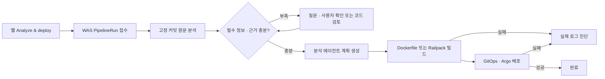

# 1002 — 분석 에이전트 · WAS · 프론트 연동 변경과 현재 설계

작성일: 2026-10-02. 작업 브랜치: `feat/ai-analysis-integration`.
이 문서는 이번 변경과 현재 구현 계약을 정리한다. 사용자의 마감 요청 이후 추가 검증 실행 없이 코드와 문서를 올린다.

## 최종 흐름

배포 전 분석을 유지한다. 단독 Analyze only도 유지한다. 분석 작업의 성공과 배포 성공은 다른 상태다. 정보 부족·소스 오류를 숨겨 배포 가능한 상태로 바꾸지 않는다.

## 무엇을 수정했는가

| 영역 | 수정 내용 | 주요 파일 |
|---|---|---|
| 분석기 연결 | 고정 분석기 wheel을 사용하며 원문 근거·검증·readiness를 저장. 입력 확인 후 동일 분석기의 `plan_async` 호출 추가 | `app/clients/analyzer_client.py`, 기존 analysis service/worker |
| 파이프라인 API | 소유자 인증, 고정 SHA, 멱등성, 최신 조회, 부족 정보 답변, 빌드 전 취소 | `app/routers/pipeline_router.py`, `app/services/pipeline_service.py`, `app/schemas/pipeline.py` |
| 진행 조정 | 분석 대기→질문→계획→BUILD 접수→배포 상태 관찰. source/config/target/설치 접근 변경 차단 | `app/services/pipeline_worker_service.py`, `app/workers/pipeline_worker.py` |
| 계획 계약 | source snapshot/result/입력/타깃과 확인된 build config를 묶고 digest 검사 | `app/services/pipeline_contract.py`, `app/services/pipeline_planning.py` |
| 빌드 실행 | 현재 develop 모델에 Worker 연결. 원문 snapshot 재검사→S3 archive→CodeBuild→ECR digest | `app/services/build_service.py`, `app/clients/aws_clients.py`, `app/workers/build_worker.py` |
| 배포 실행 | 실제 GitOps 경로/Argo 이름에 맞춤. FF commit·release tag·rollout 관찰·조건부 자동 rollback | `app/services/deploy_service.py`, GitOps/Argo clients, `app/workers/deploy_worker.py` |
| 실패 진단 | 개발된 오류 에이전트 v2 재사용. 실제 CloudWatch/Argo 로그, 마스킹, 근거·원인 후보·수정 제안 | diagnosis/failure_log clients, diagnosis service/repository/router/worker |
| 자동 배포 | 관리된 서비스 push를 raw BUILD 대신 분석 파이프라인으로 접수 | `app/services/webhook_service.py`, `app/schemas/webhook.py` |
| 기존 직접 배포 | 관리된 서비스의 raw deployment 요청은 `409 PIPELINE_REQUIRED`로 안내 | `app/services/manual_deployment_service.py` |
| DB | PipelineRun/DeploymentDiagnosis 추가, Build snapshot/config 및 Release 실행·복구 필드 추가 | `app/models/*`, 신규 Alembic revision, `.claude/rules/db-schema.sql` |
| 프론트 | Create/Analyze & deploy 연결, 단계 표시·질문 재개·계획·실패 진단·새로고침 복원 | iris-web의 pipeline/diagnosis API·hooks·Analysis/Details 화면 |
| 인프라 계약 | 확인된 공개 환경값/기존 Secret 참조를 Pod에 전달하는 chart 0.5.0 | iris-infra `iris-service` deployment/schema 및 ApplicationSet pin |

기존 코드 분석 에이전트 원본은 이번 마감에서 변경하지 않는다. 이미 `iris-code-analyzer-agent/main`에 올라간 `1d9d2e38086b394d60fe90d889c6978357e35681`을 고정한다. 오류 에이전트는 `iris-error-check-agent`의 `e4d1984bc1b0770623f4da02243100ab8639e638`을 고정한다. 각 wheel의 원본과 digest는 `vendor/*-manifest.json`에 기록한다.

## 현재 설계

### API와 다섯 Worker

| 컴포넌트 | 역할 |
|---|---|
| Control API | 사용자 권한 확인·작업 접수·조회·입력 확인 |
| Analysis Worker | 고정 source의 실제 분석·근거·readiness 보관 |
| Pipeline Worker | 질문 해결 및 계획 생성 후 빌드/배포 연결 |
| Build Worker | S3·CodeBuild·ECR 실행 |
| Deploy Worker | GitOps 갱신과 Argo 상태 관찰·안전한 자동 복구 |
| Diagnosis Worker | 실패 실행 회차의 실제 로그와 진단 결과 보관 |

모델/클라우드 실행은 Worker에서 수행한다. API에는 각 Worker의 쓰기 권한을 제공하지 않는 운영 구성이 필요하다. 프로세스 종료·lease 유실 시 오래된 Worker가 새 상태를 덮어쓰지 않도록 점유를 확인한다. 유료 모델 호출 후 결과가 불확실하면 재실행 대신 복구 불확실 오류로 남긴다.

### 상태와 사용자 입력

`QUEUED → ANALYZING → AWAITING_INPUT → PLANNING → BUILDING → DEPLOYING → SUCCEEDED`.
정보가 충분하면 질문 단계를 건너뛴다. 실패/취소는 FAILED/CANCELLED다. `autoDeploy:false`는 계획만 만들고 `SUCCEEDED/plan_ready`로 끝난다.

질문은 후보 서비스·Dockerfile·포트·환경 바인딩을 다룬다. runtime/role 불확실성, source 검증 오류, Node/Docker runtime 충돌, 미지원 storage 등은 code_review로 중단한다. 시작 명령 미확인은 이미지/빌더의 기본 실행을 허용하며 실제 실행 오류를 로그로 진단한다.

환경 입력은 공개 값 또는 기존 namespace Secret 참조다. 실제 비밀값을 폼·GitOps에 넣지 않는다. Secret은 `svc-{serviceId}`에 미리 존재해야 한다. Kubernetes runtime Secret은 CodeBuild secret 공급 경로가 아니므로 필수 build secret으로 확인되면 진행을 중단한다.

### 두 종류 계획

1. 분석기 `deploymentDossier`: 원본 계획·질문·실행 미확정 상태를 보존한다. 이미지와 런타임 검증이 아직 없으면 blocked일 수 있다. `executionAuthorized:false`를 보존한다.
2. 플랫폼 `iris.pipeline-plan.v1`: 고정 repository/SHA/sourceSnapshotId/analysisResultDigest, 선택 앱, 사용자 입력 digest, builder/root/port/commands/public-or-secret bindings, 선택 운영 타깃 및 analyzer plan digest를 묶는다.

사용자의 Analyze & deploy 요청이 기존 플랫폼 Worker 실행을 허용한다. BUILD/DEPLOY는 큐 설정과 저장된 plan digest가 같은지 검사한다. Source/readiness 및 미지원 바인딩 문제는 원본 계획에서 무시하지 않는다. 빌드 후 image digest와 배포 후 실제 runtime 상태는 각각 해당 Worker가 확인한다.

### 빌드·배포

현재 AWS ApplicationSet에 맞춰 서비스당 AWS 타깃 하나를 지원한다. 저장소 안에 앱 하나를 기본 가정으로 삼되 복수 후보는 사용자 선택을 요구한다.

Dockerfile 또는 Railpack 0.40.1로 빌드한다. 고정 SHA source를 다시 받아 analyzer snapshot을 비교하고 archive digest를 기록한다. CodeBuild 실행 ID 응답이 유실되면 기록된 실행 의도로 기존 빌드를 찾는다. 배포는 ECR digest를 사용하고 release 보존 tag를 붙인다.

GitOps 경로는 `services/{serviceId}/prod/values.yaml`, Application/namespace는 `svc-{serviceId}`다. 강제 push 없이 release trailer를 가진 FF commit을 기록한다. Argo가 해당 revision에서 Synced+Healthy가 된 뒤 성공으로 판단한다.

실패 자동 rollback은 이전 정상 manifest가 있고 실패 후 해당 서비스 subtree가 바뀌지 않은 경우에만 한다. revert revision도 Synced+Healthy까지 관찰한다. 수동 과거 commit 재배포/rollback은 별도 실행 계약이 필요해 이번 웹에서 해당 버튼을 제거했다. 새 Analyze & deploy는 현재 branch head를 분석하는 동작임을 표시한다.

### 실패 진단

원래 deployment FAILED 상태를 보존한다. 실행 회차별 진단은 멱등하게 접수한다. 실제 CloudWatch/Argo 메시지의 출처·줄 범위·마스킹·수집 제한을 저장한다. 로그가 없으면 가공해서 만들지 않는다.

결과는 diagnosis-result.v2의 관찰 사실·근거·원인 후보·불확실성·추가 확인 및 remediation을 표시한다. 수정안의 적용 조건·검증·rollback·risk는 제안이며 자동 실행하지 않는다. 모델·가격 미설정, timeout, 진단 실패도 배포 상태를 바꾸지 않는다.

## 프론트와 맞춘 계약

- `POST/GET /api/v1/services/{id}/pipelines`
- `POST /api/v1/services/{id}/pipelines/{pipelineId}/answers`
- `POST /api/v1/services/{id}/pipelines/{pipelineId}/cancel`
- `POST/GET /api/v1/services/{id}/deployments/{deploymentId}/diagnosis`

Create 및 Analyze & deploy는 `{mode,autoDeploy:true,enableAutoDeploy:true}`를 접수한다. 서버 상태를 폴링하고 분석·질문·계획·빌드·배포 단계와 해당 analysis/deployment ID를 연결한다. 빌드 이후 취소를 제공하지 않는다. AI 설정 오류를 표시하며 static으로 자동 전환하지 않는다. 사용자는 Static analysis를 직접 선택할 수 있다.

원문 근거·detected/suggested/unknown 구분·단독 분석 설정 확인은 유지한다. 기존 일반 로그/지표/Variables 샘플 탭은 이번 실제 파이프라인 바인딩/진단 기능과 구분한다.

## 적용 조건과 남은 검증

- 신규 Alembic revision `1a1a1f44b125` 적용 및 API/다섯 Worker 배포가 필요하다.
- AI 분석/계획에는 고정 OpenCode 1.18.33 또는 같은 버전·정책의 서버와 모델 설정이 필요하다. 진단 모델/가격은 `DIAGNOSIS_*`로 운영자가 지정한다.
- GitHub App, S3/CodeBuild/ECR, GitOps App, Argo token, CloudWatch 읽기 권한을 각 Worker에 구성한다. 분석/진단 budget ledger는 영속 공유 경로를 사용한다.
- 변수 포함 GitOps values에는 iris-infra chart 0.5.0 merge/tag 및 ApplicationSet 적용이 선행되어야 한다. 기존 chart 0.4.0은 새 `environment` 필드를 거절한다.
- 관리되지 않은 legacy raw deployment API의 BUILD는 새 Worker의 검증된 계획 계약을 만족하지 않는다. 지원 경로는 파이프라인 API다.
- 이전 작업 중 실제 PostgreSQL·agent 패키지와 통제된 cloud/model 대역, 프론트 타입/빌드/브라우저 fixture를 개별 확인했다. 운영 AWS/유료 모델 배포 검증은 수행하지 않았다. 사용자의 마감 요청 이후 최종 변경을 포함한 추가 전체 검증은 실행하지 않았다.

운영 구성 및 상세 계약: [pipeline-integration.md](pipeline-integration.md). 설계 결정: [ADR 0012](adr/0012-analysis-before-build-and-failure-diagnosis.md).
