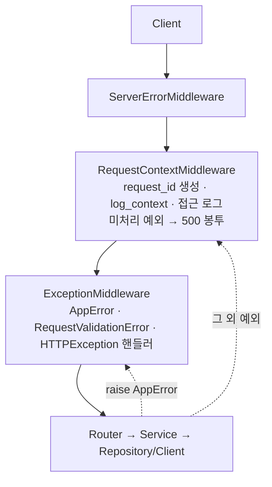

# FastAPI 응답·예외·로깅 템플릿

FastAPI 서비스에 공통 응답 봉투, 예외 계층, 구조화 로깅을 까는 템플릿이다. 이 레포(Likelion Control Plane)에서 쓰는 구성을 기록하고, 다른 프로젝트로 옮길 때 체크리스트로 쓴다.

- 대상: Python 3.13+, FastAPI, Pydantic v2
- 외부 로깅 라이브러리 없이 표준 라이브러리 `logging`·`contextvars` 만 쓴다.
- 코드 원본은 아래 파일이다. 이 문서는 계약·사용법·이식 절차만 담고 코드는 복사하지 않는다.

| 파일 | 역할 |
|---|---|
| `app/schemas/response.py` | `ApiModel`(camelCase 베이스), `ApiResponse[T]`, `ErrorDetail`, `Page[T]` |
| `app/core/exceptions.py` | `AppError` 와 카테고리 예외 |
| `app/core/exception_handlers.py` | 예외 → 공통 봉투 변환, `register_exception_handlers(app)` |
| `app/core/middleware.py` | `RequestContextMiddleware`: request_id 생성·접근 로그·미처리 예외 |
| `app/core/logging.py` | `configure_logging`, `JsonFormatter`, `ContextFilter`, `log_context`, `build_extra` |
| `tests/test_response.py`, `tests/test_error_handling.py`, `tests/test_logging.py` | 위 계약의 회귀 테스트 |

---

## 1. 전체 흐름



- 도메인 예외(`AppError`)와 프레임워크 오류(422, 404, 405)는 `ExceptionMiddleware` 안의 핸들러가 봉투로 바꾼다.
- 처리되지 않은 예외는 `RequestContextMiddleware` 가 잡아 로그를 **한 번** 남기고 500 봉투로 응답한다.
  - 여기서 처리하는 이유: Starlette 기본 `ServerErrorMiddleware` 까지 올라가면 예외를 다시 던진다. 그러면 uvicorn 이 스택 트레이스를 한 번 더 찍는데, 이 로그에는 `request_id` 가 없다.

---

## 2. 응답 계약

성공과 실패가 **같은 구조**(`ApiResponse[T]`)를 쓴다. 값이 null 인 필드는 응답에서 뺀다(`exclude_none`). JSON 필드명은 camelCase 다.

```json
{"success": true, "data": {"items": [...], "total": 1, "page": 0, "size": 20}}
{"success": false, "code": "CONFLICT", "message": "deployment in progress"}
{"success": false, "code": "VALIDATION_ERROR", "message": "request validation failed",
 "details": [{"field": "sourceSha", "reason": "Field required"}]}
```

| 필드 | 성공 | 실패 |
|---|---|---|
| `success` | `true` | `false` |
| `code` | 없음 | 예외의 `code` (클라이언트 분기용 계약) |
| `message` | 선택 | 사람이 읽는 문구. 클라이언트가 파싱하지 않는다 |
| `data` | 페이로드 | 없음 |
| `details` | 없음 | 스키마 검증 실패 시 필드별 사유 |

- 요청 ID 는 본문이 아니라 **`X-Request-ID` 응답 헤더**로 준다. 성공·실패 모두 붙는다.
- `/healthz`·`/readyz` 같은 204 응답과 파일 다운로드는 봉투를 쓰지 않는다.
- 요청·응답 스키마는 `ApiModel` 을 상속한다. 서버 내부는 snake_case, JSON 은 camelCase 다.
- 라우트에는 `response_model=ApiResponse[XxxResponse]` 와 `response_model_exclude_none=True` 를 준다.

**실패 코드 출처**

| 상황 | HTTP | `code` | 만드는 곳 |
|---|---|---|---|
| 도메인 예외 | 예외 클래스의 `status_code` | 예외 클래스의 `code` | `handle_app_error` |
| 스키마 검증 실패 | 422 | `VALIDATION_ERROR` + `details` | `handle_validation_error` |
| 없는 경로·메서드 | 404·405 | `HTTPStatus(...).name` (`NOT_FOUND`) | `handle_http_exception` |
| 처리되지 않은 예외 | 500 | `INTERNAL_ERROR` (메시지는 고정 문구) | `RequestContextMiddleware` |

---

## 3. 예외 계층

`AppError` → 카테고리 → (필요할 때만) 도메인 예외, 3단으로 둔다.

| 멤버 | 종류 | 의미 |
|---|---|---|
| `code` | 클래스 변수 | 클라이언트 분기용 고정 코드. 한 번 정하면 바꾸지 않는다 |
| `status_code` | 클래스 변수 | API 응답 HTTP 상태 |
| `retryable` | 클래스 변수 | Worker 가 재시도(`True`) / 실패 확정(`False`)을 가르는 기준 |
| `message` | 인스턴스 | 응답 `message`. 생략하면 `code` |
| `fields` | 인스턴스 | 로그에 남길 식별자 (`**fields` 로 받음) |

| 카테고리 | `code` | HTTP | `retryable` |
|---|---|---|---|
| `NotFoundError` | `NOT_FOUND` | 404 | |
| `InvalidInputError` | `INVALID_INPUT` | 422 | |
| `ConflictError` | `CONFLICT` | 409 | |
| `UnauthorizedError` | `UNAUTHORIZED` | 401 | |
| `ForbiddenError` | `FORBIDDEN` | 403 | |
| `ExternalError` | `EXTERNAL_ERROR` | 502 | ✔ |

```python
# 도메인 예외: 클라이언트가 분기하거나 재시도 정책이 다를 때만 만든다
class DeploymentInProgressError(ConflictError):
    code = "DEPLOYMENT_IN_PROGRESS"


# raise: 식별자는 메시지가 아니라 fields 로
raise DeploymentInProgressError("deployment in progress", service_id=3, environment="prod")
raise NotFoundError(deployment_id=deployment_id)  # message 생략 → "NOT_FOUND"
```

**규칙**
- raise 는 Service·Repository·Client 에서 하고, Service 는 `HTTPException` 을 쓰지 않는다. Worker 도 같은 Service 를 쓰기 때문이다.
- 외부 SDK 예외(botocore `ClientError`, `httpx.HTTPError`)는 Client 에서 `ExternalError` 계열로 바꾼다.
- 클래스 이름을 `ValidationError` 로 짓지 않는다. Pydantic 의 `ValidationError` 와 헷갈린다.
- 로그 레벨은 핸들러가 정한다. 5xx 는 `ERROR` 에 스택을 포함하고, 4xx 는 `INFO`("request rejected")로 남긴다.

---

## 4. 로깅

### 로그 한 줄

stdout 에 JSON 한 줄씩 나간다. 파일 저장·로테이션은 하지 않는다. K8s 로그 수집기가 stdout 을 가져간다.

```json
{"timestamp": "2026-09-30T15:47:56.249+00:00", "level": "INFO", "logger": "app.core.middleware",
 "message": "request completed", "action": "handle_request", "method": "GET", "route": "/deployments/{deployment_id}",
 "status_code": 404, "duration_ms": 0.7, "component": "control-api", "request_id": "demo-1"}
```

| 분류 | 필드 | 선언 방법 |
|---|---|---|
| 기본 | `timestamp`(ISO 8601 UTC), `level`, `logger`, `message` | 선언하지 않는다. 포매터가 채운다 |
| 프로세스 | `component` | 진입점에서 `configure_logging("control-api", level)` |
| 컨텍스트 | `request_id`, `job_id` 등 | `with log_context(...)` 블록. 안에서 찍히는 모든 로그에 붙는다 |
| 이벤트 | `action`, 도메인 ID, `duration_ms` | `logger.info("고정 문구", extra={...})` |
| 예외 | `exc_type`, `stack` | `logger.exception(...)` 또는 `exc_info=True` |

같은 키가 겹치면 `extra` 가 컨텍스트보다 우선한다.

### 사용법

```python
logger = logging.getLogger(__name__)

logger.info("build started", extra={"action": "start_build", "codebuild_build_id": build_id})

# Worker: job 하나를 처리하는 동안 컨텍스트를 건다
with log_context(job_id=job.id, job_kind=job.kind, deployment_request_id=job.deployment_request_id):
    await handle(job)
```

### 동작 규칙 (구현에 들어 있음)
- `ContextFilter` 는 로거가 아니라 **핸들러**에 단다. 그래야 하위 로거에서 전파된 레코드에도 적용된다.
- 키 이름에 `password`·`secret`·`token`·`authorization` 이 들어간 필드는 `***` 로 가린다. 최상위 키만 검사하므로 중첩 dict 는 넘기지 않는다.
- uvicorn 로그: `uvicorn`, `uvicorn.error` 는 JSON 으로 통합하고, `uvicorn.access` 는 끈다. 접근 로그는 미들웨어가 남긴다.
- `httpx`, `httpcore`, `botocore`, `sqlalchemy.engine` 은 WARNING 이상만 남긴다.
- 접근 로그의 `route` 는 경로 템플릿이다. `/healthz`·`/readyz` 는 접근 로그에서 뺀다.
- `request_id` 는 요청마다 `uuid4().hex` 로 새로 만든다. 요청 헤더의 `X-Request-ID` 는 받지 않는다. 앞단(게이트웨이·다른 서비스)이 ID 를 넘겨주게 되면 그때 받되, 형식을 검증해 로그 위조를 막는다.

### 작성 규칙
- message 에 값을 끼워 넣지 않는다(`f"build {id} started"` 금지). 값은 `extra` 로 넘긴다.
- `extra` 키로 `LogRecord` 기본 속성(`message`, `name`, `args`, `module`, `filename`, `lineno` 등)을 쓰면 `KeyError` 가 난다.
  예외 `fields` 처럼 바깥에서 온 키를 `extra` 에 펼칠 때는 `build_extra(고정 키, fields)` 로 감싼다. 예약 속성이나 고정 키(`action`·`error_code`)와 겹친 키는 `field_` 접두사가 붙어(`field_name`) 값이 남고, 겹치지 않는 키는 그대로 나간다.
- 예외 로그는 경계(예외 핸들러·미들웨어·Worker job 루프)에서 한 번만 찍는다. 하위 층은 raise 만 한다.
- 레벨 기준
  - `INFO`: 상태 전이
  - `WARNING`: 재시도할 수 있는 실패
  - `ERROR`: 재시도를 소진한 실패, 처리되지 않은 예외
  - `DEBUG`: 개발용
- 할 일이 없는 폴링 반복이나 요청 본문 전체는 로그로 남기지 않는다.
- 필드명 `service` 를 쓰지 않는다. 이 레포에서는 사용자 앱(`service_id`)과 헷갈린다. 어느 모듈에서 찍었는지는 `logger` 필드로 안다.

---

## 5. 다른 프로젝트로 이식하기

1. **파일 복사**: §1 표의 소스 5개와 테스트 3개를 같은 경로로 복사한다. 패키지명이 `app` 이 아니면 import 경로를 바꾼다.
2. **설정**: `Settings` 에 `log_level: Literal["DEBUG", "INFO", "WARNING", "ERROR"] = "INFO"` 를 추가한다. `.env.example` 에 `LOG_LEVEL` 을 넣는다.
3. **API 진입점**: `main.py` 에서 아래 순서로 호출한다.
   ```python
   configure_logging("<component>", get_settings().log_level)
   app = FastAPI(...)
   app.add_middleware(RequestContextMiddleware)
   register_exception_handlers(app)
   ```
4. **Worker·배치 진입점**: `__main__` 에서 `configure_logging("<component>", ...)` 을 호출하고, 작업 단위를 `log_context(...)` 로 감싼다.
5. **테스트 환경**: 필수 설정(`DATABASE_URL` 등)이 있으면 `tests/conftest.py` 에서 `os.environ.setdefault` 로 채운다.
6. **확인**
   ```bash
   uv run pytest tests/test_response.py tests/test_error_handling.py tests/test_logging.py
   uv run uvicorn app.main:app   # 로그가 JSON 한 줄인지, 응답에 X-Request-ID 가 붙는지 확인
   ```

**프로젝트마다 바꿀 곳**

| 항목 | 위치 |
|---|---|
| 민감 키워드 | `logging.py` 의 `_SENSITIVE_KEYWORDS` |
| 로그 레벨을 낮출 외부 라이브러리 | `logging.py` 의 `_NOISY_LOGGERS` |
| 접근 로그 제외 경로 | `middleware.py` 의 `_UNLOGGED_PATHS` |
| 카테고리 예외 | `exceptions.py`. 필요한 HTTP 상태만 둔다 |
| 컨텍스트 키 | 도메인에 맞게 정한다 (예: `order_id`, `tenant_id`) |

---

## 6. 알려진 한계

- `exception_handlers.py` 에 `# type: ignore[arg-type]` 이 3개 있다. Starlette 타입 힌트가 핸들러 인자를 `Exception` 으로만 받기 때문이다.
- Worker 를 `python -m` 으로 실행하면 `logger` 필드가 `__main__` 으로 찍힌다. 어느 Worker 인지는 `component` 로 구분한다.
- 응답이 이미 시작된 뒤(스트리밍 도중)에 예외가 나면 500 봉투를 보낼 수 없다. 이때는 예외를 다시 던지고, uvicorn 로그가 한 번 더 남는다.
- 분산 추적(OpenTelemetry)은 아직 없다. 도입하면 `trace_id`·`span_id` 필드만 추가된다.
