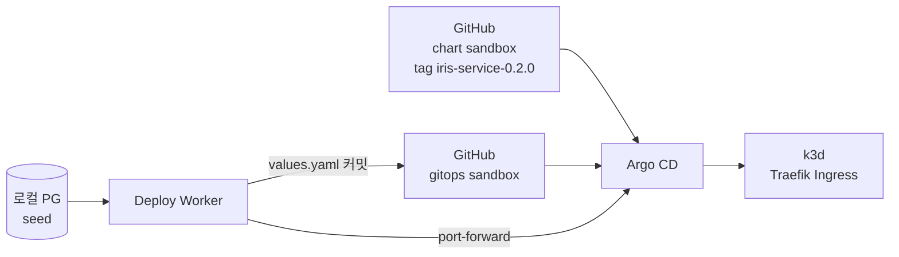

# Deploy Worker 테스트 가이드

> 기준일: 2026-10-02 · 대상: `app/workers/deploy_worker.py`, `app/services/deploy_service.py`
> 설계: [.claude/docs/deploy-worker-plan.md](../.claude/docs/deploy-worker-plan.md) · chart: iris-infra `helm/charts/iris-service`

| 단계 | 확인 범위 | 외부 의존 | 소요 |
|---|---|---|---|
| 1. 자동 테스트 | 상태 전이·재개·rollback·판정·values 렌더링 (GitHub·Argo CD·ECR 은 가짜) | 로컬 PostgreSQL | 1분 |
| 2. 로컬 E2E | 실제 GitHub 커밋 → Argo CD → Helm → k3d rollout → 성공·실패·rollback | GitHub sandbox 저장소·App, Docker, k3d | 첫 구성 30분 |

AWS 에서만 확인되는 것(ALB group·ACM·readiness gate·VPC NetworkPolicy·ECR 태그)은 계획서 §8 Task 0 에서 본다.

---

## 1. 자동 테스트

```bash
brew services start postgresql@18
createdb softbank_iris_test            # 처음 한 번. 테이블을 지우고 만드므로 전용 DB
TEST_DATABASE_URL=postgresql+asyncpg://localhost/softbank_iris_test uv run pytest -v \
  tests/test_deploy_flow.py tests/test_deploy_service.py tests/test_argocd_client.py tests/test_github_client.py
```

| 파일 | 내용 |
|---|---|
| `test_deploy_flow.py` | DB 통합. 성공·대체·in-flight 대기·커밋 후 크래시 재개·브랜치 경합·커밋 전 실패·첫 배포 실패·기한 초과·rollback·HEAD 변경·rollback 실패·ECR 태그 실패 |
| `test_deploy_service.py` | `evaluate_release` 판정 표, `render_service_values` |
| `test_argocd_client.py` | multi-source `revisions` 해석, repoURL 형식(https·SSH) |
| `test_github_client.py` | `update_branch` 충돌 매핑, `contains`, `find_subtree_sha` |

`TEST_DATABASE_URL` 이 없으면 DB 통합 테스트는 skip 된다.

---

## 2. 로컬 E2E (k3d + Argo CD + GitHub sandbox)



### 2.1 준비물

- Docker Desktop 실행, `brew install k3d` (helm·kubectl·argocd·gh 는 설치돼 있어야 한다)
- GitHub 저장소 2개(public 권장. 비밀값이 없고 Argo CD 자격증명이 필요 없다)
  - `<ORG>/iris-gitops-sandbox`: 빈 `main` 브랜치(README 커밋 하나)
  - `<ORG>/iris-chart-sandbox`: iris-infra `helm/charts/iris-service` 를 `charts/iris-service` 로 복사하고 tag `iris-service-0.2.0`
- 테스트용 GitHub App: 권한 `Contents: Read and write`, `iris-gitops-sandbox` 에만 설치. App ID·private key(PEM)·installation ID(설치 페이지 URL 끝 숫자)를 기록

> ⚠️ chart 와 values 를 **같은 저장소에 두지 않는다**. `ArgoCdClient` 는 repoURL 로 GitOps 소스를 찾으므로 같은 저장소면 chart 소스의 revision 을 읽어 판정이 틀어진다.

### 2.2 클러스터·Argo CD

```bash
k3d cluster create iris-local --agents 1 -p "8080:80@loadbalancer"
kubectl config use-context k3d-iris-local        # 다른 컨텍스트(stage 등)에 적용하지 않게 반드시 확인

helm repo add argo https://argoproj.github.io/argo-helm && helm repo update
helm install argocd argo/argo-cd -n argocd --create-namespace \
  --set 'configs.params.server\.insecure=true'
kubectl -n argocd rollout status deploy/argocd-server
```

### 2.3 AppProject·ApplicationSet

`<ORG>` 를 바꿔 저장 후 `kubectl apply -f`. 운영 정의(계획서 §3.2)와 다른 점: destination 이 `in-cluster`, Ingress 가 Traefik, readiness gate 라벨 없음.

```yaml
apiVersion: argoproj.io/v1alpha1
kind: AppProject
metadata: { name: iris-services, namespace: argocd }
spec:
  sourceRepos:
    - https://github.com/<ORG>/iris-gitops-sandbox.git
    - https://github.com/<ORG>/iris-chart-sandbox.git
  destinations: [{ name: in-cluster, namespace: "svc-*" }]
  clusterResourceWhitelist: [{ group: "", kind: Namespace }]
  namespaceResourceWhitelist:
    - { group: apps, kind: Deployment }
    - { group: "", kind: Service }
    - { group: networking.k8s.io, kind: Ingress }
    - { group: networking.k8s.io, kind: NetworkPolicy }
  roles:
    - name: deploy-reader
      policies: ["p, proj:iris-services:deploy-reader, applications, get, iris-services/*, allow"]
---
apiVersion: argoproj.io/v1alpha1
kind: ApplicationSet
metadata: { name: iris-services, namespace: argocd }
spec:
  goTemplate: true
  generators:
    - git:
        repoURL: https://github.com/<ORG>/iris-gitops-sandbox.git
        revision: main
        directories: [{ path: "services/*/prod" }]
  syncPolicy: { applicationsSync: create-update }
  template:
    metadata: { name: 'svc-{{ index .path.segments 1 }}' }
    spec:
      project: iris-services
      sources:
        - repoURL: https://github.com/<ORG>/iris-chart-sandbox.git
          path: charts/iris-service
          targetRevision: iris-service-0.2.0
          helm:
            valueFiles: ['$values/{{ .path.path }}/values.yaml']
            valuesObject: { route: { className: traefik, groupName: "" } }
        - repoURL: https://github.com/<ORG>/iris-gitops-sandbox.git
          targetRevision: main
          ref: values
      destination: { name: in-cluster, namespace: 'svc-{{ index .path.segments 1 }}' }
      syncPolicy:
        automated: { prune: true, selfHeal: true }
        syncOptions: [CreateNamespace=true, PruneLast=true]
        managedNamespaceMetadata:
          labels: { pod-security.kubernetes.io/enforce: baseline }
```

### 2.4 Argo CD 토큰·Worker 환경변수

```bash
kubectl -n argocd port-forward svc/argocd-server 8081:80 &     # 별도 터미널 권장
argocd login localhost:8081 --plaintext --username admin \
  --password "$(kubectl -n argocd get secret argocd-initial-admin-secret -o jsonpath='{.data.password}' | base64 -d)"
argocd proj role create-token iris-services deploy-reader      # 출력 토큰을 ARGOCD_TOKEN 에
```

`.env.deploy-local`(`.gitignore` 의 `.env.*` 에 걸린다. 커밋 금지):

```dotenv
AWS_REGION=ap-northeast-2
GITOPS_REPOSITORY=<ORG>/iris-gitops-sandbox
GITOPS_APP_ID=<APP_ID>
GITOPS_INSTALLATION_ID=<INSTALLATION_ID>
ARGOCD_SERVER_URL=http://localhost:8081
ARGOCD_TOKEN=<TOKEN>
```

AWS 자격증명은 없어도 된다. ECR `r-*` 태그만 실패하고 WARNING 로그 후 성공 처리된다.

### 2.5 DB seed

Control API·Build Worker 를 거치지 않으므로 빌드가 끝난 상태를 직접 넣는다. 이미지는 8080 으로 띄울 수 있는 `traefik/whoami` 를 digest 로 고정하고, Dockerfile 빌드의 `startCommand` 로 포트를 준다.

```bash
uv run alembic upgrade head
DIGEST=$(docker buildx imagetools inspect traefik/whoami:latest | awk '/^Digest:/{print $2}')
```

`seed.sql`(첫 실행만 user·service 생성. 배포마다 `:'digest'`·`:'key'` 를 바꿔 다시 실행):

```sql
INSERT INTO users (github_id, login) VALUES (1, 'local') ON CONFLICT DO NOTHING;
INSERT INTO github_installations (installation_id, account_login, account_type)
VALUES (1, 'local', 'User') ON CONFLICT DO NOTHING;
INSERT INTO projects (name, owner_id) SELECT 'local', id FROM users WHERE github_id = 1
ON CONFLICT DO NOTHING;
INSERT INTO services (project_id, name, source_repository_url, github_installation_id, source_branch)
SELECT p.id, 'my-app', 'https://github.com/local/whoami', i.id, 'main'
FROM projects p, github_installations i
WHERE p.name = 'local' AND i.installation_id = 1
  AND NOT EXISTS (SELECT 1 FROM services WHERE name = 'my-app');

WITH request AS (
  INSERT INTO deployment_requests (service_id, environment, source_sha, trigger_type,
                                   idempotency_key, status)
  SELECT id, 'prod', repeat('a', 40), 'MANUAL', :'key', 'DEPLOYING'
  FROM services WHERE name = 'my-app'
  RETURNING id
), build AS (
  INSERT INTO builds (deployment_request_id, status, builder, source_sha,
                      image_repository, image_tag, image_digest, deploy_config)
  SELECT id, 'SUCCEEDED', 'dockerfile', repeat('a', 40),
         'docker.io/traefik/whoami', 'b-local', :'digest',
         '{"startCommand": "/whoami --port 8080", "healthcheckTimeout": 60}'::jsonb
  FROM request RETURNING id, deployment_request_id
)
INSERT INTO jobs (deployment_request_id, kind, status, payload)
SELECT deployment_request_id, 'DEPLOY', 'QUEUED', jsonb_build_object('build_id', id) FROM build;
```

```bash
psql softbank_iris -v key="local-$(date +%s)" -v digest="$DIGEST" -f seed.sql
```

### 2.6 Worker 실행

```bash
set -a; source .env.deploy-local; set +a
export GITOPS_APP_PRIVATE_KEY="$(cat <APP_PRIVATE_KEY>.pem)"
uv run python -m app.workers.deploy_worker | jq -c '{message, action, release_id, failure_code}'
```

첫 배포는 ApplicationSet 폴링(약 3분) 때문에 늦다. 바로 반영하려면:

```bash
kubectl -n argocd annotate applicationset iris-services argocd.argoproj.io/application-set-refresh=true --overwrite
```

### 2.7 시나리오

| # | 방법 | 기대 결과 |
|---|---|---|
| 1 신규 배포 | seed 1회 | sandbox 에 `services/{id}/prod/values.yaml` 커밋 → Application `svc-{id}` 생성 → release·요청 `SUCCEEDED`. `curl -H 'Host: my-app-1.localhost' localhost:8080` 응답 |
| 2 추가 배포 | 같은 digest 로 seed 1회 더 | values 덮어쓰기 커밋, `release.id` 가 바뀌어 rollout → `SUCCEEDED`. 새 release 의 `previous_good_release_id` = 1번 |
| 3 실패 → rollback | `digest=sha256:` + 0 64개로 seed | ImagePullBackOff → 60초 뒤 Degraded → `DEPLOY_FAILED` → ROLLBACK 이 2번 디렉터리로 되돌리는 커밋 → `ROLLED_BACK`. 2번 Pod 는 계속 응답 |
| 4 진행 중 대기 | seed 를 연속 2회 | 두 번째 DEPLOY 가 15초 간격으로 snooze 하다 첫 배포가 끝나면 진행 |
| 5 대체 | 4번 중 대기 중인 요청에 `UPDATE deployment_requests SET cancel_requested_at = now() WHERE id = <ID>` | 그 요청 `SUPERSEDED`, 커밋 없음 |
| 6 HEAD 변경 | 3번의 RECONCILE 이 실패를 판정하기 전에 sandbox 의 `services/{id}/prod/values.yaml` 을 손으로 수정·커밋 | ROLLBACK 이 커밋하지 않고 요청 `MANUAL_INTERVENTION`, ERROR 로그 `action=rollback_blocked` |

### 2.8 상태 확인

```sql
SELECT r.id, r.status, r.failure_code, r.gitops_commit_sha, r.revert_commit_sha, d.status AS request_status
FROM releases r JOIN deployment_requests d ON d.id = r.deployment_request_id ORDER BY r.id;

SELECT id, deployment_request_id, kind, status, attempts, run_after, last_error FROM jobs ORDER BY id;
```

```bash
argocd app get svc-<ID> --refresh          # Sync·Health·revisions
kubectl -n svc-<ID> get deploy,pod,ingress
gh api repos/<ORG>/iris-gitops-sandbox/commits --jq '.[].commit.message' | head
```

### 2.9 정리

```bash
k3d cluster delete iris-local
psql softbank_iris -c "TRUNCATE releases, jobs, builds, deployment_status_histories, deployment_requests, service_targets, services, projects, user_github_installations, github_installations, users RESTART IDENTITY CASCADE"
```

> ⚠️ `TRUNCATE` 는 되돌릴 수 없다. **로컬 DB(`softbank_iris`)인지 확인**하고 실행한다. 개발 데이터를 남기려면 seed 한 서비스의 행만 지운다.
> sandbox 저장소의 `services/` 는 다음 테스트 전에 지워도 된다(삭제해도 Application 은 남으므로 클러스터를 함께 지운다).

---

## 문제 확인

| 증상 | 원인 후보 | 확인 |
|---|---|---|
| `release in flight, deploy waits` 가 계속 | 이전 release 가 `PENDING`·`ROLLING_BACK` 에 남음 | `releases` 조회. RECONCILE job 이 `RETRY_WAIT`·`FAILED` 인지 |
| 커밋은 됐는데 기한 초과 | Application 미생성, 토큰 권한, chart schema 거부 | `argocd app get` 의 Conditions(ComparisonError), Worker WARNING `gitops source not found` |
| GitHub 401·403 | App 미설치·권한 부족·PEM 오류 | App 설정의 Contents 권한, installation ID |
| `branch moved, recommitting` 반복 | 다른 커밋이 계속 들어옴 | sandbox 커밋 로그 |
| Pod 는 Ready 인데 `SUCCEEDED` 안 됨 | Ingress Health(Traefik 이 status 를 채우지 않음) | `argocd app get` 의 Ingress Health. Progressing 이면 Argo CD 의 Ingress health 설정 확인 |
