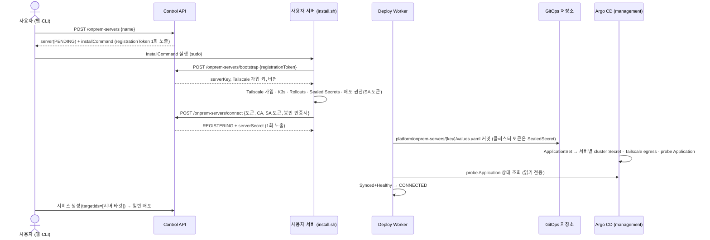

# 온프레미스 서버 등록 계약

사용자가 자기 Ubuntu 서버를 배포 대상으로 직접 붙이는 기능의 레포 간 계약이다. iris-was·iris-infra·iris-cli·iris-web 이 이 문서 하나에 맞춘다. 배경과 대안은 [ADR 0029](adr/0029-user-registered-onprem-servers.md).

- **상태**: 초안 (2026-10-04). 바꾸면 네 레포 PR 에 같이 반영한다.
- **기존 서버 1대**(타깃 `onprem`, `iris-onprem-01`)는 지금 경로를 그대로 쓴다. 새 경로가 검증된 뒤 첫 등록 데이터로 옮긴다(§9).

## 1. 흐름



## 2. 식별자

| 이름 | 형식 | 예 | 쓰는 곳 |
|---|---|---|---|
| `serverKey` | `[a-z][a-z0-9]{7}` (8자, 첫 글자 영문, 무작위) | `k3x9q2ma` | 모든 이름의 기준. 비밀 아님 |
| 타깃 이름 · Argo cluster 이름 · GitOps 디렉터리 | `onprem-{serverKey}` | `onprem-k3x9q2ma` | `targets.name`, `services/{id}/onprem-{key}/`, Argo `destination.name` |
| Tailscale hostname | `iris-{serverKey}` | `iris-k3x9q2ma` | tailnet FQDN `iris-{key}.<tailnet>.ts.net` |
| 서비스 host | `{service_host_label}-{serverKey}.internal.likelion.uk` | `api-12-k3x9q2ma.internal.likelion.uk` | 라벨 63자 이하. 넘으면 서비스 이름 부분을 줄인다 |
| management Application | `iris-onprem-server-{serverKey}` | | 서버별 chart 렌더 |
| probe Application | `iris-onprem-probe-{serverKey}` | | 서버 연결 확인 (namespace `iris-system` 의 ConfigMap 1개) |

- 기존 서버의 host(`{label}.internal.likelion.uk`, 라벨 끝이 `-숫자`)와 겹치지 않는다. 새 host 의 마지막 `-` 뒤는 영문으로 시작하는 8자다.
- 게이트웨이는 `^(?<label>[a-z0-9-]+)-(?<key>[a-z][a-z0-9]{7})\.internal\.likelion\.uk$` 에 맞으면 `iris-onprem-apps-{key}.onprem-gateway.svc.cluster.local:80` 으로, 아니면 지금 upstream(기존 서버)으로 보낸다. 정규식에 맞지만 등록되지 않은 key 는 502 이고, 기존 서버로 넘기지 않는다.

## 3. 상태 (`onprem_server_status`)

| 코드 | 의미 | 다음 |
|---|---|---|
| `PENDING` | 등록만 했다. 서버에서 명령을 아직 실행하지 않았다 | `REGISTERING`, (토큰 만료 시 재발급) |
| `REGISTERING` | 서버가 `connect` 를 보냈다. Worker 가 GitOps 반영·연결 확인 중 | `CONNECTED`, `FAILED` |
| `CONNECTED` | probe Application 이 Synced+Healthy. 배포 가능 | (끝, 삭제만) |
| `FAILED` | GitOps 커밋이 반영된 뒤 15분 안에 연결되지 않았거나 GitOps 반영 실패. `failureCode` 로 구분 | 토큰 재발급 후 명령 재실행 → `PENDING` |

`failureCode`: `CONNECT_TIMED_OUT`(probe 가 기한 안에 정상화 안 됨) · `GITOPS_COMMIT_FAILED`(재시도 소진).

## 4. Control API (사용자 인증)

모든 응답은 `ApiResponse[T]` 봉투, 필드는 camelCase. 값이 없는(null) 필드는 응답에서 빠진다(공통 규칙. 아래 예시의 `null` 은 키가 없는 것과 같다). 소유자만 보고 고친다(남의 서버는 404).

### `POST /api/v1/onprem-servers` → 201
요청 `{ "name": "home-lab" }` · 이름 규칙은 아래 · 이름이 겹치면 409 `ONPREM_SERVER_NAME_CONFLICT` · 사용자마다 5대까지(삭제한 것 제외), 넘으면 409 `ONPREM_SERVER_LIMIT_EXCEEDED` · WAS 설정 `API_BASE_URL` 이 없거나 https 가 아니면(localhost·127.0.0.1 의 http 는 허용) 503 `NOT_CONFIGURED`(재발급도 같다). `installCommand` 는 요청의 Host 로 만들지 않는다

**이름 규칙** (생성할 때만 검사한다. 이미 등록한 서버의 이름은 바꾸지 않고 규칙과 상관없이 그대로 쓴다):

1. 앞뒤 공백(`str.strip()` 이 자르는 공백·탭·줄바꿈·전각 공백 등)을 먼저 자른다. 규칙 검사·저장·중복 비교와 응답의 `name` 이 모두 자른 값이다. `" home-lab "` 은 `home-lab` 으로 등록되고, 이미 `home-lab` 이 있으면 409 다.
2. 자른 이름은 **1~63자**이고 **영문 대소문자·숫자·한글 완성형(`가`~`힣`)·`.`·`_`·`-`** 만 쓴다. **첫 글자는 영문·숫자·한글**이다(`-`·`.`·`_` 로 시작할 수 없다). 정규식 `^[A-Za-z0-9가-힣][A-Za-z0-9가-힣._-]{0,62}$`. 이름 가운데 공백, `!`·`@`·`/` 같은 특수문자, 이모지, 한글 자모(`ㄱ`, 풀어 쓴 NFD 한글)와 전각 영문·다른 문자권의 숫자는 받지 않는다.
3. 어기면(공백뿐이거나 빈 문자열 포함) 422 `INVALID_INPUT`, message `invalid onprem server name`, `details` 는 `[{ "field": "name", "reason": <사유 하나> }]` 다. 값은 담지 않는다. 사유(고정 문구): `must not be blank` · `must be at most 63 characters` · `must start with a letter, digit or Hangul syllable` · `may contain only letters, digits, Hangul syllables, '.', '_' and '-' (no spaces)`(위에서부터 먼저 걸린 것 하나). `name` 이 없거나 문자열이 아니면 지금처럼 422 `VALIDATION_ERROR` 다.
4. 이름은 **대소문자를 구분한다**(`Home-Lab` 과 `home-lab` 은 다른 이름). 유일성은 같은 소유자의 삭제되지 않은 서버끼리 비교하며(삭제한 서버의 이름은 다시 쓸 수 있다), DB 는 그대로 `VARCHAR(63)` 과 부분 유일 인덱스다.
5. 이름은 CLI(`likelion servers remove <이름>`)·화면·로그에 그대로 쓰이므로 따옴표 없이 인자로 줄 수 있고 표시가 깨지지 않는 문자만 받는다. 이름은 호스트명·타깃 이름·경로에 쓰이지 않는다(그 기준은 `serverKey`, §2).

응답 `data`:
```json
{
  "server": { "id": 3, "name": "home-lab", "serverKey": "k3x9q2ma", "status": "PENDING",
              "targetId": 7, "tailnetFqdn": null, "failureCode": null,
              "registrationExpiresAt": "2026-10-05T03:00:00Z", "connectedAt": null,
              "createdAt": "2026-10-04T03:00:00Z" },
  "registrationToken": "<43자 base64url, 이 응답에서만>",
  "installCommand": "curl -fsSL https://api.likelion.uk/api/v1/onprem-servers/install.sh | sudo bash -s -- --token <registrationToken>"
}
```
- 같은 트랜잭션에서 타깃 행을 만든다: `name=onprem-{key}`, `kind=ONPREM`, `domain_suffix=internal.likelion.uk`, `owner_id=사용자`.
- 등록 토큰 유효기간 24시간. DB 에는 SHA-256 만 둔다.

### `GET /api/v1/onprem-servers` → `OnpremServer[]` (내 것, 최신순)
### `GET /api/v1/onprem-servers/{id}` → `OnpremServer`
### `POST /api/v1/onprem-servers/{id}/registration-token` → 200 `{server, registrationToken, installCommand}`
`PENDING`·`REGISTERING`·`FAILED` 일 때만(`CONNECTED` 는 409 `INVALID_STATUS_TRANSITION`). 이전 토큰·serverSecret 은 무효, 상태는 `PENDING`. `REGISTERING` 이면 Worker 가 하던 반영·연결 확인을 버린다(잘못된 서버에서 실행했거나 연결이 멈췄을 때 처음부터 다시 한다). 저장한 접속 정보(`tailnetFqdn`·CA·SA 토큰·봉인 인증서)도 지운다. 서버는 새 토큰으로 `connect` 를 다시 보내야 한다.
### `DELETE /api/v1/onprem-servers/{id}` → 204
서비스가 붙어 있거나 붙었던 서비스를 내리는 중이면(진행 중 배포 요청) 409 `ONPREM_SERVER_IN_USE`. 소프트 삭제 + 타깃 소프트 삭제 + Worker 가 `platform/onprem-servers/{key}/` 를 지운다.

### 타깃·배포 변경
- `GET /api/v1/targets`: 공용 타깃(`owner_id` 없음) + 내 서버 타깃만. `TargetResponse` 에 `onpremServerId: int | null`, `onpremServerName: str | null`, `connectionStatus: onprem_server_status | null`(공용 타깃은 셋 다 null = 항상 배포 가능) 추가.
- 서버가 연결돼도 그 서버를 고른 서비스의 첫 배포를 자동으로 시작하지 않는다. 사용자가 배포한다.
- `registrationExpiresAt` 은 늘 그대로 준다. `PENDING`·`FAILED` 에서만 의미가 있다.
- 서비스 생성·수정: 남의 서버 타깃·삭제된 서버 타깃은 422 로, 없는 타깃과 메시지·코드까지 같게 준다(존재를 드러내지 않는다).
- 배포 요청 생성: 타깃 서버가 `CONNECTED` 가 아니면 409 `TARGET_NOT_CONNECTED`.

## 5. 서버 쪽 API (사용자 인증 없음)

### `GET /api/v1/onprem-servers/install.sh` → `text/x-shellscript`
인증 없음. iris-was 레포 `app/assets/onprem/install.sh` 를 그대로 준다. API 주소는 스크립트가 요청한 주소(`--api-url`, 기본 `https://api.likelion.uk`)를 쓴다.

### `POST /api/v1/onprem-servers/bootstrap`
요청 `{ "registrationToken": "..." }` · 상태가 `PENDING`·`REGISTERING`·`FAILED`(재실행) 이고 만료 전일 때만. `connect` 뒤 스크립트가 중간에 실패해도 같은 명령으로 다시 돌릴 수 있게 `REGISTERING` 도 받는다. `REGISTERING`·`FAILED` 에서 다시 부르면 상태는 바뀌지 않는다. 실패는 401 `INVALID_REGISTRATION_TOKEN`(없음·만료·이미 연결됨을 구분하지 않는다).

응답 `data`:
```json
{
  "serverKey": "k3x9q2ma",
  "tailscale": { "authKey": "<운영자가 발급한 키>", "hostname": "iris-k3x9q2ma", "tags": ["tag:iris-onprem"] },
  "versions": { "k3s": "v1.33.13+k3s2", "argoRollouts": "v1.10.0", "sealedSecrets": "0.40.0" }
}
```
- 버전은 iris-infra 가 고정한 것과 맞춘다: Argo Rollouts controller v1.10.0(`helm/versions.json`), Sealed Secrets chart 2.20.0 의 appVersion 0.40.0. WAS 설정 기본값으로 두고 iris-infra 를 올릴 때 같이 바꾼다.
- 가입 키는 WAS 설정 `ONPREM_TAILSCALE_AUTH_KEY`(reusable·pre-approved·`tag:iris-onprem`)에서 온다. 화면·CLI·로그에 내보내지 않는다. 나중에 Worker 가 서버마다 1회용 키를 발급하는 방식으로 바꾼다(§10).

### `POST /api/v1/onprem-servers/connect`
요청:
```json
{
  "registrationToken": "...",
  "tailnetFqdn": "iris-k3x9q2ma.tailb046e8.ts.net",
  "apiCaCert": "<K3s API server CA, PEM>",
  "serviceAccountToken": "<만료 없는 SA 토큰>",
  "sealedSecretsCert": "<서버 Sealed Secrets controller 공개 인증서, PEM>"
}
```
- `tailnetFqdn` 은 `iris-{serverKey}.` 로 시작해야 한다(422).
- SA 토큰은 Fernet(`VARIABLES_ENCRYPTION_KEY`)로 암호화해 저장한다. 평문은 Worker 가 봉인할 때만 메모리에 있다.
- `PENDING`·`REGISTERING`·`FAILED` 에서 받는다. `FAILED` 에서 받으면 `REGISTERING` 으로 돌아가고 연결 기한을 새로 잡는다.
- 응답 `data`: `{ "status": "REGISTERING", "serverSecret": "<43자, 이 응답에서만>" }`. 상태는 `REGISTERING`, 같은 토큰으로 다시 보내면 값을 덮어쓰고 새 serverSecret 을 준다(재실행 멱등).

### `POST /api/v1/onprem-servers/registry-credentials`
헤더 `Authorization: Bearer <serverSecret>` · `CONNECTED` 일 때만.
응답 `data`: `{ "registry": "<계정>.dkr.ecr.ap-northeast-2.amazonaws.com", "username": "AWS", "password": "<ECR 토큰>", "expiresAt": "...", "serviceIds": [12, 15] }`
- `expiresAt` 은 ECR 토큰 만료와 임시 자격증명 만료 중 이른 쪽이다. Control API 자격 증명이 이미 role 세션이라 AssumeRole 이 연쇄되어 세션이 1시간이고, ECR 토큰도 그 안에서 끝날 수 있다. CronJob 이 5분마다 갱신하므로 문제없다.
- Control API 가 ECR pull 전용 Role 을 AssumeRole 하면서 세션 정책으로 이 서버 타깃에 붙은 서비스들의 저장소만 허용한다. 붙은 서비스가 없으면 `serviceIds: []`, password 없음.
- 확인 순서는 401(서버 비밀이 틀리거나 재발급으로 무효) → 409 `ONPREM_SERVER_NOT_CONNECTED`(`CONNECTED` 전) → 503 `NOT_CONFIGURED`(WAS 에 ECR pull Role 설정이 없음)다. CronJob 은 409·503 을 실패로 남기지 않고 다음 회차를 기다린다.
- 서버의 CronJob(설치 스크립트가 만든다)이 5분마다 불러 `svc-{id}/iris-ecr-pull` Secret 을 갱신하고 default SA 에 `imagePullSecrets` 로 붙인다.

## 6. 설치 스크립트 (`install.sh`, Ubuntu 22.04/24.04 x86_64·arm64)

`curl -fsSL <api>/api/v1/onprem-servers/install.sh | sudo bash -s -- --token <T> [--api-url <URL>]`

1. root·OS 확인, `curl`·`jq` 설치
2. `bootstrap` 호출
3. Tailscale 설치 → `tailscale up --auth-key … --hostname iris-{key} --advertise-tags tag:iris-onprem` → FQDN 확인. ufw 가 켜져 있으면 `tailscale0` 으로 들어오는 tcp 6443·80 만 허용하고(`ufw allow in on tailscale0 to any port … proto tcp`), K3s 기본 Pod·Service 대역 `10.42.0.0/16`·`10.43.0.0/16` 을 `ufw allow from <cidr> to any`·`ufw route allow from <cidr>` 로 허용한다(ufw 의 FORWARD DROP 이 Pod 의 바깥 통신·DNS 를 막는다). 다시 실행해도 같다
4. K3s 설치(버전 고정, `--tls-san <tailnetFqdn>`, Traefik 유지)
5. 배포 권한: namespace `iris-system`, SA `iris-argocd`, ClusterRole `iris-onprem-service-deployer`(iris-infra `clusters/onprem-workload/argocd-service-deployer.yaml` 과 같은 규칙) + `iris-system` 의 ConfigMap 쓰기 권한(probe 용), 만료 없는 토큰 Secret(`kubernetes.io/service-account-token`). 복사한 ClusterRole 은 Secret 을 포함해 클러스터 전체를 읽으므로 이 토큰을 쓰는 management Argo CD 는 `iris-system/iris-server-secret` 도 읽을 수 있다(알려진 위험, ADR 0029). 토큰 교체: 이 legacy SA 토큰 Secret 은 `iat`·`jti` 가 없어 Secret 만 다시 만들면 같은 JWT 가 나온다. 바꾸려면 SA `iris-system/iris-argocd` 와 토큰 Secret `iris-argocd-token` 을 지우고, 등록 토큰을 재발급받아 `install.sh` 를 다시 실행한다
6. Argo Rollouts·Sealed Secrets controller 설치(버전 고정)
7. `connect` 호출 → `serverSecret` 을 `iris-system/iris-server-secret` 에 저장
8. ECR 갱신 CronJob(`iris-system/iris-ecr-refresh`, 5분) 설치·1회 실행. `ONPREM_SERVER_NOT_CONNECTED`(409)·`NOT_CONFIGURED`(503) 응답은 로그 한 줄만 남기고 성공으로 끝낸다(실패한 Job 을 쌓지 않는다). 5분인 이유: 새 서비스의 `svc-{id}` namespace 가 생긴 뒤 첫 pull 까지 기다리는 시간을 줄인다. 첫 Pod 가 Secret 보다 먼저 뜨면 ImagePullBackOff 로 재시도하다 Secret 이 생기면 받아진다(§7.1)
9. 상태를 `GET` 할 수단은 없으므로 "웹·CLI 에서 연결 상태를 확인하세요" 를 출력하고 끝

다시 실행해도 같은 결과가 되어야 한다(이미 설치된 것은 건너뜀). 토큰·가입 키는 출력하지 않는다(`set +x`).

## 7. GitOps 데이터 (Worker 가 커밋)

`platform/onprem-servers/{serverKey}/values.yaml`:
```yaml
server:
  key: k3x9q2ma
  clusterName: onprem-k3x9q2ma
  tailnetFqdn: iris-k3x9q2ma.tailb046e8.ts.net
  apiPort: 6443
  appsPort: 80
cluster:
  caData: <base64 PEM, 공개값>
  # management 클러스터 Sealed Secrets 인증서로 봉인. 범위 strict: namespace argocd, 이름 cluster-onprem-k3x9q2ma
  # 평문은 Argo cluster Secret 의 config: {"bearerToken": "...", "tlsClientConfig": {"caData": "...", "serverName": "<tailnetFqdn>"}}
  encryptedConfig: AgB...
```
- 봉인 인증서는 WAS 설정 `PLATFORM_SEALED_SECRETS_CERT`(management controller). 서비스 변수 봉인용 `SEALED_SECRETS_CERT` 와 다르다.
- 삭제는 디렉터리 삭제 커밋. 기록은 `onprem_servers.gitops_commit_sha`.

### 7.1 서비스 values (Deploy Worker)

서버 타깃의 서비스 `services/{id}/onprem-{key}/values.yaml` 은 기존 값에 `imagePullSecrets: [{name: iris-ecr-pull}]` 를 더한다. default SA 패치는 패치 뒤에 만든 Pod 에만 먹고, Argo 가 namespace 와 Rollout 을 같이 만들어 첫 Pod 가 먼저 뜰 수 있어서다. iris-service chart 는 이 값을 Pod spec 에 넣는다(chart 변경 필요 시 iris-infra 에서 버전을 올린다). 변수 봉인은 서버의 `sealed_secrets_cert` 를 쓴다.

## 8. iris-infra (1회 변경)

- management 에 Sealed Secrets controller 설치(키 백업 runbook 포함).
- ApplicationSet `iris-onprem-servers`: git files 생성기 `platform/onprem-servers/*/values.yaml` → 서버마다 Application `iris-onprem-server-{key}` 가 chart `iris-onprem-server` 를 렌더:
  - SealedSecret → `argocd/cluster-onprem-{key}` (label `argocd.argoproj.io/secret-type: cluster`, `name: onprem-{key}`, `server: https://iris-onprem-api-{key}.argocd.svc.cluster.local:6443`)
  - Tailscale egress Service 2개: `argocd/iris-onprem-api-{key}`(6443), `onprem-gateway/iris-onprem-apps-{key}`(80), `tailscale.com/tailnet-fqdn: {tailnetFqdn}`
  - probe Application `iris-onprem-probe-{key}` → `destination.name: onprem-{key}`, namespace `iris-system`, ConfigMap 1개
- probe Application 에는 resources finalizer 를 달지 않는다. 서버가 사라진 뒤 지우면 finalizer 가 영원히 걸리기 때문이다. 서버를 지우면 서버에 ConfigMap 하나가 남는다.
- 서비스 ApplicationSet `iris-svc-onprem-servers-appset`: git directories `services/*/onprem-*` → Application `svc-{id}`, `destination.name: {{path[2]}}`, namespace `svc-{id}`. 기존 `services/*/onprem` AppSet 은 그대로 둔다.
- AppProject `iris-svc-project`: destination `name: onprem-*`, namespace `svc-*` 허용. probe 용 project 는 `iris-system` 만.
- probe Application 은 project `iris-onprem-probe` 에 있다. Argo project role 토큰은 자기 project 만 보므로 Deploy Worker 는 probe 조회용 토큰을 따로 받는다: 설정 `ARGOCD_PROBE_TOKEN`(project `iris-onprem-probe` 의 role `iris-deploy-reader`, `applications, get` 만). 기존 `ARGOCD_TOKEN` 은 그대로 서비스 Application 조회에 쓴다. 없으면 서버 연결 확인을 하지 않고 `REGISTERING` 에 머문다(경고 로그).
- 서버 타깃 서비스 ApplicationSet 은 자기 `chartRevision`(iris-service 0.8.0, `imagePullSecrets` 지원)을 쓴다. AWS·기존 onprem 서비스의 chart 는 바꾸지 않는다.
- 게이트웨이: §2 정규식으로 서버를 골라 동적 upstream(`resolver` kube-dns). 서버 추가 때 게이트웨이 변경 없음.
- Tailscale 정책: `tag:iris-onprem` 은 목적지로만 쓴다(서버끼리·서버→tailnet 출발 grant 없음). operator egress → `tag:iris-onprem:6443,80`.
- IAM: Control API 가 AssumeRole 하는 `iris-dev-onprem-ecr-pull`(ECR pull, 저장소 `iris/services/*`) — 세션 정책으로 좁힌다.

## 9. 기존 서버 이전 (나중)

새 경로 E2E 가 통과한 뒤: 기존 VM 에 `install.sh` 를 실행해 서버 데이터를 만들고, 기존 `onprem` 서비스를 새 타깃으로 옮기는 마이그레이션을 따로 한다. 그 전까지 `onprem` 타깃·`services/*/onprem` AppSet·게이트웨이 기본 upstream 은 바꾸지 않는다.

## 10. 범위 밖 (다음 단계)

- Tailscale 가입 키 자동 발급(Worker 가 Tailscale API 로 서버마다 1회용 키 생성, ADR 0018 의 폴링 패턴)
- 서버 쪽 로그·메트릭 수집
- 서버 연결 끊김 감지(`CONNECTED` 이후 재확인)
- Ubuntu 외 배포판(Debian·RHEL)
