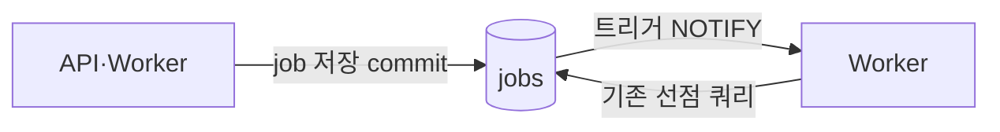

# Worker 깨우기: SQS 대신 PostgreSQL LISTEN/NOTIFY 를 택한 이유

- 날짜: 2026-10-03
- 상세 계획: [LISTEN/NOTIFY 계획](../../.claude/docs/listen-notify-job-wakeup-plan.md), 검토한 대안: [SQS 계획](../../.claude/docs/sqs-job-dispatch-plan.md)

## 문제

Build·Deploy Worker 는 일이 없어도 5초마다 `jobs` 를 선점 쿼리로 확인한다.

- 단계가 넘어갈 때마다(요청 → BUILD → DEPLOY → RECONCILE) 최대 5초씩 지연된다.
- idle 상태에서도 Worker 당 분당 12회, 전역 advisory lock 을 잡는 쿼리가 실행된다.

## 결정

`jobs` 테이블과 선점 쿼리는 그대로 두고, **DB 트리거가 보내는 NOTIFY 로 Worker 를 깨운다.** 알림을 놓쳐도 60초 fallback 으로 복구한다.

## SQS 를 택하지 않은 이유

필요한 것은 "작업 전달"이 아니라 "빨리 깨우기"다. SQS 를 도입해도 `jobs` 테이블을 진실 원본으로 남겨야 한다.

- 사용자별 동시 빌드 제한, lease·재개, "빌드 성공 → DEPLOY job 생성"을 한 트랜잭션으로 처리하는 일은 DB 에서만 할 수 있다.
- 결국 SQS 는 깨우기 신호 역할만 하는데, 그 대가로 아래 비용이 든다.

| | SQS | LISTEN/NOTIFY |
|---|---|---|
| 변경 범위 | iris-infra(큐·IAM·Pod Identity·CI 권한·chart) + iris-was | iris-was PR 1개 (트리거 migration + Worker 대기 루프) |
| Control API 권한 | 처음으로 AWS 역할(`sqs:SendMessage`) 부여 필요 | 변경 없음 |
| commit 과 신호의 일관성 | "commit 뒤 발행" 규칙을 7곳 이상에서 지키고, 유실 대비 sweeper 필요 | 트리거가 commit 시점에만 보낸다 (DB 보장) |
| 발행 지점 관리 | 앱 코드에서 지점마다 호출 | 트리거 1곳 |
| 로컬 개발 | ElasticMQ 등 SQS 에뮬레이터 필요 | 기존 PostgreSQL 그대로 |
| 롤백 | 앱 롤백 + 인프라 정리 | migration downgrade + 앱 롤백 |

## 감수한 한계

- **알림은 저장되지 않는다.** Worker 재시작 중 알림은 사라진다. 60초 fallback 이 최대 지연을 정한다.
- **lease 만료 회수**가 최대 5분 5초에서 6분으로 약 1분 늘어난다.
- PgBouncer(transaction pooling)를 도입하면 리스너만 RDS 에 직접 붙여야 한다.
- 같은 DB 에 붙은 프로세스끼리만 신호를 주고받을 수 있다.

## SQS 를 다시 검토할 조건

- 다른 시스템(외부 서비스·Lambda 등)이 job 을 넣거나 소비해야 할 때
- DB 와 분리된 버퍼나 큐 지표(CloudWatch)가 필요할 때
- Worker replica 가 늘어 알림마다 모두 깨어나는 비용이 문제가 될 때
